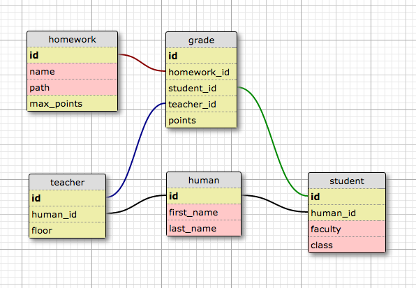

Домашнее задание Grades
-----------------------

Задача состоит в создании DBIx::Class-схемы для следующей базы:

Схема построена с помомощью http://ondras.zarovi.cz/sql/demo/, туда можно залить содержимое файла `etc/design.xml`, чтобы по схеме сгенерировать `SQL`. Чтобы залить его себе, сначал нужно создать базу, примерно так: `CREATE DATABASE grades CHARACTER SET utf8` (крайней желательно [выставить себе движок по умолчанию — InnoDB](http://stackoverflow.com/questions/3050492/how-can-i-set-default-storage-engine-used-by-mysql)).

По полученному `SQL` с помощь `dbicdump` или же вручную нужно построить DBIx-схему, а после дополнить ее некоторыми методами.

Ниже будут описаны методы, которые необходимо реализовать. За деталями интерфейса следует обратиться к тестам.

Тесты прогоняются на одноразовой MySQL-базе, которая создается автоматически. Для прохождения тестов вам понадобится установленный MySQL, а также некоторые перловые модули (как минимум `Test::DBIx::Class` и `Test::mysqld`).

Дополнительные методы
=====================

### Домашние задания

Нужен метод, выбирающий из множества домашних заданий те, в которых не указан `path`.

### Студенты

Нужен метод, возвращающий для данного студента все домашние задания, где студент получил балл, выше максимального.

### Преподаватели

Нужен метод, выбирающих преподавателей, у которых имя или фамилия содержат заданную строку.

### Оценки

Придумать и реализовать по одному методы в классах `Local::Schema::Result::Grade` и `Local::Schema::ResultSet::Grade`.
