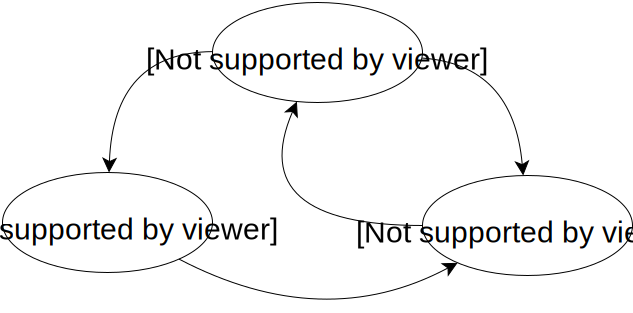
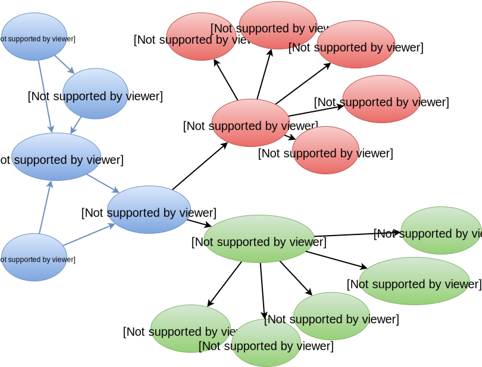

class:firstpage, title

# Программирование на Perl
## Асинхронно-событийное программирование

---

class:note_and_mark title

# Отметьтесь на портале!

---
<!-- 3 -->

layout:false
# Содержание

* Работа операционной системы
    - Паралеллизм и псевдопаралеллизм
    - Состояние процесса и переключение контекста
    - Степень многозадачности
    - Системный вызов
    - Блокирующие операции ввода-вывода
* Обработка N параллельных соединений
    - accept + fork
    - C10k
    - Неблокирующие операции ввода-вывода
    - Событийный цикл
* AnyEvent
    - Замыкания
    - Функции с отложенным результатом
    - Интерфейс AnyEvent
    - Guard
* Coro

---
<!-- 4 -->
class:center, middle

# Что такое процесс?

???

экземпляр выполняемоий программы, включая текущие значения счетчика команд,регистров и переменных

---
<!-- 5 -->

class:center, middle

# Что такое паралеллизм?

???

исполнение нескольких процессов на разных процессорах с доступом к общей памяти

---
<!-- 6 -->

class:center, middle

# Что такое псевдопаралеллизм?

???

исполнение нескольких процессов на одном физическом процессоре в условиях разделения времени.

---
<!-- 7 -->

# Состояние процесса

<div style="height:1em;"></div>
.center[

]

---
<!-- 8 -->

# Переключение контекста
## Context switch

* обработать прерывание таймера
* сохранить регистры
* сохранить стек
* выбрать новый процесс
* загрузить регистры
* загрузить стек

---
<!-- 9 -->
class: center, middle

#CONFIG_HZ_100

???

Максимум 100 переключений/c

---
<!-- 10 -->

# CPU Usage

## CPU = ( 1 − p<sup>n</sup> ) * 100%
p: часть времени ожидания ввода-вывода

.center[

]

---
<!-- 11 -->

# Системный вызов
## просьба ОС выполнить привилегированную операцию

* Прерывание
* передача управления ос
* проверка привилегий
* работа с оборудованием
* загрузка данных для программы
* возврат управления

---
<!-- 12 -->

# Системный вызов ввода-вывода

* Прерывание
* передача управления ос
* проверка привилегий
* работа с оборудованием
* установка обработчика прерывания
* context switch
* ...
* context switch
* загрузка данных для программы
* возврат управления исходному процессу

---
<!-- 13 -->

# Простой tcp сервер

```
while (1) {
    accept
    fork
        read
        write
        read
        write
        ...
        close
        exit
}
```

---
<!-- 14 -->

# Ожидание IO: 80%

CPU = 1 - p<sup>n</sup>

p = 80%

1 процесс - 20% CPU

2 процесса - 36% CPU

3 процесса - 49% CPU

10 процессов - 89% CPU

20 процессов - 99% CPU

---
<!-- 15 -->

# Ожидание IO: 0.01%

CPU = 1 - p<sup>n</sup>

p = 0.01%

1 процесс - 0.01% CPU

10 процессов - 0.1% CPU

100 процессов - 1% CPU

1000 процессов - 10% CPU

10000 процессов - 63% CPU

--
<!-- 16 -->

###1Mb/process = 10Gb RAM

###\+ 10000 CWS

---
<!-- 17 -->

# Блокирующее IO

```perl
read(...) -> SUCCESS

read(...) -> FATAL ERROR
```

---
<!-- 18 -->

# Неблокирующее IO

```perl
read(...) -> SUCCESS

*read(...) -> TEMPORARY ERROR

read(...) -> FATAL ERROR
```

---
<!-- 19 -->

# Pseudocode sample

```perl
while (1) {
    for my $fh (@fds) {
        my $res = read($fh, ...);
        if ($res) {
            # do work
        }
        elsif ($! ~~ FATAL_ERROR) {
            # close fh, remove from @fds
        }
        else {
            # wait
        }
    }
}
```

---
<!-- 20 -->

# select

```perl
($found,$timeleft) =
    select(
        $readable, # vec
        $writable, # vec
        $errors,   # vec
        $timeout   # in fractional seconds
    )
```

```perl
vec($readable, fileno(STDIN),  1) = 1;
vec($readable, fileno(STDOUT), 1) = 1;
vec($readable, fileno(STDERR), 1) = 1;

say unpack "B*", $readable; # 00000111
```

---
<!-- 21 -->

# IO::Select

```perl
use IO::Select;

$s = IO::Select->new();

$s->add(\*STDIN);
$s->add($fd);

@ready = $s->can_read($timeout);
```

---
<!-- 22 -->

# O_NONBLOCK

```perl
use Fcntl qw(F_GETFL F_SETFL O_NONBLOCK);

$flags = fcntl($fd, F_GETFL, 0)
    or die "Can't get flags for the socket: $!\n";

$flags = fcntl($fd, F_SETFL, $flags | O_NONBLOCK)
    or die "Can't set flags for the socket: $!\n";
```

---
<!-- 23 -->

# EAGAIN, EINTR, EWOULDBLOCK

```perl
use Errno qw(EAGAIN EINTR EWOULDBLOCK);

my $read = sysread($fd, my $buf, SOMELENGTH);

if ($read) { # read >= 0
    # work with data in buf
}
elsif (defined $read) { # read == 0
    # socket was closed
}
elsif ( $! ~~ [ EAGAIN, EINTR, EWOULDBLOCK ] ) {
    # socket not ready for reading
}
else {
    # socket was closed with error $!
}
```

---
<!-- 24 -->

# Event loop

```perl
use IO::Select; my $s = IO::Select->new();

my $timeout = 1;
# prepare program...

while () {
    my @ready = $s->can_read($timeout);
    for (@ready) { # do reads }

    my @ready = $s->can_write($timeout);
    for (@ready) { # do writes }
}
```

---
<!-- 25 -->

# Замыкание

```perl
{
    my `$var` = rand();

    my $sub = sub {
        print `$var`;
    }
}
```

--
<!-- 26 -->

```perl
{
    my `$var` = rand(); # .42;
    my $sub = sub {
        # my $var = .42;
        print `$var`;
    }
}
```

---
<!-- 27 -->

```perl
sub decorator {
    my $decor = shift;
    return sub {
        return $decor."@_".$decor;
    }
}

my $dq = decorator "'";
my $dd = decorator '"';
my $ds = decorator '/';

say $dq->('test');  # 'test'
say $dd->('test');  # "test"
say $ds->('test');  # /test/
```

---
<!-- 28 -->

```perl
my @subs;

for my $var (1..10) {
    my $sub = sub {
        return $var + $_[0];
    };
    push @subs, $sub;
}

for my $sub (@subs) {
    say $sub->(2);
}
# 3 4 5 6 7 8 9 10 11 12

for my $sub (@subs) {
    say $sub->(10);
}
# 11 12 13 14 15 16 17 18 19 20
```

---
<!-- 29 -->

```perl
my $fd = socket...
wait_socket_readable($fd, sub {
    read($fd, ...)
})
# ...
our %waiters;
sub wait_socket_readable {
    my ($fd,$cb) = @_;
    $select->add($fd);
    push @{ $waiters{$fd} }, $cb;
}
# Event loop:
while () {
    # ...
    for my $fd (@ready) {
        for my $cb ( @{ $waiters{$fd} } ) {
            $cb->();
        }
    }
}
```

---
<!-- 30 -->

```perl
my $fd = socket...

wait_socket_readable($fd, sub {
    sysread($fd, ...);

    wait_socket_writable($fd, sub {
        syswrite($fd, ...);

        wait_socket_readable($fd, sub {
            sysread($fd, ...);

            # ...
        });
    });
});

# ...
        my @wait = @{ $waiters{$fd} };
        @{ $waiters{$fd} } = ();
        for my $cb ( @wait ) {

```

---
<!-- 31 -->

```perl
wait_timeout 1, sub { ... };

our @deadlines;
sub wait_timeout {
    my ($t,$cb) = @_;
    my $deadline = time + $t;
    @deadlines =
        sort { $a->[0] <=> $b->[0] }
        @deadlines, [ $deadline, $cb ];
}

# Event loop:
while () {
    #...
    while ($deadlines[0][0] <= time) {
        my $next = shift(@deadlines);
        my $cb = $next->[1];
        $cb->();
    }
}
```

---
<!-- 32 -->

```perl
wait_timeout 1, sub {
    wait_timeout 0, sub {
        wait_timeout 0, sub {
            wait_timeout 0, sub {
                wait_timeout 0, sub {
                    wait_timeout 0, sub {
                        wait_timeout 0, sub {
                            ...
                        };                
                    };
                };
            };                
        };
    };
};
```

---
<!-- 33 -->

```perl
wait_timeout 1, sub {
    my $sub; $sub = sub {
        wait_timeout 0, $sub;
    }; $sub->();
};
```

--
<!-- 34 -->

```perl
my $deadline = time + $t;
unshift @deadlines, [$deadline, $cb];
# ...
    while ($deadlines[0][0] <= time) {
        my $next = shift(@deadlines);
        my $cb = $next->[1];
        $cb->();
    }

```

---
<!-- 35 -->

```perl
wait_timeout 1, sub {
    my $sub; $sub = sub {
        wait_timeout `0`, $sub;
    }; $sub->();
};
```

```perl
my $deadline = `time` + $t;
unshift @deadlines, [$deadline, $cb];
# ...
    while ($deadlines[0][0] <= `time`) {
        my $next = shift(@deadlines);
        my $cb = $next->[1];
        $cb->();
    }

```

---
<!-- 36 -->

```perl
our `$now`; our @deadlines;

sub wait_timeout {
    my ($t,$cb) = @_;
    my $deadline = `$now` + $t;
    @deadlines =
        sort { $a->[0] <=> $b->[0] }
        @deadlines, [ $deadline, $cb ];
}
# Event loop:
while () {
    `$now` = time;
    #...
    my @exec;
*   push @exec, shift @deadlines
*       while ($deadlines[0][0] <= `$now`);
    for my $dl (@exec) {
        $dl->[1]->();
    }
}
```

---
<!-- 37 -->

# Обобщённый интерфейс

```perl
io( $fd, READ | WRITE, $cb);

timer( $timeout, $cb );

runloop();
```

# AnyEvent

```perl
AE::io( $fd, $flag, $cb );

AE::timer( $after, $interval, $cb );

AE::signal( $signame, $cb );

AE::idle( $cb );

AE::now();
```

---
<!-- 38 -->

# AE::io

```perl
AE::io \*STDIN, 0, sub { # stdin is readable;
    my $line = <STDIN>;
    AE::io \*STDOUT, 1, sub {
        # stdout is writable
        print $line;
    };
};
```

```perl
AnyEvent->io( fd=>\*STDIN, poll=>'r',
    cb => sub {
        my $line = <STDIN>;
        AnyEvent->io( fd=>\*STDOUT, poll=>'w',
            cb => sub {
                print $line;
            }
        );
    }
);
```

---
<!-- 39 -->

# Guard

```perl
my $guard = guard { # same as guard(sub { ... })
    say '$guard was unrefed';
};
say "Before...";
undef $guard;
say "After";
```

```
Before...
$guard was unrefed
After
```

---
<!-- 40 -->

# Guard

```perl
sub Guard::DESTROY {
    my $self = shift;
    $self->[0]->() if $self->[0];
}

sub Guard::cancel {
    $_[0][0] = undef;
}

sub guard(&) {
    my $cb = shift;
    bless [$cb], 'Guard';
}
```

---
<!-- 41 -->

# Guard

```perl
use Guard;

sub delayed_action {
    my ($smth,$cb) = @_;
    my $state = ...

    # ...

*   return guard {
        cancel_action($state);
    }
}


my $w = delayed_action(..., sub { ... });
#  $w is a guard
# ...
*undef $w; # cancels action
```

---
<!-- 42 -->

# AE::io

```perl
my ($r,$w);

$r = AE::io \*STDIN, 0, sub {
    # stdin is readable;
    my $line = <STDIN>;

    $w = AE::io \*STDOUT, 1, sub {
        # stdout is writable
        print $line;

        undef $w; # not interesting
                  # in write anymore
    };
};

AE::cv->recv; # Run loop
```

---
<!-- 43 -->

# AE::timer (after, period)

```perl
my $w; $w = AE::timer 1, 0, sub {
    undef $w;
    say "Fired after 1s";
};

my $p; $p = AE::timer 0, 0.1, sub {
    state $counter = 0;
    return undef $p if ++$counter > 5;
    say "Fired $counter time";
};

AE::cv->recv; # Run loop
```

---
<!-- 44 -->

# AE::signal

```perl
my $s;$s = AE::signal INT => sub {
    warn "Received SIGINT, exiting...\n";
    exit(0);
};

AE::cv->recv; # Run loop
```

---
<!-- 45 -->

# AE::idle, AE::now

```perl
my $i = AE::idle sub {
    printf "now: %f, idle...\n",AE::now();
};
```

```perl
while () {
    $now = time;

    if (@ready) {
        # ...
    }
    elsif(@timers) {
        # ...
    }
    else {
        call_idle();
    }
}
```

---
<!-- 46 -->
class:center,middle


---
<!-- 47 -->

# AE::cv (condvar)

```perl
my $cv = AE::cv(); # create condvar

my $p; $p = AE::timer 0, 0.1, sub {
    state $counter = 0;
    if (++$counter > 5) {
        undef $p;
        $cv->send;
        return;
    };
    say "Fired $counter time";
};

$cv->recv;
```

---
<!-- 48 -->

# AE::cv (condvar)

```perl
my $cv = bless {}, 'condvar';

sub condvar::recv {
    my $self = shift;

    $self->_one_loop
        while !$self->{sent};

    return @{ $self->{args} };
}

sub condvar::send {
    my $self = shift;

    $self->{sent} = 1;

    $self->{args} = [ @_ ];
}

```

---
<!-- 49 -->

# AE::cv (begin/end)

```perl
my $cv = AE::cv;

$cv->begin;
my $w1;$w1 = AE::timer rand(),0, sub {
    undef $w1;
    say "First done";
    $cv->end;
};

$cv->begin;
my $w2;$w2 = AE::timer rand(),0, sub {
    undef $w2;
    say "Second done";
    $cv->end;
};

$cv->recv;
```

---
<!-- 50 -->

# AE::cv (begin/end)

```perl
sub condvar::begin {
    my $self = shift;
    $self->{counter}++;
}

sub condvar::end {
    my $self = shift;

    $self->{counter}--;

    if ($self->{counter} == 0) {
        $self->send();
    }
}
```

---
<!-- 51 -->

# AE::cv (begin/end/cb)

```perl
*my $cv = AE::cv {
*   say "cv done"
*};

$cv->begin;
my $w1;$w1 = AE::timer rand(),0, sub {
    undef $w1;
    say "First done";
    $cv->end;
};
$cv->begin;
my $w2;$w2 = AE::timer rand(),0, sub {
    undef $w2;
    say "Second done";
    $cv->end;
};

$cv->recv;
```

---
<!-- 52 -->

# AE::cv (begin/end/cb)

```perl
my $cv = AE::cv;

$cv->begin;
my $w1;$w1 = AE::timer rand(),0, sub {
    undef $w1;
    say "First done";
    $cv->end;
};
$cv->begin;
my $w2;$w2 = AE::timer rand(),0, sub {
    undef $w2;
    say "Second done";
    $cv->end;
};

*$cv->cb(sub {
*   say "cv done";
*});
$cv->recv;
```


---
<!-- 53 -->

```perl
sub AE::cv(;&) {
    my $self = bless {}, 'condvar';
    $self->{cb} = shift;
    return $self;
}

sub condvar::cb {
    my $self = shift;
    $self->{cb} = shift;
}

sub condvar::send {
    my $self = shift;

    $self->{sent} = 1;

    $self->{args} = [ @_ ];

    if ($self->{cb}) { $self->{cb}->() };
}
```

---
<!-- 54 -->

# Simple async function

```perl
sub async {
    my $cb = pop;

    my $w;$w = AE::timer rand(0.1),0,sub {
        undef $w;

        $cb->();
    };

    return;
}
```

---
<!-- 55 -->

# Параллельное выполнение

```perl
my $cv = AE::cv;
my @array = 1..10;

for my $cur (@array) {
    say "Process $array[$cur]";
    $cv->begin;
    async sub {
        say "Processed $array[$cur]";
        $cv->end;
    };
}

$cv->recv;
```

---
<!-- 56 -->

# Параллельное выполнение

```perl
my $cv = AE::cv; `$cv->begin`;
my @array = 1..10;

for my $cur (@array) {
    say "Process $array[$cur]";
    $cv->begin;
    async sub {
        say "Processed $array[$cur]";
        $cv->end;
    };
}

`$cv->end`; $cv->recv;
```

---
<!-- 57 -->

# Последовательное выполнение

```perl
my $cv = AE::cv;
my @array = 1..10;

my $i = 0;
my $next; $next = sub {
    my $cur = $i++;
    return if $cur > $#array;
    say "Process $array[$cur]";
    async sub {
        say "Processed $array[$cur]";
        $next->();
    };
}; $next->();

$cv->recv;
```

---
<!-- 58 -->

# Параллельное исполение с ограничением

```perl
my $cv = AE::cv;
my @array = 1..10;

my $i = 0;
my $next; $next = sub {
    my $cur = $i++;
    return if $cur > $#array;
    say "Process $array[$cur]";
    async sub {
        say "Processed $array[$cur]";
        $next->();
    };
}; $next->() for `1..5`;

$cv->recv;
```

---
<!-- 59 -->

```
Process 1
Processed 1
Process 2
Processed 2
Process 3
Processed 3
Process 4
Processed 4
Process 5
Processed 5
Process 6
Processed 6
Process 7
Processed 7
Process 8
Processed 8
Process 9
Processed 9
Process 10
Processed 10
```

---
<!-- 60 -->

```
Process 1
Process 2
Process 3
Process 4
Process 5
Processed 5
Process 6
Processed 2
Process 7
Processed 4
Process 8
Processed 3
Process 9
Processed 6
Process 10
Processed 1
Processed 9
Processed 8
Processed 10
Processed 7
```

---
<!-- 61 -->

```perl
my $cv = AE::cv; `$cv->begin`;
my @array = 1..10;

my $i = 0;
my $next; $next = sub {
    my $cur = $i++;
    return if $cur > $#array;
    say "Process $array[$cur]";
*   $cv->begin;
    async sub {
        say "Processed $array[$cur]";
        $next->();
*       $cv->end;
    };
}; $next->() for `1..5`;

`$cv->end`; $cv->recv;
```

---
<!-- 62 -->

# Stack

```
while ()
    -> process_fds
        -> $cb
```

---
<!-- 63 -->

```perl
http_request 1..., sub {
    http_request 2..., sub {
        http_request 3..., sub {
            http_request 4..., sub {
                $done->();
            }        
        }
    }
}
```

---
<!-- 64 -->

```perl
use Async::Chain;

chain
sub {
    my $next = shift;
    http_request 1..., sub { $next->() },
},
sub {
    my $next = shift;
    http_request 2..., sub { $next->() },
},
sub {
    my $next = shift;
    http_request 3..., sub { $next->() },
},
sub {
    my $next = shift;
    http_request 4..., sub { $done->() },
};

```

---
<!-- 65 -->

# Coro

```
use Coro;

async { # create new stack
    say 2;
    cede; # 
    say 4;
};

say 1;
cede;
print 3;
cede;

# 1 2 3 4
```

---
<!-- 66 -->

.floatright[
# Coro
* \+ есть стек
* \+ линейный код удобен
* .red[\- параллельный неудобно]
* .red[\- стек ограничен]
* .red[\- возможен дедлок]
]

.floatleft[
# AnyEvent
* .red[\- no stack]
* ~ линейный код неудобен
* \+ параллельный код легко
* \+ стек нити не ограничен
* \+ дедлок невозможен
]

---
<!-- 67 -->
class: lastpage, center, middle

# А теперь мастеркласс!

---
<!-- 68 -->

# Домашнее задание

Необходимо написать краулер с использованием `AnyEvent` или `Coro`
Требования к роботу:

* Собрать с сайта все уникальные страницы
* Для каждой страницы запомнить её размер
* Если страниц более `10000`, собрать максимум `10000` уникальных ссылок
* Не уходить с сайта на другие сайты
* Вывести `Top-10` страниц по размеру и суммарный размер всех страниц

Модули, которые могут помочь в решении: `AnyEvent::HTTP`, `Coro::LWP`, `Web::Query`. `Web::Query` допустимо использовать только как парсер документов, но не как инструмент для скачивания

```perl
$AnyEvent::HTTP::MAX_PER_HOST = 100;
```

---
<!-- 69 -->

# Домашнее задание (альтернативное)

Написать HTTP сервер или HTTP клиент на AnyEvent

* Внутри реализации можно использовать как `io` и `timer`, так и `AnyEvent::Handle`.
* Внутри реализации не должны встречаться вызовы cv->recv/send

Интерфейс HTTP-сервера:
```perl
http_server $host,$port, sub {
    my $request = shift;
    $request->reply($status, $body, $headers);
};
```

Интерфейс HTTP-клиента:
```perl
http_request $method, $url, (%options), sub {
    my ($status, $body, $headers) = @_;
};
# в options должен поддерживаться timeout
```

---
<!-- 70 -->
class:lastpage

# Оставьте отзыв на портале

Спасибо за внимание!

Mons Anderson &lt;<mons@cpan.org>&gt;
