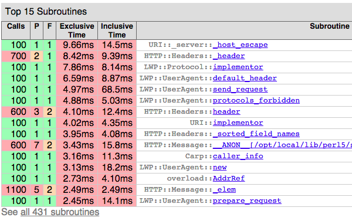
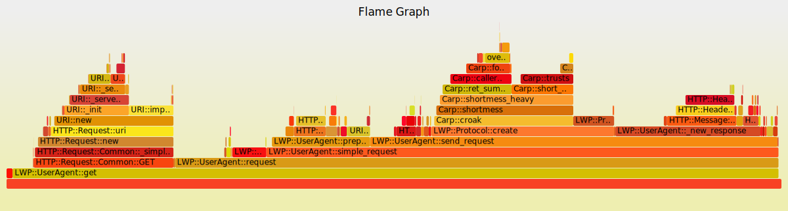
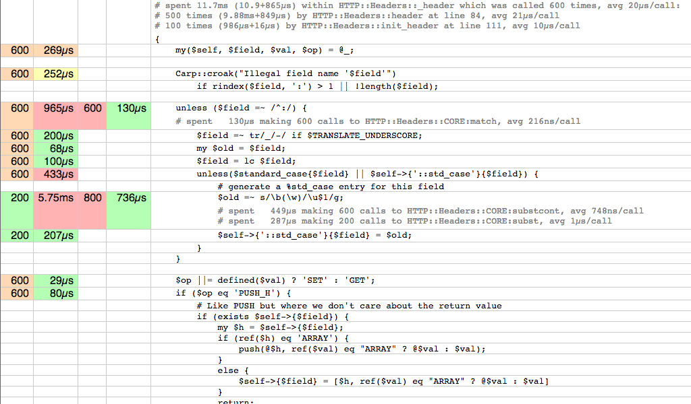

class:center,middle

# Программирование на Perl
Лекция 12

---
class:center,middle

# Профилирование и анализ<br/>производительности кода 


---
class:center,middle

# Последняя! :)

---

layout:false
# Содержание
.small[
- Профилирование
- Бенчмарки
- Поиск утечек в Pure Perl
- Поиск утечек в XS
]

---

> ***Профилирование*** — сбор характеристик работы программы, таких как время выполнения отдельных фрагментов или потребления иных ресурсов

---

# CPU time vs real time (wallclock)

## cpu time
* низкое разрешение (0.01s)
* нет влияния от загрузки системы
* не включает время io

## real time
* высокое разрешение (µs, ns)
* влияние от загрузки системы
* включает время io

---
layout:true

# time (unix tool)

---

```
$ time perl -MLWP::UserAgent -E \
'LWP::UserAgent->new->get("https://mail.ru/");'
```

```
real    0m0.056s
user    0m0.043s
sys     0m0.008s
```

0.056s / request?

---

```
$ time perl -MLWP::UserAgent -E \
'LWP::UserAgent->new->get("https://mail.ru/")
 for 1..100;'
```

```
real    0m0.164s
user    0m0.104s
sys     0m0.022s
```

0.164s/100 = 0.016s/request?

---
layout:true
# Devel::NYTProf

---

### New York Times Profiler
```
$ perl `-d:NYTProf` -MLWP::UserAgent -E \
'LWP::UserAgent->new->get("https://mail.ru/")
 for 1..100;'

$ ls -la *out
-rw-r--r-- 1   mons staff 314206   nytprof.out

$ `nytprofhtml`

$ ls -lad nytprof
drwxr-xr-x 200 mons staff 6800     nytprof
```

---

.img[

]

---

.center[
#Inclusive time vs Exclusive time
]

.img[

]

---

```
$ `NYTPROF=start=init` \
  perl -d:NYTProf -MLWP::UserAgent -E \
 'LWP::UserAgent->new->get("https://mail.ru/")
 for 1..100;'

$ nytprofhtml
```

---
.img[

]

---

```
$ `NYTPROF=start=no` \
  perl -d:NYTProf -MLWP::UserAgent -E \
 'my $ua = LWP::UserAgent->new;
  `DB::enable_profile();`
  $ua->get("https://mail.ru/") for 1..100;
  `DB::disable_profile();`'

$ nytprofhtml
```

---
.img[

]

---

.img[

]

---
.img[

]

---

```
spent 11.7ms (10.9+865µs) within
    HTTP::Headers::_header which was called
    600 times, avg 20µs/call:

    500 times (9.88ms+849µs)
        by HTTP::Headers::header at line 84,
        avg 21µs/call
    100 times (986µs+16µs)
        by HTTP::Headers::init_header at line 111,
        avg 10µs/call
```

---

```
unless ($field =~ /^:/) {
    # spent   130µs making 600 calls to
    HTTP::Headers::CORE:match, avg 216ns/call
```

```
$old =~ s/\b(\w)/\u$1/g;
    # spent   449µs making 600 calls to
        HTTP::Headers::CORE:substcont,
        avg 748ns/call
    # spent   287µs making 200 calls to
        HTTP::Headers::CORE:subst,
        avg 1µs/call
```

---
layout:false

>Первое правило оптимизации программ:
# Не делайте этого

>Второе правило оптимизации программ<br/>
>(только для экспертов):
# Не делайте этого пока
.align-right[Michael A. Jackson]

---

## Как профилировать правильно

1. Даём репрезентативную нагрузку
2. Смотрим общее время функций
3. Время выглядит адекватно?
4. Исследуем самые медленные
5. Исправляем простые проблемы
6. Профилируем заново
7. Производительность хорошая? СТОП!
8. Повторите 1-2 раза
9. Переходите к другим улучшениям
.align-right[Tim Bunce]

---

```perl
my $str = "x"x1024;

sub func1 {
    my $s = $str;
    substr($s,0,10,"");
}

sub func2 {
    my $s = $str;
    $s = substr($s,10);
}

```

---

# use Benchmark;

```perl
use Benchmark qw(:all);

timethis(1e6,\&func1);
timethis(-1,\&func1);
```

```
timethis 1000000:  0 wallclock secs
    ( 0.20 usr +  0.01 sys =  0.21 CPU)
        @ 4761904.76/s (n=1000000)
(warning: too few iterations for a reliable count)

timethis for 1:  1 wallclock secs
    ( 1.02 usr +  0.00 sys =  1.02 CPU)
        @ 4665608.82/s (n=4758921)
```

---

```perl
use Benchmark qw(:all);

timethese -1, {
    inplace => \&func1,
    copy    => \&func2,
};
```

```
Benchmark: running copy, inplace for
    at least 1 CPU seconds...
copy:  2 wallclock secs
    ( 1.00 usr +  0.02 sys =  1.02 CPU)
        @ 4151600.98/s (n=4234633)
inplace:  1 wallclock secs
    ( 1.09 usr +  0.01 sys =  1.10 CPU)
        @ 4549606.36/s (n=5004567)
```
---

```perl
cmpthese timethese -1, {
    inplace => \&func1,
    copy    => \&func2,
};
```

```
Benchmark: running copy, inplace for
    at least 1 CPU seconds...
copy:  2 wallclock secs
    ( 1.07 usr +  0.00 sys =  1.07 CPU)
        @ 3957600.93/s (n=4234633)
inplace:  1 wallclock secs
    ( 1.07 usr +  0.00 sys =  1.07 CPU)
        @ 4777389.72/s (n=5111807)
*             Rate    copy inplace
*copy    3957601/s      --    -17%
*inplace 4777390/s     21%      --
```

---

```perl
use Dumbbench;
my $bench = Dumbbench->new(
    target_rel_precision => 0.005,
    initial_runs         => 50,
);
$bench->add_instances(
    Dumbbench::Instance::PerlSub
      ->new(name => 'inplace', code => \&func1), 
    Dumbbench::Instance::PerlSub
      ->new(name => 'copy', code => \&func2), 
);
$bench->run();
$bench->report();
```

```
inplace: Ran 93 iterations (26 outliers).
inplace: Rounded run time per iteration:
    1.5462e-07 +/- 3.4e-10 (0.2%)
copy: Ran 56 iterations (6 outliers).
copy: Rounded run time per iteration:
    4.0881e-07 +/- 6.0e-10 (0.1%)
```

---

# /dev/hands

```perl
use List::Util qw(sum); my $N = 4e6;
my $cpu = sum((times)[0,1]);

func1() for 1..$N;

my $cpu1 = sum((times)[0,1]);
printf "%0.3fs CPU, %0.1fns/call\n",
$cpu1-$cpu, (1e9/$N)*($cpu1-$cpu);

func2() for 1..$N;

my $cpu2 = sum((times)[0,1]);
printf "%0.3fs CPU, %0.1fns/call\n",
$cpu2-$cpu1, (1e9/$N)*($cpu2-$cpu1);
```

```
1.320s CPU, 330.0ns/call
1.460s CPU, 365.0ns/call
```

---
class: center, middle
# Оптимизация: <br>Простые локальные изменения

---

# Вынести постоянные выражения за пределы цикла

```perl
for (...) {
    my $a = 123;
    call_sub($a);
}
```

```perl
my $a = 123;
for (...) {
    call_sub($a);
}
```

---

# Избегать повторения цепочек аксессоров

```perl
Avoid->repeated()->chains()->of->accessors();
Avoid->repeated()->chains()->of->accessors();
Avoid->repeated()->chains()->of->accessors();
```

```perl
my $one = Avoid->repeated()->chains()->of;
$one->accessors();
$one->accessors();
$one->accessors();
```

---

# Не вызывайте лишнего

```perl
use constant DEBUG => 0;
my $unused = $self->get_something;
my $do_log = $logger->logging;

for (...) {
    $logger->log(...) if $do_log;
    do_debug(...) if DEBUG;
    ...
}
```

---

# Выходите раньше, инициализируйте позже

```perl
sub {
    return unless @_;
    return 1 if @_ == 1;
    for (@_) { ... }
    ...
}

sub {
    if () { ... }
    elsif () { ... }
    else {
        return;
    }
}
```

---

# Избегайте ненужных проверок

```perl
- return exists $hash{$something}{$key}
-             ? $hash{$something}{$key}
-             : undef

+ return $hash{$something}{$key}
```

---

# Используйте аргументы без распаковки в очень "горячих" функциях

```perl

sub add ($$) {
    return $_[0] + $_[1]
}

```

---

# Внести цикл под вызов

```perl
$object->walk($_) for @dogs;

$object->walk_that(\@dogs);

```


---

class: center, middle
# Оптимизация: <br>значительные изменения

---

# Выбрать более быстрый модуль

# http://neilb.org/reviews/

---

# Обновить perl

* Сборка без тредов дает до +30%
* Сборка без отладки дает до +5%
* 5.10 -> 5.16 может дать до +15%
* 5.16 -> 5.20 может дать до +20%

---

# Оптимизация алгоритмов

O(n²) -> O(n log n) -> O(n) -> O(log n) -> O(1)

---

# Переписывание "горячих" участков на XS

---
class:center,middle

# Ресурс №2: память

---

# Классическая утечка: циклическая ссылка

```perl
my $x;$x = \$x; # << selfref

my $h = {};
$h->{key} = $h; # << cyclic ref

my $s;$s = sub {
    $s->(); # << ref by closure
};
```

---

# use Devel::Leak;

```perl
use Devel::Leak;
Devel::Leak::NoteSV($handle);

my $x;$x = \$x;
my $h = {};$h->{key} = $h;
my $s;$s = sub {$s->();};

Devel::Leak::CheckSV($handle);
```

---

# use Devel::Leak;

```
new 0x7fc84b021b28 : 
new 0x7fc84b021b40 : 
new 0x7fc84b021b58 : 
new 0x7fc84b021b70 : 
new 0x7fc84b021c00 : 
new 0x7fc84b021c18 : 
new 0x7fc84b004ce8 : 
new 0x7fc84b004ec8 : 
```

---

# perl built with -DDEBUGGING

```
new 0x2410de8 : SV = PVHV(0x2416e40) at 0x2410de8
  REFCNT = 2
  FLAGS = (SHAREKEYS)
  ARRAY = 0x24aa640  (0:7, 1:1)
  hash quality = 100.0%
  KEYS = 1
  FILL = 1
  MAX = 7
  RITER = -1
  EITER = 0x0
new 0x2410f68 : SV = IV(0x2410f58) at 0x2410f68
  REFCNT = 1
  FLAGS = (ROK)
  RV = 0x2410de8
    SV = PVHV(0x2416e40) at 0x2410de8
      REFCNT = 2
      FLAGS = (SHAREKEYS)
      ARRAY = 0x24aa640  (0:7, 1:1)
```

---

# XS version

```
int checkpoint = PL_sv_count;

/* ...some leaky code... */

printf("leaked by %d SV's",
    PL_sv_count - checkpoint);
```

---

# /dev/hands

```
/proc/[pid]/statm
  Provides information about memory usage.

  size   total program size
         (same as VmSize in /proc/[pid]/status)
  resident   resident set size
         (same as VmRSS in /proc/[pid]/status)
  share  shared pages (from shared mappings)
  text   text (code)
  lib    library (unused in Linux 2.6)
  data   data + stack
  dt     dirty pages (unused in Linux 2.6)
```

---

# /dev/hands

```perl
use POSIX qw( _SC_PAGESIZE sysconf );
my $PG = sysconf(_SC_PAGESIZE);
sub mem () {
    open my $f,'<:raw','/proc/self/statm';
    my ($all,$rss,$shr,$txt,$lib,$data) =
    map $_*$PG, split /\s+/, scalar <$f>;
    return $data;
}

my $before = mem();
for (1..1e5) {
    my %h;$h{key} = \%h;
}
my $after = mem();
printf "Lost %0.1fM\n",
    ($after-$before)/1024/1024;
```

```
Lost 17.7M
```

---
layout:true

# Manual catch in XS

---

```
void test(SV *var)
PPCODE:
    SV *leaky = newSVpvs("dummy");
    XSRETURN_UNDEF;
```

```perl
use Devel::Leak;
Devel::Leak::NoteSV(my $chk);
LeakTest::test($smth);
Devel::Leak::CheckSV($chk);
```

```
new 0x1496a68 : 
```

---

```
void test(SV *var)
PPCODE:
    SV *leaky = newSVpvs("dummy");
*   printf("var = %p\n",var);
*   SV * ghost = (SV *) ( (char *)var + 0 );
*   sv_dump( ghost );
    XSRETURN_UNDEF;
```

```
var = `0x2075c38`
SV = NULL(0x0) at `0x2075c38`
  REFCNT = 1
  FLAGS = (PADMY)
new `0x2058a68` : 
```

```
0x2058a68 - 0x2075c38 = -119248
```

---

```
void test(SV *var)
PPCODE:
    SV *leaky = newSVpvs("dummy");
    printf("var = %p\n",var);
    SV * ghost = (SV *) ( (char *)var - `119248` );
    sv_dump( ghost );
    XSRETURN_UNDEF;
```

```
var = 0x20f2c38
SV = PV(0x20d3cf0) at `0x20d5a68`
  REFCNT = 1
  FLAGS = (POK,pPOK)
  PV = 0x21ab7a0 "dummy"\0
  CUR = 5
  LEN = 16
new `0x20d5a68` : 
```

---

```
void test(SV *var)
PPCODE:
    SV *leaky = sv_2mortal(newSVpvs("dummy"));
    printf("var = %p\n",var);
    SV * ghost = (SV *) ( (char *)var - `119248` );
    sv_dump( ghost );
    XSRETURN_UNDEF;
```

```
var = 0x20f2c38
SV = PV(0x20d3cf0) at `0x20d5a68`
  REFCNT = 1
  FLAGS = (POK,pPOK)
  PV = 0x21ab7a0 "dummy"\0
  CUR = 5
  LEN = 16
```

---

layout: false

# Self-referenced closure

```perl
my $cb; $cb = sub {
    something_async sub {
        $cb->();
    };
};
$cb->();
```

---
layout: false

# Not very self-referenced closure

```perl
use Scalar::Util qw(weaken);
my $cb; $cb = sub {
    my $cb = $cb or return;
    something_async sub {
        $cb->();
    };
};
$cb->(); # initial call
# or $cb->() for 1..$N
weaken($cb);
```

---

# Destruction tracking

```perl
use Guard;
{
    my %struct;
    # ...
    $struct{__tmp} = guard {
        warn "Object destroyed";
    }
}
```

```
Object destroyed at - line 6.
```
---

# Destruction tracking

```perl
use Guard;
{
    my %struct;
    # ...
    $struct{__} = \%struct;
    $struct{__tmp} = guard {
        warn "Object destroyed";
    }
}
```

```
Object destroyed at - line 7 `during global destruction`.
```

---

[Debugging-Perl-Memory-Usage](http://perldoc.perl.org/perldebguts.html#Debugging-Perl-Memory-Usage)

```
  $ PERL_DEBUG_MSTATS=2 perl -e "require Carp"
  Memory allocation statistics after compilation: (buckets 4(4)..8188(8192)
     14216 free:   130   117    28     7     9   0   2     2   1 0 0
        437    61    36     0     5
     60924 used:   125   137   161    55     7   8   6    16   2 0 1
         74   109   304    84    20
  Total sbrk(): 77824/21:119. Odd ends: pad+heads+chain+tail: 0+636+0+2048.
  Memory allocation statistics after execution:   (buckets 4(4)..8188(8192)
     30888 free:   245    78    85    13     6   2   1     3   2 0 1
        315   162    39    42    11
    175816 used:   265   176  1112   111    26  22  11    27   2 1 1
        196   178  1066   798    39
  Total sbrk(): 215040/47:145. Odd ends: pad+heads+chain+tail: 0+2192+0+6144.
```

---

```
use Devel::Gladiator qw(arena_table);
say arena_table();
```

```
ARENA COUNTS:
 1471 SCALAR
  237 GLOB
  184 ARRAY
  114 CODE
   75 HASH
   27 REF
   21 REF-ARRAY
   15 REGEXP
    5 LVALUE
    4 IO::File
    4 REF-version
    4 version
    2 FORMAT
    2 REF-HASH
```

---
class: center, middle
layout: false

# Ресурс №3: дескрипторы

---

# /dev/hands

```perl
open my $f,'<:raw', '/dev/null';
my $before = fileno($f);
close ($f);

# ...leaky code ...

open my $f,'<:raw', '/dev/null';
my $after = fileno($f);
close ($f);

printf "Leaked by %d descriptors\n",
    $after - $before;
```

```perl 
# perlvar: $SYSTEM_FD_MAX
my $before = $^F;
# ...leaky code ...
my $after = $^F;
```

---
layout: false

# Resources

* Devel::NYTProf
* Benchmark, Bench
* Dumbbench
* Devel::Leak, Devel::Leak::Object
* Devel::Size, Devel::SizeMe
* DashProfiler
* Dash::Leak
* Devel::Gladiator, Devel::Arena
* Guard

---
class: center, middle
layout: false

# \_\_END\_\_

---
class: center, middle
layout: false

# +5 каждому )