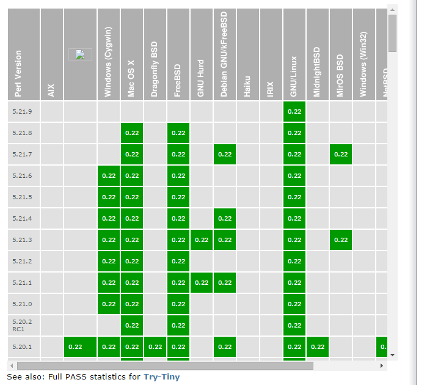

class: firstpage

# Модульность и повторное использование

---

# Как разбить по файлам?

```
1234
1235 sub deployed_sources
1236 {
1237   my ($self) = @_;
1238
1239   my $deploy_opts = $self->deploy_opts;
1240
1241   return $deploy_opts->{sources}
1242     if exists $deploy_opts->{sources};
1243   return $deploy_opts->{parser_args}->{sources}
1244     if exists $deploy_opts->{args}->{sources};
1245
1246   return [ $self->schema->sources ];
1247 }
1248
```

---

# eval

```perl
my $u;

eval '
  $u = 5;
  my $y = 10;
  sub m_3 {
    my ($x) = @_;
    return $x * 3;
  }
';

$u; # 5
$y; # Undefined
m_3(2); # 6
```

---

# do

```perl
do 'sqr.pl';
```

```perl
# sqr.pl
$u = 5;
my $y = 10;
sub m_3 {
  my ($x) = @_;
  return $x * 3;
}
```

```perl
$u; # 5
$y; # Undefined
m_3(2); # 6
```

---

# require

```perl
require 'sqr.pl';
require Local::Sqr; # Local/Sqr.pm
```

```perl
# Local/Sqr.pm
$u = 5;
my $y = 10;
sub m_3 {
  my ($x) = @_;
  return $x * 3;
}

1; # return value!
```

```perl
$u; # 5
$y; # Undefined
m_3(2); # 6
```

---

# Файл модуля

```perl
require Module; # Module.pm
require Module::My; # Module/My.pm
```

---

# Поиск модулей

```
perl -e 'print join "\n", @INC'
/etc/perl
/usr/local/lib/perl/5.14.2
/usr/local/share/perl/5.14.2
/usr/lib/perl5
/usr/share/perl5
/usr/lib/perl/5.14
/usr/share/perl/5.14
/usr/local/lib/site_perl
```

```
$ PERL5LIB=/tmp/lib perl ...
$ perl -I /tmp/lib ...
```

---

# BEGIN

.not[
```perl
BEGIN {
  require Some::Module;
}

sub test1 {
  return 'test1';

* sub test2 {
*   return 'test2';
*
*   BEGIN {...}
* }
}
```
]

---

# END

```perl
open(my $fh, '>', $file);

while (1) {
  # ...
}

END {
  close($fh);
  unlink($file);
}
```

---

# Другие блоки

```perl
CHECK {}
UNITCHECK {}
INIT {}

${^GLOBAL_PHASE}
```

---

# use Module;

```perl
use My_module;     # My_module.pm
use Data::Dumper;  # Data/Dumper.pm
BEGIN { push(@INC, '/tmp/lib'); }
use Local::Module; # Local/Module.pm
```

```perl
sub sqr {
  my ($number) = @_;

  return $number ** 2;
}

my $load_time = time();

1; # return value!
```

---

# Как разбить по файлам? (Итого)

```perl
eval 'code';

do 'file';

require 'file';
require Module::Name;

use Module::Name;
```

---

# Пространства имен?

```perl
require Some::Module;
function(); # ?

require Another::Module;
another_function(); # ??

require Another::Module2;
another_function(); # again!?
```

```perl
require Some::Module;
Some::Module::function();

require Another::Module;
Another::Module::another_function();

require Another::Module2;
Another::Module2::another_function(); # np!
```

---

# package

```perl
package Local::Multiplier;

sub m2 {
  my ($x) = @_;
  return $x * 2;
}

sub m3 {
  my ($x) = @_;
  return $x * 3;
}
```

```perl
use Local::Multiplier;

print Local::Multiplier::m3(8); # 24
```

---

# package — inline

```perl
{
  package Multiplier;
  sub m_4 { return shift() * 4 }
}

print Multiplier::m_4(8); # 32
```

---

# our

```perl
{
  package Some;
  my $x = 1;
  our $y = 2; # $Some::y;

  our @array = qw(foo bar baz);
}

print $Some::x; # ''
print $Some::y; # '2'

print join(' ', @Some::array); # 'foo bar baz'
```

---

# my, state

```perl
my $x = 4;
{
  my $x = 5;
  print $x; # 5
}
print $x; # 4
```

```perl
use feature 'state';

sub test {
  state $x = 42;
  return $x++;
}

printf(
  '%d %d %d %d %d',
  test(), test(), test(), test(), test()
); # 42 43 44 45 46
```

---

# main package

```perl
our $size = 42;

sub print_size {
  print $main::size;
}

package Some;
main::print_size(); # 42
```

---

# `__PACKAGE__`

```perl
package Some::Module::Lala;

print __PACKAGE__; # Some::Module::Lala
```

---

# package VS module

```perl
require 'Some/Module.pm';
require Some::Module;
```

```perl
package Some::Module;
```

```perl
# :-O :-(

use Some::Module;
Some::Another::Module::function(); # surprise!
```

---

# Пространства имен? (Итого)

```
Local/MusicLibrary/Table.pm
```

```
use Local::MusicLibrary::Table;
```

```
package Local::MusicLibrary::Table;
```

---

# Импорт?

``` perl
use Net::FaceBook::Feed::Post;

Net::FaceBook::Feed::Post::download('...');
```

```perl
use Net::FaceBook::Feed::Post 'download';

download('...');
```

```cpp
using namespace std;
cout << endl;
```

```python
from facebook.feed.post import download
download('...')
```

---

# use Module LIST;

```perl
use Local::Module ('param1', 'param2');
use Another::Module qw(param1 param2);
```

```perl
BEGIN {
  require Module;
  Module->import(LIST);
  # ~ Module::import('Module', LIST);
}
```

```perl
use Module ();
# BEGIN { require Module; }
```
---

# Пример

```perl
package My::Package;

use File::Path qw(make_path remove_tree);

# File::Path::make_path
make_path('foo/bar/baz', '/zug/zwang');
File::Path::make_path('...');
My::Package::make_path('...');

# File::Path::remove_tree
remove_tree('foo/bar/baz', '/zug/zwang');
File::Path::remove_tree('...');
My::Package::remove_tree('...');
```

---

# Exporter

```perl
package Local::Multiplier;

use Exporter 'import';
our @EXPORT = qw(m2 m3 m4 m5 m6);

sub m2 { shift() ** 2 }
sub m3 { shift() ** 3 }
sub m4 { shift() ** 4 }
sub m5 { shift() ** 5 }
sub m6 { shift() ** 6 }
```

```perl
use Local::Multiplier;

print m3(5); # 125
print Local::Multiplier::m3(5); # 125
```

---

# Exporter — EXPORT_OK

```perl
package Local::Multiplier;

use Exporter 'import';
our @EXPORT_OK = qw(m2 m3 m4 m5 m6);

sub m2 { shift() ** 2 }
sub m3 { shift() ** 3 }
sub m4 { shift() ** 4 }
sub m5 { shift() ** 5 }
sub m6 { shift() ** 6 }
```

```perl
use Local::Multiplier qw(m3);

print m3(5); # 125
print Local::Multiplier::m4(5); # 625
```

---

# %EXPORT_TAGS

```perl
our %EXPORT_TAGS = (
  odd  => [qw(m3 m5)],
  even => [qw(m2 m4 m6)],
  all  => [qw(m2 m3 m4 m5 m6)],
);
```

```perl
use Local::Multiplier qw(:odd);

print m3(5);
```

---

# import()

* Не зарезервированное слово
* Не обязан экспортировать функции пакета
* Не обязан экспортировать в принципе

```
$ perl -e 'Lol->import();'
$ perl -e 'Lol->method();'
Can't locate object method "method" via package "Lol"
(perhaps you forgot to load "Lol"?) at -e line 1.
```

---

# Импорт? (Итого)

```perl
use Some::Module qw(some_function);
some_function('...');
```

```perl
package Some::Module;
use Exporter 'import';
our @EXPORT = qw(some_function);

sub some_function {}
```

---

# Контроль версий?

```
$ perl -we 'use File::Path qw(make_path);'
"make_path" is not exported by the File::Path module
Can't continue after import errors at -e line 1.
BEGIN failed--compilation aborted at -e line 1.
```

```perl
use File::Path 2.00 qw(make_path);
```

---

# use Module VERSION;

```perl
package Local::Module;

our $VERSION = 1.4;
```

```perl
use Local::Module 1.5;
```

```
$ perl -e 'use Data::Dumper 500'
Data::Dumper version 500 required--
this is only version 2.130_02 at -e line 1.
BEGIN failed--compilation aborted at -e line 1.
```

---

# sub VERSION

```perl
use Local::Module 500;
# Local::Module->VERSION(500);
# ~ Local::Module::VERSION('Local::Module', 500);
```

```perl
package Local::Module;

sub VERSION {
  my ($package, $version) = @_;

  # ...
}
```

---

# v-strings

```perl
use Local::Module v5.11.133;
```

```
v102.111.111; # 'foo'
102.111.111;  # 'foo'
v1.5;
```

---

# use VERSION;

```perl
use 5.12.1;
use 5.012_001;

$^V # v5.12.1
$]  # 5.012001
```

---

# Контроль версий? (Итого)

```perl
use Module v1.1.1;
use 5.10;
```

---

# Pragmatic modules

```perl
use strict;
use warnings;
```

---

# use strict 'refs';

```perl
use strict 'refs';

$ref = \$foo;
print $$ref;  # ok
$ref = "foo";
print $$ref;  # runtime error; normally ok
```

---

# use strict 'vars';

```perl
use strict 'vars';

$Module::a;
my  $x = 4;
our $y = 5;
```

---

# use strict 'subs';

```perl
use strict 'subs';
```

```perl
print Dumper [test]; # 'test'
```

```perl
sub test {
  return 'str';
}
print Dumper [test]; # 'str'
```

---

# use warnings

```perl
use warings;
use warnings 'deprecated';
```

```
$ perl -e 'use warnings; print(5+"a")'
Argument "a" isn't numeric in addition (+) at -e line 1.
```

```
$ perl -we 'print(5+"a")'
Argument "a" isn't numeric in addition (+) at -e line 1.
```

---

# use diagnostics;

```perl
use diagnostics;
```

```
$ perl -e 'use diagnostics; print(5+"a")'
Argument "a" isn't numeric in addition (+) at -e line 1 (#1)
    (W numeric) The indicated string was fed as an argument to an operator
    that expected a numeric value instead.  If you're fortunate the message
    will identify which operator was so unfortunate.
```

---

# use lib;

```perl
use lib qw(/tmp/lib);

BEGIN { unshift(@INC, '/tmp/lib') }
```

---

# FindBin

```perl
use FindBin '$Bin';
use lib "$Bin/../lib";
```

---

# use feautre;

```perl
use feature qw(say);

say 'New line follows this';
```

---

# use bignum;

```perl
use bignum;
use bigint;
use bigrat;
```

```
$ perl -E 'use bigint; say 500**50'
888178419700125232338905334472656250000000000000000000000000000000000000000000000000000000000000000000000000000000000000000000000000000

$ perl -E 'say 500**50'
8.88178419700125e+134
```

---

# Pragmatic modules (Итого)

```perl
package Some::Module;

use strict;
use warnings;

1;
```

---

# no

```perl
no Local::Module LIST;

# Local::Module->unimport(LIST);
```

```perl
no 5.010;
```

```perl
no strict;
no feature;
```

---

# Как работает экспорт?

* Как копируются функции?
* Как `Exporter` узнает, куда их копировать?

---

# Symbol Tables

```perl
{
  package Some::Package;
  our $var = 500;
  our @var = (1,2,3);
  our %func = (1 => 2, 3 => 4);
  sub func { return 400 }
}


use Data::Dumper;
print Dumper \%Some::Package::;
```

```perl
$VAR1 = {
          'var' => *Some::Package::var,
          'func' => *Some::Package::func
        };
```


---

# Typeglob

```sh
                       +------> SCALAR - $bar
                       |
                       +------> ARRAY  - @bar
                       |
                       +------> HASH   - %bar
                       |
Foo:: -----> bar  -----+------> CODE   - &bar
                       |
                       +------> IO     - bar (FH)
                       |
                       +------> GLOB   - *bar
```

---

# Typeglob — операции

```perl
 *Some::Package::foo = *Some::Package::var;

 *Some::Package::foo = \$bar;
 *Some::Package::foo = \@bar;

 *Some::Package::func = sub { ... }
 *Some::Package::func = \&Another::Package::func;
```

---

# caller()

```perl
# 0         1          2
($package, $filename, $line) = caller();
```

```perl
(
	$package,    $filename,   $line,
	$subroutine, $hasargs,    $wantarray,
	$evaltext,   $is_require, $hints,
	$bitmask,    $hinthash
) = caller($i);
```

---

# Как работает экспорт? (Итого)

* Как копируются функции? — Таблица символов.
* Как `Exporter` узнает, куда их копировать? — `caller()`

---

# local

```perl
{
  package Test;
  our $x = 123;

  sub bark { print $x }
}

Test::bark(); # 123
{
  local $Test::x = 321;
  Test::bark(); # 321
}
Test::bark(); # 123
```

---

# local — варианты

```perl
# localization of values
local $foo;
local (@wid, %get);
local $foo = "flurp";
local @oof = @bar;
local $hash{key} = "val";
delete local $hash{key};
local ($cond ? $v1 : $v2);

# localization of symbols
local *FH;
local *merlyn = *randal;

local *merlyn = 'randal';
local *merlyn = \$randal;
```

---

# CPAN

The Comprehensive Perl Archive Network

http://cpan.org


---

# Metacpan

http://metacpan.org


---

# Установка из пакета в Debian

```sh
$ apt-cache search libjson-perl
libjson-perl - module for manipulating
  JSON-formatted data
libjson-pp-perl - module for manipulating
  JSON-formatted data (Pure Perl)
libjson-xs-perl - module for manipulating
  JSON-formatted data (C/XS-accelerated)

# apt-get install libjson-perl
```

---

# Установка из пакета в CentOS

```sh
$ yum search perl-json
======================== Matched: perl-json ========================
perl-JSON-XS.x86_64 : JSON serialising/deserialising,
  done correctly and fast
perl-JSON.noarch : Parse and convert to JSON
  (JavaScript Object Notation)
perl-JSON-PP.noarch : JSON::XS compatible pure-Perl module

$ yum install perl-JSON-XS
```

---

# Утилита cpan

```sh
$ cpan
Terminal does not support AddHistory.

cpan shell -- CPAN exploration and modules installation (v1.960001)
Enter 'h' for help.
```

```sh
$ cpan install JSON
```

```sh
perl -MCPAN -e shell
```

---

# Утилита cpanm

```sh
curl -L https://cpanmin.us | \
    perl - --sudo App::cpanminus
```

```sh
cpanm Data::Printer
cpanm MIYAGAWA/Plack-0.99_05.tar.gz
cpanm ~/dists/MyCompany-Enterprise-1.00.tar.gz
```

---

# cpantesters



---

# module-starter

```sh
module-starter --module Local::PerlCourse
  --author Vadim --email vadim@pushtaev.ru
```

```sh
$ tree Local-PerlCourse/
Local-PerlCourse/
├── Changes
├── ignore.txt
├── lib
│   └── Local
│       └── PerlCourse.pm
├── Makefile.PL
├── MANIFEST
├── README
└── t
    ├── 00-load.t
    ├── boilerplate.t
    ├── manifest.t
    ├── pod-coverage.t
    └── pod.t
```

---

# ExtUtils::MakeMaker

```sh
use 5.006;
use strict;
use warnings;
use ExtUtils::MakeMaker;

WriteMakefile(
    NAME                => 'Local::PerlCourse',
    AUTHOR              => q{Vadim <vadim@pushtaev.rut>},
    VERSION_FROM        => 'lib/Local/PerlCourse.pm',
    ABSTRACT_FROM       => 'lib/Local/PerlCourse.pm',
    ($ExtUtils::MakeMaker::VERSION >= 6.3002
      ? ('LICENSE'=> 'perl')
      : ()),
    PL_FILES            => {},
    PREREQ_PM => {
        'Test::More' => 0,
    },
    dist                => { COMPRESS => 'gzip -9f', SUFFIX => 'gz', },
    clean               => { FILES => 'Local-PerlCourse-*' },
);
```

---

# Module::Install

```perl
  use inc::Module::Install;

  # Define metadata
  name           'Your-Module';
  all_from       'lib/Your/Module.pm';

  # Specific dependencies
  requires       'File::Spec'  => '0.80';
  test_requires  'Test::More'  => '0.42';
  recommends     'Text::CSV_XS'=> '0.50';
  no_index       'directory'   => 'demos';
  install_script 'myscript';

  WriteAll;
```

---

# Module::Build

```perl
use Module::Build;
my $build = Module::Build->new(
  module_name => 'Foo::Bar',
  license  => 'perl',
  requires => {
    'perl'          => '5.6.1',
    'Some::Module'  => '1.23',
    'Other::Module' => '>= 1.2, != 1.5, < 2.0',
  },
);
$build->create_build_script;
```

```sh
  perl Build.PL
  ./Build
  ./Build test
  ./Build install
```

---

# ДЗ 3.1

*Упражнение, баллов не дает*

`homeworks/getset`

```perl
package Local::SomePackage;

use Local::GetterSetter qw(x y);
# scalar only

set_x(50);
$Local::SomePackage::x; # 50

our $y = 42;
get_y(); # 42
set_y(11);
get_y(); # 11
```

---

# ДЗ 3.2

*8 баллов*

`homeworks/music_library`

```
./Midas Fall/2015 - The Menagerie Inside/Low.ogg
./Midas Fall/2015 - The Menagerie Inside/Holes.ogg
./Midas Fall/2015 - The Menagerie Inside/Push.ogg
```

```
/--------------------------\
| Midas Fall |   Low | ogg |
|------------+-------+-----|
| Midas Fall | Holes | ogg |
|------------+-------+-----|
| Midas Fall |  Push | ogg |
\--------------------------/
```
