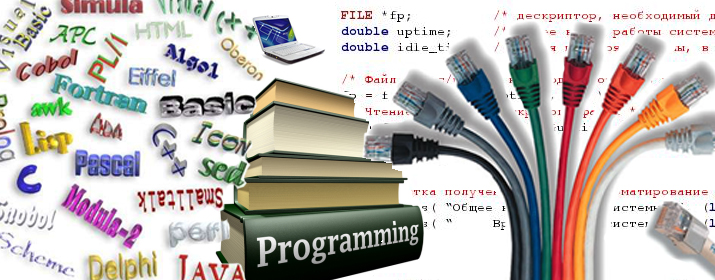

# Работа в "Мой Мир"

.floatright[]

- Системная разработка

- WEB-Разработка

- Мобильная разработка

---

# Технологии и языки

- Perl, С/С++, Lua, Swift, Go

- MySQL, PgSQL, Octopus/Tarantool, Memcached

---

# Карьера

.floatright[]

- Стажер

- Разработчик

- Старший разработчик

- Руководитель отдела

- ...

---

# Путь развития

- Разработка

- Умение читать чужой код

- Хранилища и особенности их работы

- Смежные технологии/языки

- Отладка/ускорение

- Умение заглядывать вперёд

.

---

# Собеседование

- Задачи на логику

- Задачи на математику

- Построение алгоритмов

- Задачи на "поговорить"

---

# Чем надо будет заниматься

Прогрессивные направления:

- Лента

- Музыка

- Фото/Видео

- ...

# Задачи

От **"сделать кнопочку для пользователя"** 

до **"спроектировать нагруженное хранилище"**

---

.center[.normal-width[]]

.center[

Спасибо за внимание!

Николай Шуляковский

Email & Agent: n.shulyakovskiy@corp.mail.ru
]
