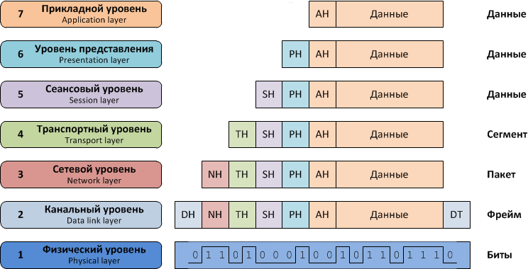
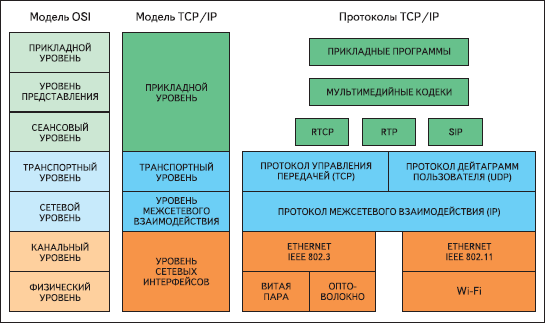
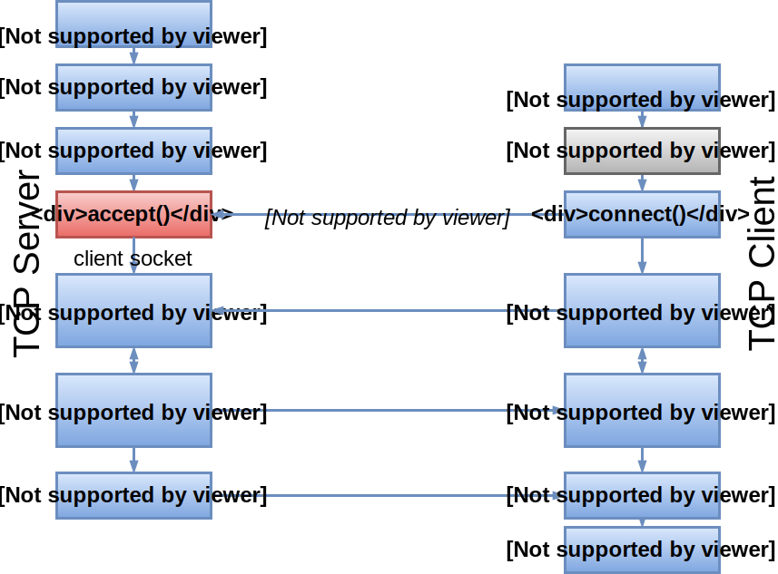
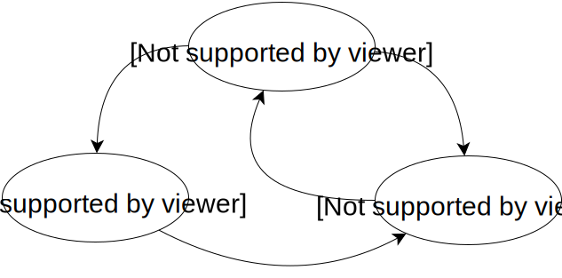
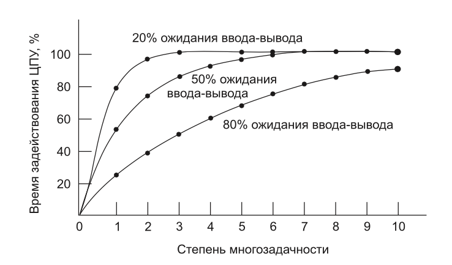
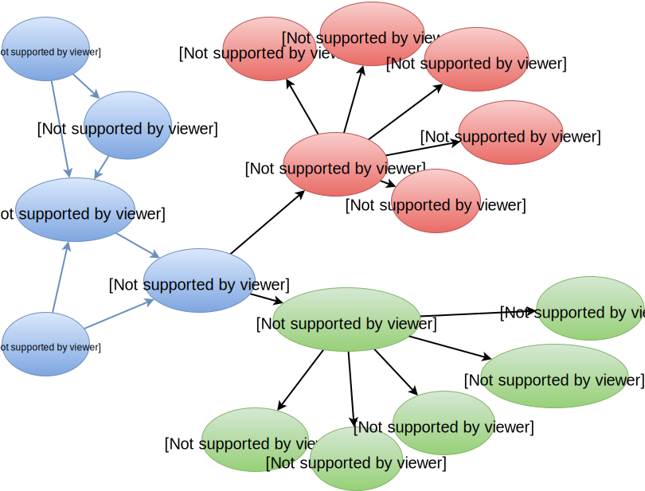
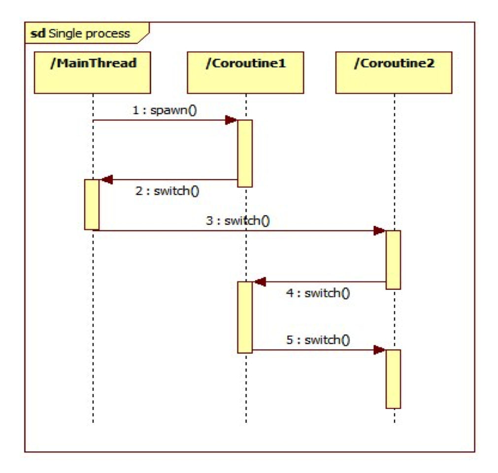
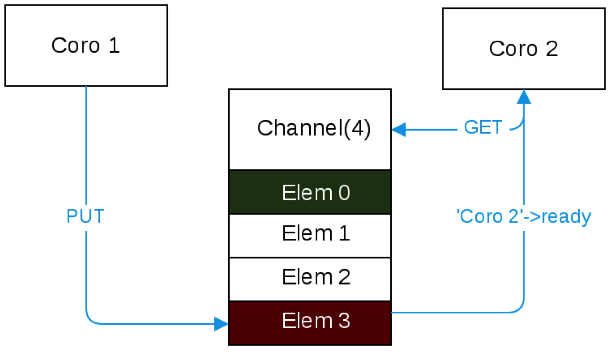
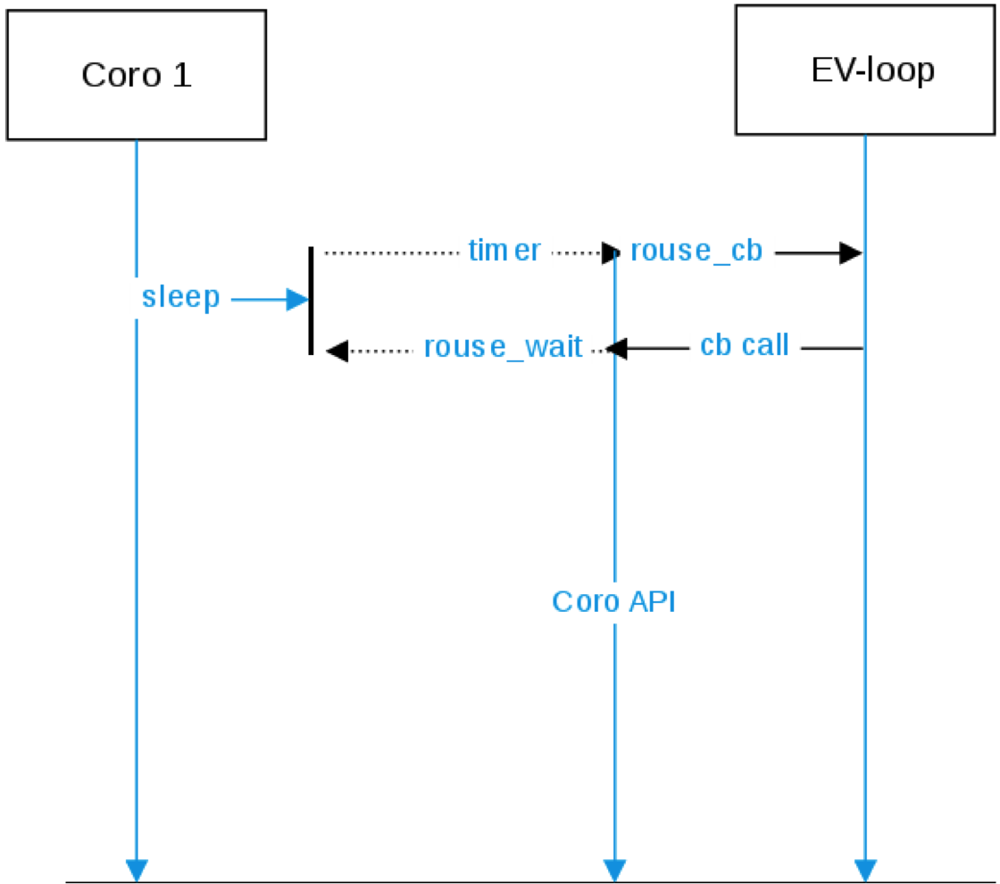

class:firstpage, title

# Программирование на Perl

## Сетевое программирование

---
class:note_and_mark title

# Отметьтесь на портале!

---
class: center, middle

# TIMTOWTDI

##There’s More Than One Way To Do It

---
layout:false

# Содержание

* Модель OSI
* TCP/IP
* TCP Server & Client
* UDP Server & Client
* Forking server
* Состояние процесса и переключение контекста
* Блокирующие операции ввода-вывода
* Event loop
* Замыкания
* AnyEvent
* Coro

---

# Модель OSI
.center[

]

---

# Модель TCP/IP

.center[

]

---

.center[
# TCP vs UDP
]

.left[
## TCP
- Устанавливает соединение
- Подтверждает доставку
- Сохраняет порядок
- Передаёт поток (STREAM)
]

.right[
## UDP
- Не устанавливает соединение
- Не подтверждает доставку
- Доставляет произвольно
- Передаёт блоки (DGRAM)
]

.center[
Оба работают поверх IP
]

.left[
- HTTP
- HTTPS
- SMTP
- POP3
- telnet
- ...
]

.right[
- DNS
- RIP
- QUIC
- Games ;)
]

---

# TCP Functions

.center[

]

---

# TCP Client

```perl
use IO::Socket;

my $socket = IO::Socket::INET->new(
    PeerAddr => 'search.cpan.org',
    PeerPort => 80,
    Proto    => "tcp",
    Type     => SOCK_STREAM,
) or die "Can't connect to search.cpan.org: $!";

print $socket 
   "GET / HTTP/1.0\nHost: search.cpan.org\n\n";

my @answer = <$socket>;
print @answer[0..9];
```

---

# TCP Client inside

.left[
```perl
use Socket ':all';
```
]
--
.right[
```c
#include <socket.h>
```
]

--

```perl
socket my $s, AF_INET, SOCK_STREAM, IPPROTO_TCP
    or die "failed to create socket: $!";
```

---

# IP Address

```perl
my $host = 'search.cpan.org';
my $ip = gethostbyname $host;
say $ip;  # ����
say length $ip; # 4
```
--
```perl
say `inet_ntoa` $ip; # 194.106.223.155
say $ip eq `inet_aton`("194.106.223.155"); # 1
```
--
```perl
say unpack "H*", $ip; # c26adf9b
say join ".", unpack "C4", $ip; # 194.106.223.155
say unpack "N", $ip; # 3261783963
```
--
```sh
$ ping 3261783963
PING 3261783963 (194.106.223.155): 56 data bytes
64 bytes from 194.106.223.155: icmp_seq=0
    ttl=50 time=58.534 ms
```

---

# TCP Client

```perl
use Socket ':all';
```
```perl
socket my $s, AF_INET, SOCK_STREAM, IPPROTO_TCP;
```

```perl
my $host = 'search.cpan.org'; my $port = 80;
my $addr = gethostbyname $host;
my $sa = sockaddr_in($port, $addr);
connect($s, $sa);
```

```perl
$s->autoflush(1);
print $s
   "GET / HTTP/1.0\nHost: search.cpan.org\n\n";

my @answer = <$s>;
print @answer[0..9];
```

---

# Autoflush

```perl
$handle->autoflush(1);
```
--
```perl
$| = 1; # STDOUT->autoflush(1);
```
--
```perl
my $old = select($sock); # STDOUT
$| = 1;                  # $sock->autoflush(1);
select($old);            # $sock
```
--
```perl
select( ( select($fh), $|++ )[0] );
        # 1. select fh
                     # 2. $|=1
                            # 3. take return
# 4. select return of 1st select back
```

---

# TCP Client: sysread/syswrite

```perl
use Socket ':all';
socket my $s, AF_INET, SOCK_STREAM, IPPROTO_TCP;
my $host = 'search.cpan.org'; my $port = 80;
my $addr = gethostbyname $host;
my $sa = sockaddr_in($port, $addr);
connect($s, $sa);
```

```perl
syswrite $s,
    "GET / HTTP/1.0\nHost: search.cpan.org\n\n"
    or die "write failed: $!";

while () {
    my $r = sysread $s, my $buf, 1024;
    if ($r) { print $buf; }
    elsif (defined $r) { last } # $r == 0
    else { die "read failed: $!" } # $r is undef
}
```

---

# TCP Client: send/recv

```perl
use Socket ':all';
socket my $s, AF_INET, SOCK_STREAM, IPPROTO_TCP;
my $host = 'search.cpan.org'; my $port = 80;
my $addr = gethostbyname $host;
my $sa = sockaddr_in($port, $addr);
connect($s, $sa);
```

```perl
send $s,
    "GET / HTTP/1.0\nHost: search.cpan.org\n\n", 0
    or die "send: $!";
while () {
    my $r = recv $s, my $buf, 1024, 0;
    if (defined $r) {
        last unless length $buf;
        print $buf;
    }
    else { die "recv failed: $!" }
}
```

---

# TCP Functions

.center[

]

---

# TCP Server

```perl
use Socket ':all';
```
--
```perl
`socket` my $s, AF_INET, SOCK_STREAM, IPPROTO_TCP;
```
--
```perl
my $port = 1234;
`bind` $s, sockaddr_in($port, `INADDR_ANY`);
```
--
```perl
`listen` $s, SOMAXCONN;
```
--
```perl
while (my $peer = `accept` my $c, $s) {
    $c->autoflush(1); # got client socket $c
    while (<$c>) { # read from client
        print {$c} $_; # send it back
    }
}
```

---

# TCP Server: SO_REUSEADDR

.not[
```sh
*bind: Address already in use
```
]

--

```perl
use Socket ':all';
socket my $s, AF_INET, SOCK_STREAM, IPPROTO_TCP;
```

```perl
`setsockopt` $s, SOL_SOCKET, `SO_REUSEADDR`, 1;
```

```perl
bind $s, sockaddr_in(1234, INADDR_ANY);
listen $s, SOMAXCONN;
...
```

---

# TCP Server: SO_REUSEPORT

.not[
```
* I know what I'm doing, I know what I'm doing
```
]

```perl
use Socket ':all';
socket my $s, AF_INET, SOCK_STREAM, IPPROTO_TCP;
```

```perl
`setsockopt` $s, SOL_SOCKET, SO_REUSE`PORT`, 1;
```

.not[
>```
* Allow multiple server instances
```
]

```perl
bind $s, sockaddr_in(1234, INADDR_ANY);
listen $s, SOMAXCONN;
...
```

---

# TCP Server: getpeername
```perl
socket my $s, AF_INET, SOCK_STREAM, IPPROTO_TCP;
bind $s, sockaddr_in(1234, INADDR_ANY);
listen $s, SOMAXCONN;

my ($port, $addr) = `sockaddr_in`(`getsockname`($s));
say "Listening on ".inet_ntoa($addr).":".$port;

while (my $peer = accept my $c, $s) {
    # got client socket $c
    # $peer = `getpeername`($c);
    my ($port, $addr) = `sockaddr_in`($peer);
    my $ip = inet_ntoa($addr);
    my $host = gethostbyaddr($addr, AF_INET);
    say "Client connected from $ip:$port ($host)";
}
```


---

# TCP Functions

.center[

]

---

# UDP Functions

.center[

]

---

# UDP Server

```perl
use Socket ':all';

`socket` my $s, AF_INET, SOCK_`DGRAM`, IPPROTO_`UDP`;
`setsockopt` $s, SOL_SOCKET, SO_REUSEADDR, 1;
`bind` $s, sockaddr_in(1234, INADDR_ANY);

my ($port, $addr) = sockaddr_in(getsockname($s));
say "Working on ".inet_ntoa($addr).":".$port;

while (my $peer = `recv`( $s, my $msg, 2048, 0 )) {
    my ($port, $addr) = sockaddr_in($peer);
    my $ip = inet_ntoa($addr);
    say "Message $msg from $ip:$port";
}
```

---

# UDP Client

```perl
use Socket ':all';

`socket` my $s, AF_INET, SOCK_`DGRAM`, IPPROTO_`UDP`;

my $host = 'localhost'; my $port = 1234;
my $addr = gethostbyname $host;
my `$sa` = sockaddr_in($port, $addr);

`send`($s, "test direct message", 0, `$sa`);
```
--
```perl
connect $s, $sa; # associate $sa with $s
send($s, "test connected message", 0);
```

---

# Forking TCP server

.center[

]

---

# Forking TCP server
```perl
socket my $srv, AF_INET, SOCK_STREAM, IPPROTO_TCP;
bind $srv, sockaddr_in(1234, INADDR_ANY);
listen $srv, SOMAXCONN;

while (`accept` my $cln, $srv) {
    defined(my $chld = `fork`()) or die "fork: $!";
    if ($chld) {
        close $cln;
        # continue to accept
    }
    else {
        close $srv;
        while (<$cln>) {
            print {$cln} $_;
        }
        exit;
    }
}
```

---

# What if?

<br/>
<br/>
<br/>
<br/>
<br/>
<br/>
.center[
# 10_000 connections?
]

---

# Состояние процесса

<div style="height:1em;"></div>
.center[

]

---

# CPU Usage

## CPU = ( 1 − p<sup>n</sup> ) * 100%
p: часть времени ожидания ввода-вывода (вероятность)  
n: количество процессов в системе (степень многозадачности)

.center[

]

---

# Ожидание IO: 80%

CPU = 1 - p<sup>n</sup>

p = 80% (0.80)

1 процесс - 20% CPU

2 процесса - 36% CPU

3 процесса - 49% CPU

10 процессов - 89% CPU

20 процессов - 99% CPU

---

# Ожидание IO: 99.99%

CPU = 1 - p<sup>n</sup>

p = 99.99% (0.9999)

1 процесс - 0.01% CPU

10 процессов - 0.1% CPU

100 процессов - 1% CPU

1000 процессов - 10% CPU

10000 процессов - 63% CPU

--

##1Mb/process = 10Gb RAM

##\+ 10000 CWS


---

# Переключение контекста
## Context switch, CSW

* сохранить регистры
* сохранить стек
* выбрать новый процесс
* загрузить регистры
* загрузить стек


---

# Системный вызов
## просьба ОС выполнить привилегированную операцию

* прерывание
* передача управления ос
* проверка привилегий
* работа с оборудованием
* загрузка данных для программы
* возврат управления

---

# Системный вызов ввода-вывода

* прерывание
* передача управления ос
* проверка привилегий
* работа с оборудованием
* установка обработчика прерывания
* ...
* загрузка данных для программы
* возврат управления исходному процессу

---

# Блокирующее IO

```perl
read(...) -> SUCCESS

read(...) -> FATAL ERROR
```

---

# Буфера чтения и записи

.center[

]


---

# Неблокирующее IO

```perl
read(...) -> SUCCESS

*read(...) -> TEMPORARY ERROR

read(...) -> FATAL ERROR
```

---

# Busyloop

```perl
while () {
    for my $fh (values %fds) {
        my $res = sysread($fh, ...);
        if ($res) {
            # do work
        }
        elsif ($! ~~ FATAL_ERROR) {
            # close fh, remove from @fds
            delete $fds{ fileno $fh };
        }
        else {
            # wait for another try
        }
    }
}
```

---

# select

```perl
my ($found,$timeleft) =
    select(
        $readable, # vec
        $writable, # vec
        $errors,   # vec
        $timeout   # in fractional seconds
    )
```

```perl
my $readable;
vec($readable, fileno(STDIN),  1) = 1;
vec($readable, fileno(STDOUT), 1) = 1;
vec($readable, fileno(STDERR), 1) = 1;

say unpack "B*", $readable; # 00000111
```

---

# IO::Select

```perl
use IO::Select;

my $s = IO::Select->new();

$s->add(\*STDIN);
$s->add($fd);

my @ready = $s->can_read($timeout);
```

---

# O_NONBLOCK

```perl
use Fcntl qw(F_GETFL F_SETFL O_NONBLOCK);

$flags = fcntl($fd, F_GETFL, 0)
    or die "Can't get flags for the socket: $!\n";

$flags = fcntl($fd, F_SETFL, $flags | O_NONBLOCK)
    or die "Can't set flags for the socket: $!\n";
```

---

# EAGAIN, EINTR, EWOULDBLOCK

**EAGAIN** - Try again  
**EINTR** - Interrupted system call  
**EWOULDBLOCK** - Operation would block (== EAGAIN)

```perl
use Errno qw(EAGAIN EINTR EWOULDBLOCK);
my $read = sysread($fd, my $buf, SOMELENGTH);
if ($read) { # read > 0
    # work with data in buf
}
elsif (defined $read) { # read == 0
    # socket was closed
}
elsif ( $! ~~ [ EAGAIN, EINTR, EWOULDBLOCK ] ) {
    # socket not ready for reading
}
else {
    # socket was closed with error $!
}
```

---
# Event loop

```perl
my $timeout = 1;
# prepare program...

sub ready_fds {
    my $vec = shift;
    map { fileno_to_fd($_) }
    grep { vec($vec,$_,1) }
        0..8*length($vec)-1;
}

while () {
    select($r, $w, $e, $timeout);
    for (ready_fds($r)) { # do reads }
    for (ready_fds($w)) { # do writes }
    for (ready_fds($e)) { # cleanup fds }
}
```

---

# Замыкание

```perl
{
    my `$var` = rand();

    my $sub = sub {
        print `$var`;
    }
}
```

--

```perl
{
    my `$var` = rand(); # .42;
    my $sub = sub {
        # my $var = .42;
        print `$var`;
    }
}
```

---

```perl
sub decorator {
    my $decor = shift;
    return sub {
        return $decor."@_".$decor;
    }
}

my $dq = decorator "'";
my $dd = decorator '"';
my $ds = decorator '/';

say $dq->('test');  # 'test'
say $dd->('test');  # "test"
say $ds->('test');  # /test/
```

---

```perl
my @subs;

for my $var (1..10) {
    my $sub = sub {
        return $var + $_[0];
    };
    push @subs, $sub;
}

for my $sub (@subs) {
    say $sub->(2);
}
# 3 4 5 6 7 8 9 10 11 12

for my $sub (@subs) {
    say $sub->(10);
}
# 11 12 13 14 15 16 17 18 19 20
```

---

```perl
my $fd = socket...
wait_socket_readable($fd, sub {
    read($fd, ...)
})
# ...
our %waiters;
sub wait_socket_readable {
    my ($fd,$cb) = @_;
    $select->add($fd);
    push @{ $waiters{$fd} }, $cb;
}
# Event loop:
while () {
    # ...
    for my $fd (@ready) {
        for my $cb ( @{ $waiters{$fd} } ) {
            $cb->();
        }
    }
}
```

---

```perl
my $fd = socket...

wait_socket_readable($fd, sub {
    sysread($fd, ...);

    wait_socket_writable($fd, sub {
        syswrite($fd, ...);

        wait_socket_readable($fd, sub {
            sysread($fd, ...);

            # ...
        });
    });
});

# ...
        my @wait = @{ $waiters{$fd} };
        @{ $waiters{$fd} } = ();
        for my $cb ( @wait ) {

```

---

```perl
wait_timeout 1, sub { ... };

our @deadlines;
sub wait_timeout {
    my ($t,$cb) = @_;
    my $deadline = time + $t;
    @deadlines =
        sort { $a->[0] <=> $b->[0] }
        @deadlines, [ $deadline, $cb ];
}

# Event loop:
while () {
    #...
    while ($deadlines[0][0] <= time) {
        my $next = shift(@deadlines);
        my $cb = $next->[1];
        $cb->();
    }
}
```

---

```perl
wait_timeout 1, sub {
    wait_timeout 0, sub {
        wait_timeout 0, sub {
            wait_timeout 0, sub {
                wait_timeout 0, sub {
                    wait_timeout 0, sub {
                        wait_timeout 0, sub {
                            ...
                        };                
                    };
                };
            };                
        };
    };
};
```

---

```perl
wait_timeout 1, sub {
    my $sub; $sub = sub {
        wait_timeout 0, $sub;
    }; $sub->();
};
```

--

```perl
my $deadline = time + $t;
unshift @deadlines, [$deadline, $cb];
# ...
    while ($deadlines[0][0] <= time) {
        my $next = shift(@deadlines);
        my $cb = $next->[1];
        $cb->();
    }

```

---

```perl
wait_timeout 1, sub {
    my $sub; $sub = sub {
        wait_timeout `0`, $sub;
    }; $sub->();
};
```

```perl
my $deadline = `time` + $t;
unshift @deadlines, [$deadline, $cb];
# ...
    while ($deadlines[0][0] <= `time`) {
        my $next = shift(@deadlines);
        my $cb = $next->[1];
        $cb->();
    }

```

---

```perl
our `$now`; our @deadlines;

sub wait_timeout {
    my ($t,$cb) = @_;
    my $deadline = `$now` + $t;
    @deadlines =
        sort { $a->[0] <=> $b->[0] }
        @deadlines, [ $deadline, $cb ];
}
# Event loop:
while () {
    `$now` = time;
    #...
    my @exec;
*   push @exec, shift @deadlines
*       while ($deadlines[0][0] <= `$now`);
    for my $dl (@exec) {
        $dl->[1]->();
    }
}
```

---

# Обобщённый интерфейс

```perl
io( $fd, READ | WRITE, $cb);

timer( $timeout, $cb );

runloop();
```

# AnyEvent

```perl
AE::io( $fd, $flag, $cb );

AE::timer( $after, $interval, $cb );

AE::signal( $signame, $cb );

AE::idle( $cb );

AE::now();
```

---

# AE::io

```perl
AE::io \*STDIN, 0, sub { # stdin is readable;
    my $line = <STDIN>;
    AE::io \*STDOUT, 1, sub {
        # stdout is writable
        print $line;
    };
};
```

```perl
AnyEvent->io( fd=>\*STDIN, poll=>'r',
    cb => sub {
        my $line = <STDIN>;
        AnyEvent->io( fd=>\*STDOUT, poll=>'w',
            cb => sub {
                print $line;
            }
        );
    }
);
```

---

# Guard

```perl
my $guard = guard { # same as guard(sub { ... })
    say '$guard was unrefed';
};
say "Before...";
undef $guard;
say "After";
```

```
Before...
$guard was unrefed
After
```

---

# Guard

```perl
sub Guard::DESTROY {
    my $self = shift;
    $self->[0]->() if $self->[0];
}

sub Guard::cancel {
    $_[0][0] = undef;
}

sub guard(&) {
    my $cb = shift;
    bless [$cb], 'Guard';
}
```

---

# Guard

```perl
use Guard;

sub delayed_action {
    my ($smth,$cb) = @_;
    my $state = ...

    # ...

*   return guard {
        cancel_action($state);
    }
}


my $w = delayed_action(..., sub { ... });
#  $w is a guard
# ...
*undef $w; # cancels action
```

---

# AE::io

```perl
my ($r,$w);

$r = AE::io \*STDIN, 0, sub {
    # stdin is readable;
    my $line = <STDIN>;

    $w = AE::io \*STDOUT, 1, sub {
        # stdout is writable
        print $line;

        undef $w; # not interesting
                  # in write anymore
    };
};

AE::cv->recv; # Run loop
```

---

# AE::timer (after, period)

```perl
my $w; $w = AE::timer 1, 0, sub {
    undef $w;
    say "Fired after 1s";
};

my $p; $p = AE::timer 0, 0.1, sub {
    state $counter = 0;
    return undef $p if ++$counter > 5;
    say "Fired $counter time";
};

AE::cv->recv; # Run loop
```

---

# AE::signal

```perl
my $s;$s = AE::signal INT => sub {
    warn "Received SIGINT, exiting...\n";
    exit(0);
};

AE::cv->recv; # Run loop
```

---

# AE::idle, AE::now

```perl
my $i = AE::idle sub {
    printf "now: %f, idle...\n",AE::now();
};
```

```perl
while () {
    $now = time;

    if (@ready) {
        # ...
    }
    elsif(@timers) {
        # ...
    }
    else {
        call_idle();
    }
}
```

---
class:center,middle



---

# AE::cv (condvar)

```perl
my $cv = AE::cv(); # create condvar

my $p; $p = AE::timer 0, 0.1, sub {
    state $counter = 0;
    if (++$counter > 5) {
        undef $p;
        $cv->send;
        return;
    };
    say "Fired $counter time";
};

$cv->recv;
```

---

# AE::cv (condvar)

```perl
my $cv = bless {}, 'condvar';

sub condvar::recv {
    my $self = shift;

    $self->_one_loop
        while !$self->{sent};

    return @{ $self->{args} };
}

sub condvar::send {
    my $self = shift;

    $self->{sent} = 1;

    $self->{args} = [ @_ ];
}

```

---

# AE::cv (begin/end)

```perl
my $cv = AE::cv;

$cv->begin;
my $w1;$w1 = AE::timer rand(),0, sub {
    undef $w1;
    say "First done";
    $cv->end;
};

$cv->begin;
my $w2;$w2 = AE::timer rand(),0, sub {
    undef $w2;
    say "Second done";
    $cv->end;
};

$cv->recv;
```

---

# AE::cv (begin/end)

```perl
sub condvar::begin {
    my $self = shift;
    $self->{counter}++;
}

sub condvar::end {
    my $self = shift;

    $self->{counter}--;

    if ($self->{counter} == 0) {
        $self->send();
    }
}
```

---

# AE::cv (begin/end/cb)

```perl
*my $cv = AE::cv {
*   say "cv done"
*};

$cv->begin;
my $w1;$w1 = AE::timer rand(),0, sub {
    undef $w1;
    say "First done";
    $cv->end;
};
$cv->begin;
my $w2;$w2 = AE::timer rand(),0, sub {
    undef $w2;
    say "Second done";
    $cv->end;
};

$cv->recv;
```

---

# AE::cv (begin/end/cb)

```perl
my $cv = AE::cv;

$cv->begin;
my $w1;$w1 = AE::timer rand(),0, sub {
    undef $w1;
    say "First done";
    $cv->end;
};
$cv->begin;
my $w2;$w2 = AE::timer rand(),0, sub {
    undef $w2;
    say "Second done";
    $cv->end;
};

*$cv->cb(sub {
*   say "cv done";
*});
$cv->recv;
```

---

```perl
sub AE::cv(;&) {
    my $self = bless {}, 'condvar';
    $self->{cb} = shift;
    return $self;
}

sub condvar::cb {
    my $self = shift;
    $self->{cb} = shift;
}

sub condvar::send {
    my $self = shift;

    $self->{sent} = 1;
    $self->{args} = [ @_ ];

    if ($self->{cb}) { $self->{cb}->() };
}
```

---

# Simple async function (as example)

```perl
sub async {
    my $cb = pop;

    my $w;$w = AE::timer rand(0.1),0,sub {
        undef $w;

        $cb->();
    };

    return;
}
```

```perl
async sub { say "later" };
```

---

# Параллельное выполнение

```perl
my $cv = AE::cv;
my @array = 1..10;

for my $cur (@array) {
    say "Process $cur";
    `$cv->begin`;
    async sub {
        say "Processed $cur";
        `$cv->end`;
    };
}

$cv->recv;
```

---

# Параллельное выполнение

```perl
my $cv = AE::cv; `$cv->begin`;
my @array = 1..10;

for my $cur (@array) {
    say "Process $cur";
    $cv->begin;
    async sub {
        say "Processed $cur";
        $cv->end;
    };
}

`$cv->end`; $cv->recv;
```

---

```xx
Process 1
Process 2
Process 3
Process 4
Process 5
Process 6
Process 7
Process 8
Process 9
Process 10
Processed 7
Processed 5
Processed 8
Processed 3
Processed 9
Processed 6
Processed 4
Processed 10
Processed 1
Processed 2
```

---
class: normal-width

# Параллельное выполнение

.center[

]


---

# Последовательное выполнение

```perl
my $cv = AE::cv;
my @array = 1..10;

my $i = 0;
my $next; $next = sub {
    my $cur = $i++;
    return if $cur > $#array;
    say "Process $array[$cur]";
    async sub {
        say "Processed $array[$cur]";
        $next->();
    };
}; $next->();

$cv->recv;
```

---

```
Process 1
Processed 1
Process 2
Processed 2
Process 3
Processed 3
Process 4
Processed 4
Process 5
Processed 5
Process 6
Processed 6
Process 7
Processed 7
Process 8
Processed 8
Process 9
Processed 9
Process 10
Processed 10
```

---

# Параллельное с лимитом

## Не более 3 задач одновременно

```perl
my $cv = AE::cv;
my @array = 1..10;

my $i = 0;
my $next; $next = sub {
    my $cur = $i++;
    return if $cur > $#array;
    say "Process $array[$cur]";
    async sub {
        say "Processed $array[$cur]";
        $next->();
    };
}; $next->() for `1..3`;

$cv->recv;
```

---

# Параллельное с лимитом

```perl
my $cv = AE::cv; `$cv->begin`;
my @array = 1..10;

my $i = 0;
my $next; $next = sub {
    my $cur = $i++;
    return if $cur > $#array;
    say "Process $array[$cur]";
    `$cv->begin`;
    async sub {
        say "Processed $array[$cur]";
        $next->();
        `$cv->end`;
    };
}; $next->() for `1..3`;

`$cv->end`; $cv->recv;
```

---

```
Process 1
Process 2
Process 3
Processed 2
Process 4
Processed 4
Process 5
Processed 3
Process 6
Processed 6
Process 7
Processed 5
Process 8
Processed 1
Process 9
Processed 7
Process 10
Processed 8
Processed 9
Processed 10
```

---
class: normal-width

# Параллельное с лимитом

.center[

]

---

# AnyEvent::HTTP

```perl
http_request
    GET => "http://search.cpan.org",
    timeout => 1,
    sub {
        my ($body, $hdr) = @_;
        if ($hdr{Status} == 200) {
            say "Success: ".length $body;
        } else {
            say "Fail: @$hdr{qw(Status Reason)}";
        }
    }
;
```

---

# AnyEvent::HTTP

```perl
http_request
    HEAD => "http://search.cpan.org/~mons",
    sub { p @_; }
;
```

```xxx
    [0] ""
    [1] {
        `Status`           200,
        `Reason`           "OK",
        `URL`              "http://search.cpan.org/~mons/"
        content-type     "text/html",
        content-length   17413,
        cache-control    "max-age=3599",
        connection       "Keep-Alive",
        date             "Wed, 22 Mar 2017 01:05:27 GMT",
        expires          "Wed, 22 Mar 2017 02:05:27 GMT",
        HTTPVersion      1.1,
        keep-alive       "timeout=5, max=100",
        last-modified    "Wed, 22 Mar 2017 01:05:27 GMT",
        server           "Plack/Starman (Perl)",
```

---

# AnyEvent::Socket: client

```perl
use AnyEvent::Socket;

tcp_connect "search.cpan.org", 80, sub {
    if (my $fh = shift) {
        syswrite $fh, "GET / HTTP/1.0\n\n";
        ...
    }
    else {
        warn "Connect failed: $!";
    }
};

AE::cv->recv;
```

---

# AnyEvent::Socket: server

```perl
use AnyEvent::Socket;

tcp_server "0.0.0.0", 1234, sub {
    my $fh = shift;
    # Client connected ...
    ...
};

AE::cv->recv;
```

---

# AnyEvent::Socket + Handle

```perl
use AnyEvent::Socket;

tcp_server "0.0.0.0", 1234, sub {
    my $fh = shift;
    my $h = AnyEvent::Handle->new(
        fh => $fh,
    );
    $h->on_error(sub {
        $h->destroy;
    });
    $h->push_read(line => sub {
        $h->push_write($_[1]);
    });
};

AE::cv->recv;
```

---

# AnyEvent::Socket + Handle

```perl
use AnyEvent::Socket;

tcp_server "0.0.0.0", 1234, sub {
    my $fh = shift;
    my $h = AnyEvent::Handle->new(
        fh => $fh,
    );
*   $h->timeout(10);
    $h->on_error(sub {
        $h->destroy;
    });
    $h->push_read(line => sub {
        $h->push_write($_[1]);
    });
};

AE::cv->recv;
```

---

```perl
http_request 1..., sub {
    http_request 2..., sub {
        http_request 3..., sub {
            http_request 4..., sub {
                $done->();
            }        
        }
    }
}
```

---

# Stack

```
while ()
    -> process_fds
        -> $cb
```

---

```perl
use Async::Chain;

chain
sub {
    my $next = shift;
    http_request 1..., sub { $next->() },
},
sub {
    my $next = shift;
    http_request 2..., sub { $next->() },
},
sub {
    my $next = shift;
    http_request 3..., sub { $next->() },
},
sub {
    my $next = shift;
    http_request 4..., sub { $done->() },
};

```

---

# Coro



---

# Coro

> cede [siːd] гл. уступить

```perl
use Coro;

`async` { # create coroutine
    say 2;
    `cede`; # 
    say 4;
};

say 1;
`cede`;
print 3;
`cede`;

# 1 2 3 4
```

---

# Coro

- **cede** — перемещает «корутину» в конец очереди и вызывает schedule.
- **schedule** — вызывает планировщик, он выбирает следующую «корутину» из очереди и передает выполнение ей. Если очередь пуста, то передается выполнение `$Coro::idle`.

---

# Coro deadlock

```perl
use Coro;
my $wakeme = $Coro::current;
async {
    $wakeme->ready if 0.5 > rand;
};
schedule;
```

```xxx
FATAL: deadlock detected.
PID      SC  RSS  USES Description     Where
31976480 -C  19k  0    [main::]        [program:9]
32223768 UC  12k  1                    [Coro.pm:691]
32225088 --  2068 1    [coro manager]  [Coro.pm:691]
32225184 N-  216  0    [scheduler]     -
```

---

# Coro channel

```perl
use Coro;
my $chan = Coro::Channel->new(2); # 2 elements chan
async {
    while(my $val = $chan->get){
        say "chan out:", $val;
    }
};
$chan->put($_) for 1..3;
```

```xxx
chan out:1
chan out:2
```

---

# Coro channel



---

# Coro + AnyEvent

```perl
use Coro;
use Coro::AnyEvent;
my $start = time;
async {
    Coro::AnyEvent::sleep 4;
    say "sleep 4";
};
Coro::AnyEvent::sleep 5;
say "sleep 5";
say "total = ", time - $start;
```

```xxx
sleep 4
sleep 5
total = 5
```

---

# Coro vs Event Loop



---

# Coro + AnyEvent::HTTP

```perl
use Coro; use AnyEvent::HTTP;

    http_request
        GET => "http://search.cpan.org",
        timeout => 1,
        `rouse_cb`;

    my ($body, $hdr) = `rouse_wait`;
    if ($hdr{Status} == 200) {
        say "Success: ".length $body;
    } else {
        say "Fail: @$hdr{qw(Status Reason)}";
    }

```

---

# Coro::Generator

```perl
use Coro::Generator;
my $even = `generator` {
    my $x = 0;
    while(1) {
      $x += 2;
      `yield` $x;
    }
};
# This will print even numbers from 2..20
for(1..10) {
    say $even->();
}
```

---
<!-- 66 -->

.floatright[
# Coro
* \+ есть стек
* \+ линейный код удобен
* .red[\- параллельный неудобно]
* .red[\- стек ограничен]
* .red[\- возможен дедлок]
]

.floatleft[
# AnyEvent
* .red[\- no stack]
* ~ линейный код неудобен
* \+ параллельный код легко
* \+ стек нити не ограничен
* \+ дедлок невозможен
]

---

# Домашнее задание 1

Необходимо написать краулер с использованием `AnyEvent` или `Coro`

https://github.com/Nikolo/Technosfera-perl/tree/master/homeworks/crawler

* На вход подаётся URL и фактор паралльности.

Требования к роботу:

* Собрать с сайта все ссылки на уникальные страницы
* Для каждой найденной ссылки выполнить запрос HEAD
* Если содержимое text/html, то выполнить запрос GET
* Для каждой скачанной страницы запомнить её размер
* Если страниц более `1000`, собрать максимум `1000` уникальных ссылок
* Относительные ссылки превращать в абсолютные.
* Из сылок должны быть вырезаны теги привязки
* Обрабатывать (запрашивать) только ссылки, которые начинаются на URL
* Вывести `Top-10` страниц по размеру и суммарный размер всех страниц

Модули, которые могут помочь в решении: `URI`, `AnyEvent::HTTP`, `Coro::LWP`, `Web::Query`. `Web::Query` допустимо использовать только как парсер документов, но не как инструмент для скачивания

```perl
$AnyEvent::HTTP::MAX_PER_HOST = 100;
```

---

# URI

```perl
use URI;
my $base = URI->new(
    'http://search.cpan.org/~mons/lib-abs-0.93/'
);
my $rel = "../Test-If-0.01/?q=1";

my $uri = URI->new_abs($rel, $base);
say $uri;
# http://search.cpan.org/~mons/Test-If-0.01/?q=1

say $uri->host;  # search.cpan.org
say $uri->path;  # /~mons/Test-If-0.01/
say $uri->query; # q=1

my $uri = URI->new_abs("http://mail.ru", $base);
say $uri;
# http://mail.ru
```

---

# Домашнее задание 2

Необходимо написать прокси-сервер с использованием `AnyEvent` или `Coro`

* Реализовать TCP-сервер с текстовым протоколом
* Поддержать команды URL, HEAD, GET, FIN
* Протокол на вход сессионный. URL ассоциируется с соединением.
* Команда HEAD делает HEAD запрос на запомненый URL и возвращает заголовки
* Команда GET делает GET запрос на запомненый URL и возвращает тело
* На команду FIN нужно закрыть соединение и прекратить любую работу

.left[
```perl
URL http://mail.ru\n
HEAD\n

GET\n

FIN\n
```
]
.right[
```perl
OK\n
OK `16`\n
`Header1: Value1\n`
OK `4`\n
`body`
OK\n
```
Connection closed
]

---
class:lastpage title

# Спасибо за внимание!

## Оставьте отзыв

.teacher[]
