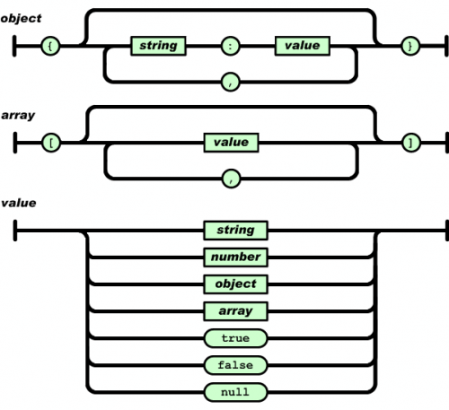

class:firstpage, title

# Программирование на perl
## Взаимодествие с ОС

---

class:note_and_mark title

# Отметьтесь на портале!
 
---

# Содержание

1. **Работа с файлами**
1. Perl io backend
1. Взаимодействие процессов
1. Сериализация
    - JSON
    - преобразование данных в двоичный вид (-f pack)
    - CBOR
    - MSGPACK
    - XML
1. Работа с сокетами
1. Разбор входных параметров (Getopt::Long)

---

layout: true

#Работа с файлами

.footer[[perlopentut](http://perldoc.perl.org/perlopentut.html)]

---

.floatright[]

FILEHANDLE - специальный тип

STDIN, STDOUT, STDERR - стандартные потоки

FILE_HANDLE vs my $fh

open or die

close

/dev/random + /dev/urandom - генераторы случайных/псевдослучайных чисел

/dev/null - пустое устройство

/dev/zero - чтение 0 в бесконечном количестве

---

```perl
open( $fh, '<', 'file') vs open( $fh, '< file')
```

.floatright[]

Режимы открытия файла

&lt;, +&lt;, &gt;, +>, &gt;&gt;;

fopen(3) r , r+ , w , w+ , a 

Указание кодировки при открытии

.clear[
```perl
open(my $fh_cp,'<:encoding(CP-1251)','cp1251.txt');
open(my $fh_utf, '>:encoding(UTF-8)', 'utf8.txt');
while( <$fh_cp> ){
    print {$fh_utf} $_;
}
close($fh_utf);
close($fh_cp);
```
]

---

.floatright[]

Чтение из файлового манипулятора

```perl
$input = <>    # ≡  <ARGV> 
               # || <STDIN>

$line = <$handle>

@lines = <$handle>
```

Запись и файловый манипулятор

```perl
print $var;

print {$fh} $var;

print STDERR $var;
```

---

Выбор файлового манипулятора

```perl
open(my $fh1, '>', 'file_1.txt') or die $!;
open(my $fh2, '>', 'file_2.txt') or die $!;

print "test stdout\n";
select($fh1);
print "test file1\n";
my $old_fh = select($fh2);
print "test file2\n";
select(STDOUT);
print "again stdout\n";
select($old_fh);
print "test old_fh\n";
close($fh1);
close($fh2);
```

---

layout: true

#Работа с файлами

.footer[[perldata](http://perldoc.perl.org/perldata.html)]

---

__DATA__ - данные непосредственно в програмном модуле

```perl
package mypkg;

sub read_my_data {
    my @lines = <DATA>;
    return \@lines;
}

1;
__DATA__
This is data from pm file
```

Не нужно вызывать open
```perl
my $line = <DATA>
```

---

layout: true

#Работа с файлами

.footer[[perlopentut](http://perldoc.perl.org/perlopentut.html)]

---

```perl
# для работы с двоичными данными
binmode($fh);  # open with :raw

# небуферизированная запись
syswrite($fh, $data, length($data)); 

# прямой вызов системного read
sysread($fh, $data, $data_size); 

# чтение двоичных данных
read($fh, $data, $data_size); 

# проверка на отсутствие данных
eof($fh); 
```

---

Пример:

```perl
use strict;
use Digest::MD5 qw/md5_hex/;

$\ = "\n";
my $data = '';
my $data_size = 1024; # Размер записи в файле

open(my $fh, '<:raw', 'data.bin') or die $!;

while(!eof($fh)){
    read($fh, $data, $data_size) == $data_size
        or die("Неверный размер");
    print md5_hex($data);
}

close($fh);
```

---

Проверка результата работы команды open

```perl
my $fh; 

```
```perl
open $fh, '<', 'not_exist' || die $!;
```
```perl
open $fh, '<', 'not_exist' or die $!;
```

---


Проверка результата работы команды open

```perl
my $fh; 

```

.not[
```perl
*open $fh, '<', 'not_exist' || die $!;
```
]

```perl
open $fh, '<', 'not_exist' or die $!;
```

```perl
open($fh, '<', 'not_exist') || die $!;

```

---

.floatright[]

Произвольный доступ

```perl
seek( $fh, $len, $type); 
  # позиционирование

tell($fh); 
  # текущая позиция
```

---

layout: true

#Работа с файлами

.footer[[testfile](http://perldoc.perl.org/filetest.html)]

---

Операции проверки файлов

.floatright[]

-r -w -x чтение, запись, исполнение

-o принадлежность файла пользователю

-e существование файла

-z файл нулевой длины

-s размер файла

-f, -d, -l, -S, -p файл, каталог, ссылка, сокет, канал

```perl
my $fname = 'file.txt';
my $fh;
if ( -e $fname and -f $fname and 
     -r $fname and !-z $fname) {
    open($fh, '<', $fname) or die $!;
}
```

---

layout: true

#Работа с файлами

.footer[[perlfunc](http://perldoc.perl.org/perlfunc.html)]

---

rename - переименование

unlink - удаление

truncate - очистка

stat - информация о доступе к файлу

utime - модификация времени доступа к файлу

---

layout: true

#Работа с файлами

.footer[[File::Path](http://perldoc.perl.org/File/Path.html)]

---

.floatright[]

```perl
mkdir 'dir_name',   0755;
rmdir 'dir_name';
chdir 'dir_name';
```

.clear[
```perl
use File::Path qw/make_path/;
make_path( '/full/path/to/dir', 
    owner => 'user', 
    group => 'group', 
    mode => 0755);
```]

---

layout: true

#Работа с файлами

.footer[[perlfunc](http://perldoc.perl.org/perlfunc.html)]

---

```perl
opendir(my $dh, 'path_to_dir') or die $!;

my $pos;

while(my $fname = readdir $dh){
    print $fname;
    $pos = telldir $dh if $fname = 'data.bin';
}

if ($pos){
    seekdir($dh, $pos);
    while(my $fname = readdir $dh){
        print "Second iter: $fname";
    }
}

closedir($dh);
```

---

layout: false

# Содержание

1. Работа с файлами
1. **Perl io backend**
1. Взаимодействие процессов
1. Сериализация
    - JSON
    - преобразование данных в двоичный вид (-f pack)
    - CBOR
    - MSGPACK
    - XML
1. Работа с сокетами
1. Разбор входных параметров (Getopt::Long)

---

layout: true
# Perl io backend
.footer[[perliol](http://perldoc.perl.org/perliol.html)]

---

:unix - использование pread/pwrite

:stdio - использование fread, fwrite, fseek/ftell

:perlio - перл буфер для быстрого доступа к данным после чтения и минимизации копирования (readline/&lt;&gt;)

:crlf - преобразование перевода строки

:utf8 - работа в utf-е

:encoding - перекодировка содержимого файла

:bytes - работа с однобайтовыми кодировками

:raw - binmode()

:pop - псевдослой, который позволяет убрать из цепочки верхний слой

```bash
% PERLIO=perlio
```

---

```perl
use strict;
use PerlIO;
use Time::HiRes qw/gettimeofday/;

my $i=0;
my $start_time = gettimeofday();

while(<>){$i++}

print "Layers: "
    .join(',', PerlIO::get_layers(STDIN)).'; ';
print "lines: $i; time: "
    .(gettimeofday() - $start_time).$/;
```

Layers: unix,perlio; lines: 2932894; time: 0.410083055496216

Layers: stdio; lines: 2932894; time: 3.00101494789124

Layers: unix; lines: 2932894; time: 33.2629461288452

---

.floatright[]

:via - возможность подключения слоя из внешних библиотек

perldoc PerlIO::via

Если на CPAN нет необходимого слоя, его можно реализовать, самостоятельно определив необходимый набор функций вашего модуля.

Например PerlIO::via::gzip

```perl
open( $cfh, ">:via(gzip)", 'stdout.gz' );
print $cfh @stuff;

open( $fh, "<:via(gzip)", "stuff.gz" );
while (<$fh>) {
...
}
```


---

layout: false
# Содержание

1. Работа с файлами
1. Perl io backend
1. **Взаимодействие процессов**
1. Сериализация
    - JSON
    - преобразование данных в двоичный вид (-f pack)
    - CBOR
    - MSGPACK
    - XML
1. Работа с сокетами
1. Разбор входных параметров (Getopt::Long)

---
layout: true
#Взаимодействие процессов

.footer[[perlipc](http://perldoc.perl.org/perlipc.html)]
---

Запуск процессов из perl программы

.floatleft[]

.clear[
```perl
my $out = `ls -l`; 
  # построчное чтение stdout
my @out = `ls -l`; 
  # стандартный вывод на выходе
system('ls -l');   
  # только код завершения
open(my $out, '-|', 'ls', '-l');
```
]

---

pipe - связка манипуляторов в канал

fork - порождение нового процесса (единственный способ)

exec - замена текущего процесса другим


autoflush - управление буферизацией

---

.floatright[]

```perl-nof
use strict;
use POSIX qw(:sys_wait_h);
$|=1;

my ($r, $w);
pipe($r, $w);
if(my $pid = fork()){
    close($r);
    print $w $_ for 1..5;
    close($w);
    waitpid($pid, 0);
}
else {
    die "Cannot fork $!" unless defined $pid;
    close($w);
    while(<$r>){ print $_ }
    close($r);
    exit;
}
```

---

Дополнительные модули

- IPC::Open3
- IPC::Run3
- IO::Handle

```perl
my($wtr, $rdr, $err);
$pid = open3($wtr, $rdr, $err, 'cmd', 'arg', ...);
```

Именованные каналы

% mkfifo /path/named.pipe

```perl
open( my $fifo, '<', '/path/named.pipe' );
while(<$fifo>){
    print "Got: $_";
}
close($fifo);
```

---

.floatright[]

##Обработка сигналов

INT,CHLD,TERM,ALRM ... кроме KILL, SEGV, ABRT, STOP

Уборка зомби

$? : 16-битное число

```perl
my $exit_status = $? >> 8;
my $signal_num = $? & 127;
my $core_dump = $? & 128;
```

WIFEXITED - истина если процесс завершился

WEXITSTATUS - код возврата, установлен только если WIFEXITED истина

WIFSIGNALED - истина если процесс был остановлен сигналом

WTERMSIG - номер сигнала, который остановил процесс

---


---

##Обработка сигналов

Игнорируем сигнал

```perl
$SIG{INT} = 'IGNORE';
```

Обрабатываем сигнал сами

```perl
$SIG{INT} = sub {...};
```

Возвращаем обработку сигнала в изначальное поведение
```perl
$SIG{INT} = 'DEFAULT';
```

Не забываем, что обработчик только один
```perl
local $SIG{}
```

---

```perl
$SIG{CHLD} = sub {
  while( my $pid = waitpid(-1, WNOHANG)){

    last if $pid == -1;

    if( WIFEXITED($?) ){ 
      my $status = $? >> 8; 
      print "$pid exit with status $status $/";
    }
    else { 
      print "Process $pid sleep $/"
    }

  }
};
```

---

Блокировка файлов LOCK_EX LOCK_SH LOCK_UN

```perl
use Fcntl ':flock';
$SIG{ALRM} = sub {die "Timeout"};

alarm(10);

eval {
    flock(FH, LOCK_EX) or die "can't flock: $!";
};

alarm(0);
```

Неблокирующий вызов

```perl
flock(FH, LOCK_EX|LOCK_NB)
```

---

layout: false
# Содержание

1. Работа с файлами
1. Perl io backend
1. Взаимодействие процессов
1. **Сериализация**
    - преобразование данных в двоичный вид (-f pack)
    - JSON
    - CBOR
    - MSGPACK
    - XML
1. Работа с сокетами
1. Разбор входных параметров (Getopt::Long)

---

layout: true
# Сериализация

---


---

layout: true
# Сериализация JSON

---

```json
{ "orderID": 12345,
  "shopperName": "Ваня Иванов",
  "shopperEmail": "ivanov@example.com",
  "contents": [
    {
      "productID": 34,
      "productName": "Супер товар",
      "quantity": 1
    },
    {
      "productID": 56,
      "productName": "Чудо товар",
      "quantity": 3
    }
  ],
  "orderCompleted": true
}

```

---

```perl
use JSON::XS;
use DDP;
p JSON::XS::decode_json( 
    '{"key_array":["val1", "val2", 3]}' 
);
```

```bash 
{"key_array":["val1","val2",3]}
\ {
    key_array   [
        [0] "val1",
        [1] "val2",
        [2] 3
    ]
}
```

---


```perl
use strict;
use JSON::XS;
my $struct = {key1 => 3};
print "Value: ".$struct->{key1}.$/;
print JSON::XS::encode_json( $struct ).$/;
```

```
Value: 3
{"key1":"3"}
```

---

.center[.normal-width[]]

---

layout: true
# Сериализация pack

.footer[[perlpack](http://perldoc.perl.org/perlpack.html)]
---

pack - преобразование перловых типов данных в последовательность байт.

unpack - обратная операция pack

pack TEMPLATE, LIST

- **a** - строка байт, дополняемая нулями
- **A** - строка байт, дополняемая пробелами
- **b** - Битовая строка (младший бит идет первым)
- **с** - Однобайтовый символ со знаком
- **d** - Значение с плавающей запятой, двойной точности
- **f** - Значение с плавающей запятой, одинарной точности шаблона
- **h** - Строка шестнадцатиричных значений (младшие разряды идут    первыми)
- **i** - Целое со знаком
- **l** - Целое со знаком типа long
- **n** - Целое 16 бит big-endian
- **v** - Целое 16 бит little-endian

---

```perl
pack "A5", "perl", "language";      # "perl␣"
pack "A5 A2 A3", "perl", "language";# "perl␣la␣␣␣"

pack "H2", "31";                    # "1"
pack "B8", "00110001"               # "1"

pack "LLxLLx", 1, 2, 3, 4;
    # "\1\0\0\0 \2\0\0\0 \0 \3\0\0\0 \4\0\0\0 \0"

unpack "H*", pack "A*", "string";   # 737472696e67

unpack "(H2)*", pack "A*", "string";
    # (73,74,72,69,6e,67)
```

---

Специальный символ **/**

length-item/string - позволяет упаковывать строки

```perl
pack "Ca* ", length("Test"), "Test";# "\04Test"

pack "C/a*", "Test";          # "\04Test"
pack "L/a*", "Test";          # "\04\00\00\00Test"
pack "w/a*", "Test";          # "\04Test"

```

---

layout: true
# Сериализация CBOR

---

```perl
use CBOR::XS;
my $cbor = CBOR::XS::encode_cbor([12,20,30]);
my $hash = CBOR::XS::decode_cbor( $cbor );
```

```perl
use CBOR::XS;
my $cbors = CBOR::XS::encode_cbor([12,20,30]);
$cbors   .= CBOR::XS::encode_cbor(
    ["val1","val2","val3"]
);
my @array = ();
my $cbor_obj = CBOR::XS->new();
while( length $cbors ){
  my($data, $len)=$cbor_obj->decode_prefix($cbors);
  substr $cbors, 0, $len, '';
  push @array, $data;
}
```

---

layout: true
# Сериализация MSGPACK

---

```perl
use strict;
use Data::MessagePack;
my $mp = Data::MessagePack->new();
my $packed   = $mp->pack({a => 1, b => 2, c => 3});
my $hash = $mp->unpack($packed);
```


---

layout: true
# Сериализация XML

---

```perl
use XML::LibXML;
my $dom = XML::LibXML->load_xml(
    string => '<xml><test>1</test></xml>'
);
```

```perl
use XML::Parser;
my $parser = XML::Parser->new(
    Handlers => {
        Start => sub{print "New tag"},
        End   => sub{print "End tag"},
        Char  => sub{print "Data"}
    });
$parser->parse('<xml><test>1</test></xml>');
```

---

layout: true
# Сериализация (быстродействие)

---

```bash
YAML                1220/s
XML::Simple         1798/s
JSON::PP           15456/s
YAML::Syck         28090/s
JSON::Syck         30303/s
Data::MessagePack 319489/s
JSON::XS          684932/s
pack              751880/s
CBOR::XS          769231/s
```

```perl
my %struct = (
    a => 1,
    b => 2,
    c => 3,
    d => 4,
);
```

---

layout: false
# Содержание

1. Работа с файлами
1. Perl io backend
1. Взаимодействие процессов
1. Сериализация
    - JSON
    - преобразование данных в двоичный вид (-f pack)
    - CBOR
    - MSGPACK
    - Storable
    - XML
1. **Работа с сокетами**
1. Разбор входных параметров (Getopt::Long)

---

layout: true

.footer[[Socket](http://perldoc.perl.org/Socket.html)]

---

#Работа с сокетами (Клиент)

```perl
use strict;
use IO::Socket;
my $socket = IO::Socket::INET->new(
    PeerAddr => 'search.cpan.org',
    PeerPort => 80,
    Proto    => "tcp",
    Type     => SOCK_STREAM) 
or die "Can't connect to search.cpan.org $/";

print $socket 
   "GET / HTTP/1.0\nHost: search.cpan.org\n\n";
while (<$socket>) {
    ... #work with answer
}
```

---

#Работа с сокетами (Клиент)

```perl
use strict;
use IO::Socket;
my $server = IO::Socket::INET->new(
    LocalPort => 8081,
    Type      => SOCK_STREAM,
    ReuseAddr => 1,
    Listen    => 10) 
or die "Can't create server on port 8081 : $@ $/";
while(my $client = $server->accept()){
    $client->autoflush(1);
    my $message = <$client>; chomp( $message );
    print $client "Echo: ".$message;
    close( $client );
    last if $message eq 'END';
}
close( $server );
```

---

layout: false
# Содержание

1. Работа с файлами
1. Perl io backend
1. Взаимодействие процессов
1. Сериализация
    - преобразование данных в двоичный вид (-f pack)
    - JSON
    - CBOR
    - MSGPACK
    - Storable
    - XML
1. Работа с сокетами
1. **Разбор входных параметров (Getopt::Long)**

---

layout: true
# Разбор входных параметров

.footer[[Getopt::Long](http://perldoc.perl.org/Getopt/Long.html)]
---

.floatright[]

Флаги

```bash
rm -rf
ls -l
```

Параметры

```bash
mkdir -m 755
perl -e ''

```

---

```perl
use Getopt::Long;

my $param;
GetOptions("example" => \$param);
```

Описание параметра/флага      | Пример
:-----------------------------|:---------
param            | --param или отсутствует
param!          | --param --noparam
param=s         | --param=string
param:s         | --param --param=string
param=i         | --param=1
param:i         | --param --param=1
param=f         | --param=3.14
param:f         | --param --param=3.14

param|p=s

---

layout: true
# Getopt::Long + Pod::Usage

---

class: compact
```perl
use Getopt::Long;
use Pod::Usage;
my $param = {};
GetOptions($param, 'help|?', 'man', 'verbose') 
	or pod2usage(2);
pod2usage(1) if $param->{help};
pod2usage(-exitval => 0, -verbose => 2) 
	if $param->{man};

__END__

=head1 NAME

sample - Script with Getopt::Long

=head1 SYNOPSIS
sample [options] [file ...]
Options:
-help            brief help message
-verbose         verbosity mode

=head1 OPTIONS

=over 8

=item B<-help>

Print help message.

=item B<-verbose>

Verbosely processing

=back

=head1 DESCRIPTION

B<this program>
Programm do something

=cut

```

---

layout: true
# Интерактивный режим

---

```perl
use strict;

sub is_interactive {
    return -t STDIN && -t STDOUT;
}

my $do = 1;
while( is_interactive() && $do ){
    print "Tell me anything: ";
    my $line = <>;
    print "Echo: ".$line;
    $do = 0 if $line eq "bye$/";
}

print "Goodbye$/";

```

---

layout: false

# Домашнее задание

- VFS (virtual file system) — уровень абстракции поверх конкретной реализации файловой системы. В этой задаче необходимо написать преобразователь из бинарного формата (unpack) представления дерева файлов и каталогов в JSON. Подробности и тесты: [vfs_dumper](https://github.com/Nikolo/Technosfera-perl/tree/master/homeworks/vfs_dumper)

- Написать программы сохраняющую STDIN в файл, с защитой от случайного нажатия Ctrl+C. Подробности и тесты:  [save_stdin](https://github.com/Nikolo/Technosfera-perl/tree/master/homeworks/save_stdin)

- Реализовать параллельное умножение квадратных матриц. Подробности и тесты:  [matrix_multiplier](https://github.com/Nikolo/Technosfera-perl/tree/master/homeworks/matrix_multiplier)

---

class:lastpage title

# Спасибо за внимание!

## Оставьте отзыв

.teacher[]

