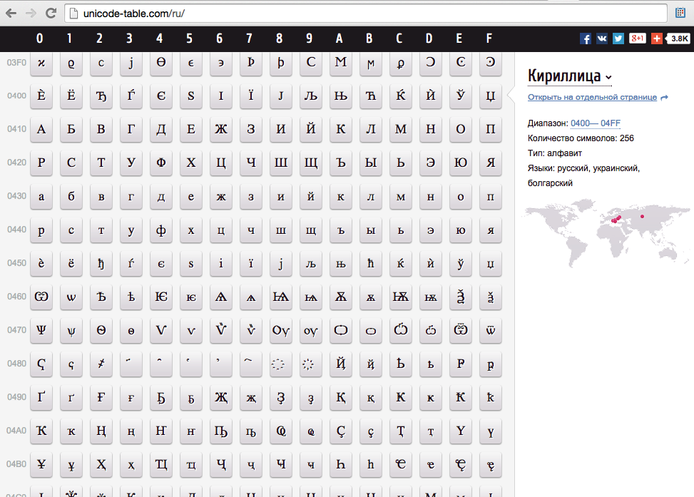

class:firstpage
# Программирование на Perl

---

class:firstpage
# Регулярные выражения и юникод

---

layout:false
# Содержание
.small[
* Поддержка Unicode
    - Определения
    - Строки и октеты
    - Преобразования
    - UTF8-Flag
    - Ввод/вывод
* Регулярные выражения
    - Сопоставление
    - Поиск и замена
    - Транслитерация
    - Классы символов
    - Модификаторы
    - Группы
    - Оглядывания
    - Захваты
    - Квантификаторы
    - Работа с юникодом
    - Отладка
]

---

layout: true

.footer[[perlunicode](http://perldoc.perl.org/perlunicode.html)]


---

# Unicode

Стандарт кодирования символов, позволяющий представить знаки практически всех письменных языков

Даже Клингонского )

А также разнообразных специальных символов

---
class:center,middle

.img-uni[

]

---
class:center,middle

.huge1[☺]

WHITE SMILING FACE<br/>
U+263A<br/>
"\x{263A}"<br/>
"\xE2\x98\xBA"<br/>
"\342\230\272"

---
class:center,middle

.huge[☺]

WHITE SMILING FACE<br/>
U+263A<br/>
"\x{263A}"<br/>
"\xE2\x98\xBA"<br/>
"\342\230\272"

---
class:center,middle

.huge[😈]

SMILING FACE WITH HORNS<br/>
U+1F608<br/>
"\x{1F608}"<br/>
"\xF0\x9F\x98\x88"<br/>
"\360\237\230\210"

---
class:center,middle

.huge[💩]

PILE OF POO<br/>
U+1F4A9<br/>
"\x{1F4A9}"<br/>
"\xF0\x9F\x92\xA9"<br/>
"\360\237\222\251"

---

# UTF

Unicode Transformation Format<br>
Формат преобразования юникода<br/>
Способ представления символов Unicode в виде последовательности целых положительных чисел

* UTF-8 (8-битный) endianness safe
* UTF-16 (16-битный) LE | BE
* UTF-32 (32-битный) LE | BE

---

# Представление в байтах

```
 Code Points   Bytes: 1st    2nd    3rd    4th
 
  U+0000..U+007F     00..7F
  U+0080..U+07FF     C2..DF 80..BF
  U+0800..U+0FFF     E0     A0..BF 80..BF
  U+1000..U+CFFF     E1..EC 80..BF 80..BF
  U+D000..U+D7FF     ED     80..9F 80..BF
  U+D800..U+DFFF     utf16 surrogates, not utf8
  U+E000..U+FFFF     EE..EF 80..BF 80..BF
 U+10000..U+3FFFF    F0     90..BF 80..BF 80..BF
 U+40000..U+FFFFF    F1..F3 80..BF 80..BF 80..BF
U+100000..U+10FFFF   F4     80..8F 80..BF 80..BF
```

---

# Значащие биты в UTF-8

.small[
```
1    7  0`vvvvvvv` ≡ ASCII

2   11  110`vvvvv` 10`vvvvvv`

3   16  1110`vvvv` 10`vvvvvv` 10`vvvvvv`

4   21  11110`vvv` 10`vvvvvv` 10`vvvvvv` 10`vvvvvv`

5   26  111110`vv` 10`vvvvvv` 10`vvvvvv` 10`vvvvvv` 10`vvvvvv`

6   31  1111110`v` 10`vvvvvv` 10`vvvvvv` 10`vvvvvv` 10`vvvvvv` 10`vvvvvv`

```
]

---

# Строки и байты

Символ (character)

```perl
"\x{1}" .. "\x{10FFFF}"
chr(1)  .. chr(0x10FFFF)
```

Байт (символы 0..255)

```perl
"\x00" .. "\xff"
"\000" .. "\377"
chr(0) .. chr(255)
```

Октет - 8 бит данных

---

# Строки и байты

Бинарные данные - строка из байт
```perl
my $bytes = "123";
printf "%vX", $bytes; # 31.32.33
my $bytes = "\001\002\377";
printf "%vX", $bytes; # 1.2.ff
my $bytes = "\xfe\xff";
printf "%vX", $bytes; # fe.ff
```
Строка - строка из символов (codepoints)
```perl
use utf8;
my $string = "Ёлка";#\x{401}\x{43b}\x{43a}\x{430}
printf "%vX", $string; # 401.43B.43A.430
my $string = "\x{263A}";
printf "%vX", $string; # 263A
```

---

# Преобразование

## Энкодинг (*encode*)
> преобразование **текста** (строк, символов) в **данные** (байты, октеты)

## Декодинг (*decode*)
> преобразование **данных** (байт, октетов) в **текст** (строки символов)


---

# Кодировка, набор символов

> таблица соответствия символов одного алфавита, последовательности из одного или нескольких символов другого алфавита

```
Байт `F1` в кодировке `cp866` это буква "ё"

Буква `ё` в Unicode - это codepoint `U+0451`
               (CYRILLIC SMALL LETTER IO)

Буква `ё` в windows (`cp1251`) - это байт `B8`
```

### decoding: charset → codepoint
### encoding: codepoint → charset
### recoding: charset → codepoint → charset

---

# Кодировка, набор символов

```perl
use Encode;

say "\xf1";                          # �
say decode('cp866', "\xf1");         # ё
say ord(decode('cp866', "\xf1"));    # 1105 (0x451)

use charnames;
say charnames::viacode(0x451);
                       # CYRILLIC SMALL LETTER IO

say "\x{451}";                       # ё
say encode('cp1251', "\x{451}");     # �
say ord encode('cp1251', "\x{451}"); # 184 (0xB8)

printf "%vX", "ab\x{451}"; # 61.62.451
printf "%vX", "\x1\x20\xff"; # 1.20.FF
```

---

# Преобразование

```perl
use Encode qw(encode decode);

my $bin = "\342\230\272";
printf "%vX", $bin; # E2.98.BA

my $str = decode("utf-8", $b); # "\x{263a}"
printf "%vX",$str; # 263A

my $bin = encode("utf-8", $str); # "\342\230\272"
printf "%vX", $bin; # E2.98.BA

my $bytes_dos = "\xf1"; # cp866 ё
printf "%vX", $bytes_dos; # F1
my $chars = decode("cp866",$bytes_866);
my $bytes_win = encode("cp1251", $chars);
printf "%vX", $bytes_win; # B8

my $to = encode("cp1251",decode("cp866",$from));
from_to($from,"cp866","cp1251"); # inplace
```


---

# UTF8_FLAG

```perl
say utf8::is_utf8("\342\230\272"); # ''
my $string = decode("utf-8", "\342\230\272");
say utf8::is_utf8($string); # 1

say utf8::is_utf8("\x{263a}"); # 1
my $octets = encode("utf-8", "\x{263a}");
say utf8::is_utf8($octets); # ''

printf "U+%v04X\n", decode('utf8',"тест");
# U+0442.0435.0441.0442

*say utf8::is_utf8("☺"); # ''

printf "U+%v04X\n", "☺";
# U+00E2.0098.00BA
```

---

# use utf8;

> директива `use utf8` "выполняет"<br/> `decode('utf8',<исходник>)`

```perl
use utf8;

say utf8::is_utf8("\342\230\272"); # ''

say utf8::is_utf8("\x{263a}"); # 1

*say utf8::is_utf8("☺"); # 1
```

---

# С флагом и без флага
```
$ perl -MDevel::Peek -E 'Dump "☺"'
SV = PV(0x7f8041804ae8) at 0x7f804182d658
  REFCNT = 1
* FLAGS = (PADTMP,POK,READONLY,pPOK)
  PV = 0x7f804140cf20 "\342\230\272"\0
  CUR = 3
  LEN = 16
```

```

$ perl -MDevel::Peek `-Mutf8` -E 'Dump "☺"'
SV = PV(0x7fbf7a804b48) at 0x7fbf7b801f00
  REFCNT = 1
  FLAGS = (PADTMP,POK,READONLY,pPOK,`UTF8`)
  PV = 0x7fbf7a613920 "\342\230\272"\0 [`UTF8 "\x{263a}"`]
  CUR = 3
  LEN = 16
```

---

# С флагом и без флага
```
$ perl -MDevel::Peek -E 'Dump "\x{ff}"'
SV = PV(0x7fa153802948) at 0x7fa153005b00
  REFCNT = 1
* FLAGS = (PADTMP,POK,READONLY,pPOK)
  PV = 0x7fa152d06a10 "\377"\0
  CUR = 1
  LEN = 16
```

```

$ perl -MDevel::Peek -E 'Dump "\x{100}"'
SV = PV(0x7fcdbc003548) at 0x7fcdbc02c100
  REFCNT = 1
* FLAGS = (PADTMP,POK,READONLY,pPOK,UTF8)
  PV = 0x7fcdbb707110 "\304\200"\0 [`UTF8 "\x{100}"`]
  CUR = 2
  LEN = 16
```


---

# Поведение функций

.left[
```perl
my $test = "тест";
say length $test;
say uc $test;
say utf8::is_utf8 $test;
say ord(substr($test,0,1));
printf "%vX", $test;
```
]
.right[
```perl
#
8
тест
''
209
D1.82.D0.B5.D1.81.D1.82
```
]
.left[
```perl
use utf8;
my $test = "тест";
say length $test;
say uc $test;
say utf8::is_utf8 $test;
say ord(substr($test,0,1));
printf "%vX", $test;
```
]
.right[
```perl
#
#
4
ТЕСТ
1
1090 # 0x442
442.435.441.442
```
]

---

# `@ARGV` в UTF-8

```perl
$ perl -CA ...
```
или
```perl
$ export PERL_UNICODE=A
```
или
```perl
use Encode qw(decode_utf8);
BEGIN {
    @ARGV = map { decode_utf8($_, 1) } @ARGV;
}
```

---

# STDIN, STDOUT, STDERR в UTF-8

> Wide character in print at...<br/>

## IO Layer `:utf8`

```perl
$ perl -CS ...
$ export PERL_UNICODE=S
```

```perl
binmode(STDOUT,':utf8');
open my $f, '<:utf8', 'file.txt';
use open qw(:std); # auto
```

---

# Весь ввод/вывод в UTF-8

```perl
$ perl -CASD ... | perl -CS -CA -CD ...
```

```perl
$ export PERL_UNICODE=ASD
```

```perl
use open qw(:std :utf8);
use Encode qw(decode_utf8);
BEGIN{ @ARGV = map decode_utf8($_, 1),@ARGV; }
```

---

# Ввод/вывод в октетах при UTF-8

## IO Layer `:raw`

```perl
binmode($fh,':raw');

binmode(STDOUT,':raw');

open my $f, '<:raw', 'file.bin';

my $socket = accept(...);
binmode($socket,':raw');
```

---

# Полезности

```perl
use utf8;
use Text::Unidecode;

say unidecode "\x{5317}\x{4EB0}"; # 北亰
# That prints: Bei Jing

say unidecode "Это тест";
# That prints: Eto tiest
```

---

# use charnames

```perl
use charnames qw(:full :short latin greek);
say "\N{MATHEMATICAL ITALIC SMALL N}"; # 𝑛
say "\N{GREEK CAPITAL LETTER SIGMA}"; # Σ
say "\N{Greek:Sigma}"; # Σ
say "\N{ae}"; # æ
say "\N{epsilon}"; # ε
say "\N{LATIN CAPITAL LETTER A WITH MACRON AND GRAVE}";
$s = "\N{Latin:A WITH MACRON AND GRAVE}";
say $s;  # Ā̀
printf "U+%v04X\n", $s; # U+0100.0300

use charnames ":alias" => {
    "APPLE LOGO" => 0xF8FF,
};
say "\N{APPLE LOGO}"; # 
```

---

# Casefolding

```perl
use feature "fc"; # perl v5.16+

# sort case-insensitively
my @sorted = sort {
    fc($a) cmp fc($b)
} @list;
 
# both are true:
fc("tschüß") eq fc("TSCHÜSS")
fc("Σίσυφος") eq fc("ΣΊΣΥΦΟΣ")
```

---

class: casecharts

# [Case Charts](http://www.unicode.org/charts/case/)

<table>
<tr><td class="z">Code</td><td class="z">Lower</td><td class="z">Title</td><td class="z">Upper</td><td class="z">Fold</td></tr>
<tr>
<td class="z" title="LATIN CAPITAL LETTER I">I<br><tt>0049</tt></td>
<td class="n" title="LATIN SMALL LETTER I">i<br><tt>0069</tt></td>
<td class="g">I<br><tt>0049</tt></td>
<td class="g">I<br><tt>0049</tt></td>
<td class="g">i<br><tt>0069</tt></td>
</tr>
<tr>
<td class="z" title="LATIN SMALL LETTER I">i<br><tt>0069</tt></td>
<td class="g">i<br><tt>0069</tt></td>
<td class="g">I<br><tt>0049</tt></td>
<td class="n" title="LATIN CAPITAL LETTER I">I<br><tt>0049</tt></td>
<td class="g">i<br><tt>0069</tt></td>
</tr>
<tr>
<td class="z" title="LATIN SMALL LETTER DOTLESS I">ı<br><tt>0131</tt></td>
<td class="g">ı<br><tt>0131</tt></td>
<td class="g">I<br><tt>0049</tt></td>
<td class="n" title="LATIN CAPITAL LETTER I">I<br><tt>0049</tt></td>
<td class="g">ı<br><tt>0131</tt></td>
</tr>

<tr>
<td class="z" title="GREEK CAPITAL LETTER SIGMA">Σ<br><tt>03A3</tt></td>
<td class="n" title="GREEK SMALL LETTER SIGMA">σ<br><tt>03C3</tt></td>
<td class="g">Σ<br><tt>03A3</tt></td>
<td class="g">Σ<br><tt>03A3</tt></td>
<td class="g">σ<br><tt>03C3</tt></td>
</tr>
<tr>
<td class="z" title="GREEK SMALL LETTER FINAL SIGMA">ς<br><tt>03C2</tt></td>
<td class="g">ς<br><tt>03C2</tt></td>
<td class="g">Σ<br><tt>03A3</tt></td>
<td class="n" title="GREEK CAPITAL LETTER SIGMA">Σ<br><tt>03A3</tt></td>
<td class="n" title="GREEK SMALL LETTER SIGMA">σ<br><tt>03C3</tt></td>
</tr>
<tr>
<td class="z" title="GREEK SMALL LETTER SIGMA">σ<br><tt>03C3</tt></td>
<td class="g">σ<br><tt>03C3</tt></td>
<td class="g">Σ<br><tt>03A3</tt></td>
<td class="n" title="GREEK CAPITAL LETTER SIGMA">Σ<br><tt>03A3</tt></td>
<td class="g">σ<br><tt>03C3</tt></td>
</tr>

</table>

---
class: casecharts

# [Case Charts](http://www.unicode.org/charts/case/)

<table>
<tr><td class="z">Code</td><td class="z">Lower</td><td class="z">Title</td><td class="z">Upper</td><td class="z">Fold</td></tr>
<tr>
<td class="z" title="GREEK CAPITAL LETTER THETA">Θ<br><tt>0398</tt></td>
<td class="n" title="GREEK SMALL LETTER THETA">θ<br><tt>03B8</tt></td>
<td class="g">Θ<br><tt>0398</tt></td>
<td class="g">Θ<br><tt>0398</tt></td>
<td class="g">θ<br><tt>03B8</tt></td>
</tr>
<tr>
<td class="z" title="GREEK SMALL LETTER THETA">θ<br><tt>03B8</tt></td>
<td class="g">θ<br><tt>03B8</tt></td>
<td class="g">Θ<br><tt>0398</tt></td>
<td class="n" title="GREEK CAPITAL LETTER THETA">Θ<br><tt>0398</tt></td>
<td class="g">θ<br><tt>03B8</tt></td>
</tr>
<tr>
<td class="z" title="GREEK THETA SYMBOL">ϑ<br><tt>03D1</tt></td>
<td class="g">ϑ<br><tt>03D1</tt></td>
<td class="g">Θ<br><tt>0398</tt></td>
<td class="n" title="GREEK CAPITAL LETTER THETA">Θ<br><tt>0398</tt></td>
<td class="n" title="GREEK SMALL LETTER THETA">θ<br><tt>03B8</tt></td>
</tr>
<tr>
<td class="z" title="GREEK CAPITAL THETA SYMBOL">ϴ<br><tt>03F4</tt></td>
<td class="n" title="GREEK SMALL LETTER THETA">θ<br><tt>03B8</tt></td>
<td class="g">ϴ<br><tt>03F4</tt></td>
<td class="g">ϴ<br><tt>03F4</tt></td>
<td class="g">θ<br><tt>03B8</tt></td>
</tr>

<tr>
<td class="z" title="GREEK CAPITAL LETTER PI">Π<br><tt>03A0</tt></td>
<td class="n" title="GREEK SMALL LETTER PI">π<br><tt>03C0</tt></td>
<td class="g">Π<br><tt>03A0</tt></td>
<td class="g">Π<br><tt>03A0</tt></td>
<td class="g">π<br><tt>03C0</tt></td>
</tr>
<tr>
<td class="z" title="GREEK SMALL LETTER PI">π<br><tt>03C0</tt></td>
<td class="g">π<br><tt>03C0</tt></td>
<td class="g">Π<br><tt>03A0</tt></td>
<td class="n" title="GREEK CAPITAL LETTER PI">Π<br><tt>03A0</tt></td>
<td class="g">π<br><tt>03C0</tt></td>
</tr>
<tr>
<td class="z" title="GREEK PI SYMBOL">ϖ<br><tt>03D6</tt></td>
<td class="g">ϖ<br><tt>03D6</tt></td>
<td class="g">Π<br><tt>03A0</tt></td>
<td class="n" title="GREEK CAPITAL LETTER PI">Π<br><tt>03A0</tt></td>
<td class="n" title="GREEK SMALL LETTER PI">π<br><tt>03C0</tt></td>
</tr>

</table>

---

# v-strings
> that's not what you've thought

```perl
my $v1 = v1.999;
printf "%vx", $v1; # 1.3e7
say unpack "H*", encode_utf8 $v1; # 01cfa7

my $v2 = v1.1000;
printf "%vx", $v2; # 1.3e8
say unpack "H*", encode_utf8 $v2; # 01cfa8

*$v1 cmp $v2
```
Compare:
.small[
```
1111110v > 111110vv > 11110vvv > 1110vvvv > 110vvvvv > 0vvvvvvv
```
]

---

layout: false

# Documentation

## perldoc
- [perluniintro](http://metacpan.org/pod/perluniintro), [perlunitut](http://metacpan.org/pod/perlunitut), [perlunicook](http://metacpan.org/pod/perlunicook), [perlunifaq](http://metacpan.org/pod/perlunifaq),  [perlunicode](http://metacpan.org/pod/perlunicode), [perluniprops](http://perldoc.perl.org/perluniprops.html)

## Modules

- [Encode](http://metacpan.org/pod/Encode), [Encode::Locale](http://metacpan.org/pod/Encode::Locale)
- [Unicode::UCD](http://metacpan.org/pod/Unicode::UCD)
- [Unicode::Normalize](http://metacpan.org/pod/Unicode::Normalize), [Unicode::CaseFold](http://metacpan.org/pod/Unicode::CaseFold)
- [Unicode::GCString](http://metacpan.org/pod/Unicode::GCString)
- [Unicode::LineBreak](http://metacpan.org/pod/Unicode::LineBreak)
- [Unicode::Collate](http://metacpan.org/pod/Unicode::Collate), [Unicode::Collate::Locale](http://metacpan.org/pod/Unicode::Collate::Locale)

## Other

- [Tom Christiansen on StackOverflow](http://stackoverflow.com/questions/6162484/why-does-modern-perl-avoid-utf-8-by-default/6163129)
- [Кодировка или набор символов](https://ru.wikipedia.org/wiki/%D0%9D%D0%B0%D0%B1%D0%BE%D1%80_%D1%81%D0%B8%D0%BC%D0%B2%D0%BE%D0%BB%D0%BE%D0%B2)
- [Статья Joel Spolsky про кодировки](http://local.joelonsoftware.com/wiki/%D0%90%D0%B1%D1%81%D0%BE%D0%BB%D1%8E%D1%82%D0%BD%D1%8B%D0%B9_%D0%9C%D0%B8%D0%BD%D0%B8%D0%BC%D1%83%D0%BC,_%D0%BA%D0%BE%D1%82%D0%BE%D1%80%D1%8B%D0%B9_%D0%9A%D0%B0%D0%B6%D0%B4%D1%8B%D0%B9_%D0%A0%D0%B0%D0%B7%D1%80%D0%B0%D0%B1%D0%BE%D1%82%D1%87%D0%B8%D0%BA_%D0%9F%D1%80%D0%BE%D0%B3%D1%80%D0%B0%D0%BC%D0%BC%D0%BD%D0%BE%D0%B3%D0%BE_%D0%9E%D0%B1%D0%B5%D1%81%D0%BF%D0%B5%D1%87%D0%B5%D0%BD%D0%B8%D1%8F_%D0%9E%D0%B1%D1%8F%D0%B7%D0%B0%D1%82%D0%B5%D0%BB%D1%8C%D0%BD%D0%BE_%D0%94%D0%BE%D0%BB%D0%B6%D0%B5%D0%BD_%D0%97%D0%BD%D0%B0%D1%82%D1%8C_%D0%BE_Unicode_%D0%B8_%D0%9D%D0%B0%D0%B1%D0%BE%D1%80%D0%B0%D1%85_%D0%A1%D0%B8%D0%BC%D0%B2%D0%BE%D0%BB%D0%BE%D0%B2)

---
class:center,middle

# Регулярные выражения

---

# Регулярные выражения
> (*regular expressions*)

формальный язык поиска и осуществления манипуляций с подстроками в тексте, основанный на использовании метасимволов

---
class:center
.img-xkcd[

]
.footer[[xkcd #208](http://xkcd.com/208/)]
---

layout: true

.footer[[perlre](http://perldoc.perl.org/perlre.html)]

---

# Credit card numbers
```perl

^(?:
    4[0-9]{12}(?:[0-9]{3})?          # Visa
|
    5[1-5][0-9]{14}                  # MC
|
    3[47][0-9]{13}                   # AmEx
|
    3(?:0[0-5]|[68][0-9])[0-9]{11}   # Diners
|
    6(?:011|5[0-9]{2})[0-9]{12}      # Discover
|
    (?:2131|1800|35\d{3})\d{11}      # JCB
)$
```

---

# Сопоставление (`m//`)

```perl
"hello" =~ /hell/; # matches
"1+2" =~ /1+2/;  # not, "12" or "112" will match
"1+2" =~ /1\+2/; # matches
"1+2" =~ /\d\+\d/; # matches
"/my/path" =~ m"/path" # match /path

"bat" =~ /[bcr]at/; # matches
"cat" =~ /[bcr]at/; # matches
"rat" =~ /[bcr]at/; # matches
"fat" =~ /[bcr]at/; # not
"at"  =~ /[bcr]at/; # not
```

---

# Сопоставление (`m//`)

```perl
my $string = "sample string";

$string =~  /sample/;
$string =~ m/sample/;
$string =~ m(sample);

my @a = $string =~ /sample/; # list of caps
my $a = $string =~ /sample/; # true|false
if ($string =~ /sample/) # also boolean
   { ... }

for (@samples) {
    /sample/;
    # same as $_ =~ /sample/;
    if (m/sample/) { ... }
    # if ($_ =~ /sample/) { ... }
}
```

---

# Поиск и замена (`s///`)

```perl
my $say = "Time to drink a beer";
s/drink/make/;
s/beer/homework/;
say $say; # Time to make a homework

my $money = '$10000000 and $10000';
$money =~ s/000000\b/M/;
$money =~ s/000\b/k/;
say $money; # $1M and $10k

my $s = 
"Bill have 100 apples and Ann have 4 oranges";
$s =~ s{\d+}{some}g;
say $s;
# Bill have some apples and Ann have some oranges
```

---

# Поиск и замена (`s///`)

```perl
my $string = "sample string";

$string =~ s/sample/item/;
$string =~ s{sample}{item};
$string =~ s{sample}
            (item);

my $count_of_replace =
    $string =~ s{sample}{item}g;

for (@samples) {
    s/sample/item/;
    # $_ =~ /sample/item/;
}
```

---

# Транслитерация (`y///`, `tr///`)

```perl
my $str = "MiXeD CaSe StRiNg";

# ASCII lowercase;
$str =~ tr/A-Z/a-z/;
# mixed case string

# Change case
my $str = "MiXeD CaSe StRiNg";
$str =~ tr/A-Za-z/a-zA-Z/;
# mIxEd cAsE sTrInG

# ROT-13
$str =~ tr/A-Za-z/N-ZA-Mn-za-m/;
# zVkRq pNfR fGeVaT
```

---

# Метасимволы

## Символы, которые необходимо экранировать

.huge[
```
{ } [ ] ( ) ^
$ . | * + ? \
```
]
Остальное можно использовать как есть

---

# Классы символов<br/>(character classes)

```perl
[...]      # перечисление
/[abc]/      # "a" или "b" или "c"
/[a-c]/      # то-же самое
/[a-zA-Z]/   # ASCII алфавит

/[bcr]at/    # "bat" или "cat" или "rat"

[^...]     # отрицательное перечисление
/[^abc]/     # что угодно, кроме "a", "b", "c"
/[^a-zA-Z]/  # что угодно, кроме букв ASCII
```

---

# Классы символов

```perl
`\d` - цифры. не только `[0-9]` # ۰ ۱ ۲ ۳ ۴ ۵
`\s` - пробельные символы `[\ \t\r\n\f]` и др.
`\w` - "буква". `[0-9a-zA-Z_]` и юникод

`\D` - не цифра. `[^\d]`
`\S` - не пробельный символ. `[^\s]`
`\W` - не "буква". `[^\w]`

`\N` - что угодно, кроме "\n"
`.`  - что угодно, кроме "\n" ⃰
`^`  - начало строки ⃰ ⃰
`$`  - конец строки ⃰ ⃰
```
.small[
>∗  поведение меняется в зависимости от модификатора /s<br/>
>∗∗ поведение меняется в зависимости от модификатора /m
]

---

# Квантификаторы

> `?` - 0 или 1 (`{0,1}`)<br/>
> `*` - 0 или более (`{0,}`)<br/>
> `+` - 1 или более (`{1,}`)<br/>
> `{x}` - ровно x<br/>
> `{x,y}` - от x до y включительно<br/>
> `{,y}` - от 0 до y включительно<br/>
> `{x,}` - от x до бесконечности*<br/>

```perl
/^1?$/  # "" or "1"
/^a*$/  # "" or "a", "aa", "aaa", ...
/^\d*$/ # "" or "123", "11111111", ...
/^.+$/  # "1" or "abc", not ""

/^\d{4}-\d{2}-\d{2} \d{2}:\d{2}:\d{2}$/
	# "2015-10-14 19:35:01"
```

\* бесконечность равна 32768
---

# Захваты

> `$1`, `$2`, `$3`, ...

```perl
$_ = "foo bar baz";

m/^(\w+)\s+(\w+)\s+(\w+)$/;
# $1 = 'foo';
# $2 = 'bar';
# $3 = 'baz';

m/^(\w(\w+))\s+((\w+))/;
#  1  2        34
# $1 = 'foo';
# $2 = 'oo';
# $3 = 'bar';
# $4 = 'bar';
```

---

# Группы

> `(...)` - захватывающая группа<br/>
> `(?:...)` - незахватывающая группа<br/>

```perl
"a" =~ /^(?:a|b|cd)$/;   # match
"b" =~ /^(?:a|b|cd)$/;   # match
say $1; # undef
"ax" =~ /^(?:a|b|cd)$/;  # no match

"a" =~ /^(a|b|cd)$/;   # match
say $1; # a
"b" =~ /^(a|b|cd)$/;   # match
say $1; # b
"ax" =~ /^(a|b|cd)$/;  # no match
say $1; # undef
```

---

# Группы
> `(?<name>...)`<br/>
> `(?'name'...)` - захватывающая именованная группа<br/>

```perl
"abc" =~ /^(.)(.)/;
say "first: $1; second: $2";
# first: a; second: b

"abc" =~ /^(?<first>.)(?<second>.)/;
say "first: $+{first}; second: $+{second}";
# first: a; second: b
```

---

# Оглядывания

> `(?=...)` - 0W+ вперёд<br/>
> `(?!...)` - 0W- вперёд<br/>
> `(?<=...)` - 0W+ назад<br/>
> `(?<!...)` - 0W- назад<br/>

```perl
$_ = "foo bar baz";

say s{(\w+)(?=\s+)}{$1,}r; # foo, bar, baz
say s{(\s+)(?!bar)}{_}r; # foo bar_baz

say s{(?<= )(\w+)}{:$1}rg; # foo :bar :baz
say s{(?<! )(\w\w\w)}{[$1]}rg; # [foo] bar baz
```


---

# Модификаторы

> `/s` (single line) - включает в `.` всё

```perl
"\n" =~ /^.$/; # no match
"\n" =~ /^.$/s; # match

my $s = "line1\nline2\n";

$s =~ /line1.line2/; # no match
$s =~ /line1.line2/s; # match
```

---

# Модификаторы

> `/m` (multiline)<br/>
> - `^` начало каждой строки<br/>
> - `$` конец каждой строки (до \n)

```perl
my $s = "sample\nstring";

$s =~ /^(.+)$/;    # no match
$s =~ /^(.+)$/m;   # "sample"
$s =~ /^(.+)$/ms;  # "sample\nstring"

$s =~ /^string/;   # no match
$s =~ /^string/m;  # matches "string"
```

---

# Модификаторы

> `/i` (case insensitive)

```perl
my $s = "sample\nstring";

$s =~ /SAMPLE/;    # no match
$s =~ /SAMPLE/i;   # "sample"

# Unicode!

"tschüß" =~ /TSCHÜSS/i    # match. ß ↔ SS
"Σίσυφος" =~ /ΣΊΣΥΦΟΣ/i   # match. Σ ↔ σ ↔ ς
```

---

# Модификаторы

> `/x` (eXtended regexp)

```perl
$hexdig =~ m{
    ^ # begin of string
    (?:
        [0-9] # it could be digit
        |     # or
        [a-f] # letters from a to f
    )+ # several times
    $ # end of string
}sx;
```

---

# Модификаторы

> `/g` (global)

```perl
my $s = "aaaa";
$s =~ s/a/b/;  # "baaa"
$s =~ s/a/b/g; # "bbbb"

@a = $a =~ /(.)/; # ('a')
@a = $a =~ /(.)/g; # ('a','a','a','a')

my $string = '~!@#$%^&*()';
$string =~ s{(.)}{\\$1}g;
# \~\!\@\#\$\%\^\&\*\(\)
```

---

# Модификаторы

> `/e`, `/ee` (eval, double eval)

```perl
my $string = '~!@#$%^&*()';

$string =~ s{(.)}{
    sprintf("U+%v04x;",$1)
}ge;
#U+007e;U+0021;U+0040;U+0023;U+0024;U+0025;
#U+005e;U+0026;U+002a;U+0028;U+0029;

my $nums = "0x123 123 0xff";
$nums =~ s{0x([\da-f]+)}{ hex($1) }ge;
say $nums; # 291 123 255
```

---

# Модификаторы

> `/e`, `/ee` (eval, double eval)

[не печатает](http://www.linux.org.ru/forum/development/392747)

<code>
&#99;&#97;&#116;&#32;&#34;&#116;&#101;&#115;&#116;&#46;&#46;&#46;&#32;&#116;&#101;&#115;&#116;&#46;&#46;&#46;&#32;&#116;&#101;&#115;&#116;&#46;&#46;&#46;&#34;&#32;&#124;&#32;&#112;&#101;&#114;&#108;&#32;&#45;&#101;&#32;&#39;&#36;&#63;&#63;&#115;&#58;&#59;&#115;&#58;&#115;&#59;&#59;&#36;&#63;&#58;&#58;&#115;&#59;&#59;&#61;&#93;&#61;&#62;&#37;&#45;&#123;&#37;&#35;&#40;&#47;&#124;&#125;&#60;&#38;&#124;&#96;&#123;&#59;&#59;&#121;&#59;&#32;&#45;&#47;&#58;&#45;&#64;&#91;&#45;&#96;&#123;&#45;&#125;&#59;&#96;&#45;&#123;&#47;&#34;&#32;&#45;&#59;&#59;&#115;&#59;&#59;&#36;&#95;&#59;&#115;&#101;&#101;&#59;&#39;
</code>

---
class:realbacktick

# Модификаторы

> `/e`, `/ee` (eval, double eval)

```perl
$?
    ?
        s:;s:s;;$?:
    :
        s;;=]=>%-{%#(/|}<&|`{;
    ;
y; -/:-@[-`{-};`-{/" -;;
s;;$_;see;
```

---
class:realbacktick

# Модификаторы

> `/e`, `/ee` (eval, double eval)

```perl
$?
    ?
        s/;s/s;;$?/
    :
        $_ = '=]=>%-{%#(/|}<&|`{'
    ;
tr( -/:-@[-`{-})
  (`-{/" -);

s//$_/see;
```

---
class:realbacktick

# Модификаторы

> `/e`, `/ee` (eval, double eval)

```perl
$?
    ?
        s/;s/s;;$?/
    :
        $_ = '=]=>%-{%#(/|}<&|`{'
    ;
tr( -/:-@[-`{-})
  (`-{/" -);
say $_; # system"echo -rf /"
s//$_/see;
# match empty string in $_
# replace it with eval(eval( '$_' ))
# eval '$_' gives 'system"echo -rf /"'
# eval 'system"echo -rf /"' gives ...
```

---

# Модификаторы

> `/a`, `/aa` (ASCII-safe) (`\d`, `\s`, `\w`)

```perl
use utf8;
use charnames ':full';
my $nums = "०१२३";
$nums =~ /\d/; # match
$nums =~ /\d/a; # no match

my $str = "\N{KELVIN SIGN}";
say $str =~ /K/i; # match
say $str =~ /K/ai; # match
say $str =~ /K/aai; # no match
```

---

# Квантификаторы и жадность

> `?` - 0 или 1 (`{0,1}`)<br/>
> `*` - 0 или более (`{0,}`)<br/>
> `+` - 1 или более (`{1,}`)<br/>
> `{x}` - ровно x<br/>
> `{x,y}` - от x до y включительно<br/>
> `{,y}` - от 0 до y включительно<br/>
> `{x,}` - от x до бесконечности<br/>
> quantifier `?` - минимально<br/>
> quantifier `+` - без отката

---

# Квантификаторы и жадность

```perl
say "bc"    =~ /^(a*)b/;   # match, ""
say "abc"   =~ /^(a*)b/;   # match, "a"
say "aabc"  =~ /^(a*)b/;   # match, "aa"
say "aaabc" =~ /^(a*)b/;   # match, "aaa"

say "aaabc" =~ /^(a*)/;    # match, "aaa"
say "aaabc" =~ /^(a*?)/;   # match, ""
say "aaabc" =~ /^(a*?)a/;  # match, ""
say "aaabc" =~ /^(a*?)ab/; # match, "aa"

say "aaabc" =~ /^(a*+)/;   # match, "aaa"
say "aaabc" =~ /^(a*+)b/;  # match, "aaa"
say "aaabc" =~ /^(a*+)ab/; # no match
```

---

# Квантификаторы и жадность

```perl
say "bc"    =~ /^(a+)b/;   # no match
say "abc"   =~ /^(a+)b/;   # match, "a"
say "aabc"  =~ /^(a+)b/;   # match, "aa"
say "aaabc" =~ /^(a+)b/;   # match, "aaa"

say "aaabc" =~ /^(a+)/;    # match, "aaa"
say "aaabc" =~ /^(a+?)/;   # match, "a"
say "aaabc" =~ /^(a+?)a/;  # match, "a"
say "aaabc" =~ /^(a+?)ab/; # match, "aa"

say "aaabc" =~ /^(a++)/;   # match, "aaa"
say "aaabc" =~ /^(a++)b/;  # match, "aaa"
say "aaabc" =~ /^(a++)ab/; # no match
```

---

# Квантификаторы и жадность

```perl
say "bc"    =~ /^(a{1,2})b/; # no match
say "abc"   =~ /^(a{1,2})b/; # match, "a"
say "aabc"  =~ /^(a{1,2})b/; # match, "aa"
say "aaabc" =~ /^(a{1,2})b/; # no match

say "aaabc"  =~ /^(a{1,2})a/;  # match "aa"
say "aaabc"  =~ /^(a{1,2}?)a/; # match "a"
say "aabc"   =~ /^(a{1,2}?)b/; # match "aa"
```

---

# Backreferencing

> `\gN` или `\N` или `\g{-N}`

```perl
for (
    q{some with "quoted value" string},
    q{some with 'quoted " value' string},
) {
    say $2 if m{(["'])([^\g1]*)\g1};
}
# quoted value
# quoted " value

for ('e66e', 'f99f', 'z87z' ) {
    say $1 if m{(([a-z])(\d)\g{-1}\g{-2})}x;
}
#e66e
#f99f
```

---

# Global match

> `/g`, `/c`, `\G` и `pos()`

```perl
$_ = "abcd";
while (/(.)/g) {
    say $1, " ", pos($_);
    # a 1
    # b 2
    # c 3
    # d 4
}
say $1, " ", pos($_);
# undef, undef
```

---

# Global match

> `/g`, `/c`, `\G` и `pos()`

```perl
$_ = "abcd";
while (/(.)/gc) {
    say $1, " ", pos($_);
    # a 1
    # b 2
    # c 3
    # d 4
}
say $1, " ", pos($_);
# undef, 4
```

---

# Global match

> `/g`, `/c`, `\G` и `pos()`

```perl
$_ = "abcdxcdcd";
while (/\G(.)/gc) {
    my $key = $1;
    my $pos = pos($_);
    if (/\Gcd/gc) {
        say "the key before cd is $key at $pos";
    } else {
        say "no cd next after $key";
    }
}
# no cd next after a
# the key before cd is b at 2
# the key before cd is x at 5
# no cd next after c
# no cd next after d

```

---

# Классы символов Unicode

```perl
`\p{Category}` - совпадение с категорией
`\P{Category}` - исключение категории
`\N{SYMBOL NAME}` - точное имя (см. charnames)
```

```perl
"UPPER" =~ /\p{IsUpper}/; # match
"UPPER" =~ /\P{IsUpper}/; # no match
"UPPER" =~ /\p{IsLower}/; # no match
"UPPER" =~ /\P{IsLower}/; # match

say q{«string"with'quotes»} =~
    s/\p{Quotation Mark}+/ /rg;
# ' string with quotes '
```

---

# Отладка регулярных выражений

> `use re 'debug';`<br>
> [perldebguts](http://perldoc.perl.org/perldebguts.html#Debugging-Regular-Expressions)


```perl
perl -Mre=debug -E '"aaabc"   =~ /^(a{1,2}?)ab/;'
```

```
Compiling REx "^(a{1,2}?)ab"
Final program:
   1: BOL (2)             # Beginning of line
   2: OPEN1 (4)           # Open group 1
   4:   MINMOD (5)        # Nongreedy (?)
   5:   CURLY {1,2} (9)   # Quantifier {}
   7:     EXACT <a> (0)
   9: CLOSE1 (11)
  11: EXACT <ab> (13)
  13: END (0)
```


---

# Отладка регулярных выражений

```
Guessed: match at offset 0
Matching REx "^(a{1,2}?)ab" against "aaabc"
   0 <> <aaabc>              |  1:BOL(2)
   0 <> <aaabc>              |  2:OPEN1(4)
   0 <> <aaabc>              |  4:MINMOD(5)
   0 <> <aaabc>              |  5:CURLY {1,2}(9)
                  EXACT <a> can match 1 times out of 1...
   1 <a> <aabc>              |  9:  CLOSE1(11)
   1 <a> <aabc>              | 11:  EXACT <ab>(13)
                    failed...
                  EXACT <a> can match 1 times out of 1...
   2 <aa> <abc>              |  9:  CLOSE1(11)
   2 <aa> <abc>              | 11:  EXACT <ab>(13)
   4 <aaab> <c>              | 13:  END(0)
Match successful!
```

---
layout: false

# Список документации

* [perlre](http://perldoc.perl.org/perlre.html)
* [perlrequick](http://perldoc.perl.org/perlrequick.html)
* [perlretut](http://perldoc.perl.org/perlretut.html)
* [perlrecharclass](http://perldoc.perl.org/perlrecharclass.html)
* [re](http://perldoc.perl.org/re.html)
* [pos](http://perldoc.perl.org/functions/pos.html)

---

# Домашнее задание

Реализовать с помощью регулярных выражений парсер (синтаксический анализатор) формата данных JSON ([http://json.org](http://json.org)). На выходе необходимо получить структуру, аналогичную возвращаемой модулем JSON::XS.

Описать всё в модуле Local::JSONParser в виде экспортируемой функции parse_json:

```perl
use Local::JSONParser;
use DDP;

my $data = '{ "key" : "value", "array": [1,2,3]}';
my $struct = parse_json($data);
p $struct;
```

---

```sh
$ git clone \
  git@github.com:`<your-repo>`/Technosfera-perl.git \
  sfera
Cloning into 'sfera'...
remote: Counting objects: 948, done.
remote: Total 948 (delta 0), reused 0 (delta 0), pack-reused 948
Receiving objects: 100% (948/948), 5.47 MiB | 888.00 KiB/s, done.
Resolving deltas: 100% (447/447), done.
Checking connectivity... done.

$ cd sfera/homeworks/json-parser
```

---

```sh
$ tree
.
├── Makefile.PL
├── data.json    # тестовые наборы
├── data1.json   # тестовые наборы
├── data2.json   # тестовые наборы
├── ex
│   └── test.pl  # пример, которым можно проверять
├── lib
│   └──          # здесь нужно создать модуль
└── t
    └── 00-test.t # тесты
```

---
# Пример файла в виде JSON

data.json:
```json
{
  "key1": "string value",
  "key2": -3.1415,
  "key3": ["nested array"],
  "key4": { "nested": "object" },
}
```

---
# Тест с такими данными

```sh
> perl ex/test.pl data.json

\ {
    key1   "string value",
    key2   -3.1415,
    key3   [
        [0] "nested array"
    ],
    key4   {
        nested   "object"
    }
}

>
```

---
# Диаграмма структуры JSON


---

# JSON-строка


---

# JSON-число


---

# Домашнее задание: требования

Минимальный удовлетворительный набор:

1. Поддержать объект, массив, строку, число
```json
{ "k": "v" }, [1,2,3], "string", 123
```
2. В строке поддержать последовательности \", \n, \uXXXX
```json
"my string with \"\u410\n"
```
3. В числе поддержать унарный минус и десятичную точку
```json
0, 0.1234, -17000
```
4. Разрешается пропускать "висящую" запятую
```json
[ 1, 2, 3, ]
```

Не обязательно парсить всё одним регэкспом

---
layout:true
# Подсказки

---

## split для калькулятора
```perl
my @source = split
  m{((?<!e)[-+]|[*()/^]|\s+)},
  $expr;

my @source = split
  m{
    (
      (?<!e) [-+] # +|- w/o 'e' before
      |
      [*()/^]     # or operations
      |
      \s+         # or spaces
    )
  }x, $expr;
```

---

```perl
my $s = "./Dreams Of Sanity/1999 - ".
        "Masquerade/Lost Paradise '99.mp3";
$s =~ m{
  ^
    \. /
    (?<band>[^/]+)
    /
    (?<year>\d+)
    \s+ - \s+
    (?<album>[^/]+)
    /
    (?<track>.+)
    \.
    (?<format>[^\.]+)
  $
}x;

say $+{track};
use DDP; p %+;
```

---

## однопроходный парсинг

```perl
my $str = ...
for ($str) {
  while (pos < length) {
    if (/\G(\d+)/) {
      say "got digits $1";
    }
    elsif (/\G(\D+)/) {
      say "got non-digits $1";
    }
    else {
      die "Bad sequence";
    }
  }
}
```


---
class: center, middle
layout:false

# \_\_END\_\_

---
class:lastpage

# Оставьте отзыв на портале

Благодарю за внимание!

Mons Anderson &lt;<mons@cpan.org>&gt;
