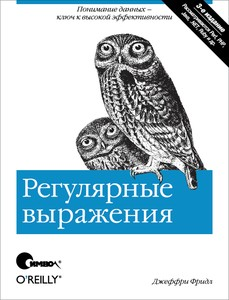
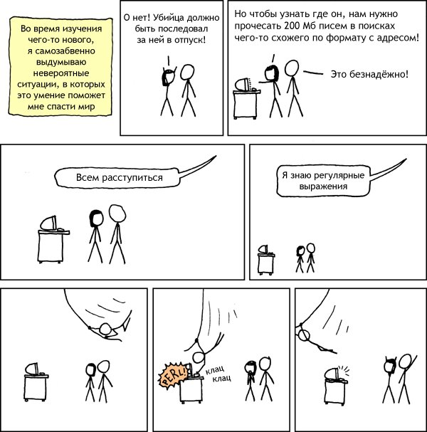

class:firstpage,title

# Программирование на perl

## Регулярки и однострочники

---

# Содержание
* **Регулярные выражения**
    - Сопоставление
    - Поиск и замена
    - Транслитерация
    - Классы символов
    - Модификаторы
    - Группы
    - Оглядывания
    - Захваты
    - Квантификаторы
    - Работа с юникодом
    - Отладка
* Однострочники
* Отладчик

---

# Регулярные выражения
> (*regular expressions*)

## формальный язык поиска и осуществления манипуляций с подстроками в тексте, основанный на использовании метасимволов

.normal-width[]

---

class:center
.img-xkcd[

]
.footer[[xkcd #208](http://xkcd.com/208/)]

---

class:center
.img-xkcd[

]
.footer[[xkcd #208](http://xkcd.ru/208/)]

---

layout: true

.footer[[perlre](http://perldoc.perl.org/perlre.html)]

---

# Сопоставление (`m//`)

```perl
my $string = "sample string";

say "match" if $string =~  /sample/;
say "match" if $string =~ m/sample/;
say "match" if $string =~ m(sample);

for ("sample string") {
    # $_ = "sample string"
    say "match" if /sample/;
#   say "match" if `$_ =~ `/sample/;
}

my $success = $string =~ /sample/;
my $success = /sample/; # $_
```

---

# `m//` - скалярный контекст

> возвращает true (1) или false ("")

```perl
my $str = "my test string";

say scalar $str =~ /test/; # 1
say scalar $str =~ /text/; # ""

for ($str) {
    say scalar /test/; # 1
    say scalar /text/; # ""
}

while ($str =~ /^./) {
    $str = substr($str,1);
}
```

---

# `m//` - списковый контекст

> возвращает все захваты или true/false

```perl
my $str = "my test string";

say $str =~ /test/; # 1
say $str =~ /text/; # ""

say $str =~ /(test)/; # test
say $str =~ /(\w+)/; # my
say $str =~ /(\w+)$/; # string
say $str =~ /(\w+)\s+(\w+)/; # my, test

my @a = $st =~ /(\w+)\s+(\w+)/; # "my", "test"
```

---

# Поиск и замена (`s///`)

> возвращает количество замен (или false)

```perl
my $string = "sample string with sample";

$string =~ s/sample/item/;
$string =~ s{sample}{item};
$string =~ s{sample}
            (item);

$string = "sample string with sample";
my $count = $string =~ s{sample}{item}g;
say $count; # 2

my @samples = ($string);
for (@samples) {
    s/sample/item/;
    # `$_ =~ `s/sample/item/;
}
```

---

# Транслитерация (`y///`, `tr///`)

```perl
my $str = "MiXeD CaSe StRiNg";

# ASCII lowercase;
$str =~ tr/A-Z/a-z/;
# mixed case string

# Change case
my $str = "MiXeD CaSe StRiNg";
$str =~ tr/A-Za-z/a-zA-Z/;
# mIxEd cAsE sTrInG

# ROT-13
$str =~ tr/A-Za-z/N-ZA-Mn-za-m/;
# zVkRq pNfR fGeVaT
```

---

# Метасимволы

## Символы, которые необходимо экранировать

.center.huge[
```
{ } [ ] ( ) ^
$ . | * + ? \
```
]

## Для экранирования можно использовать `quotemeta`

```perl
my $str = '{}[]()^\$.|*+?';
say quotemeta($str);
# \{\}\[\]\(\)\^\\\$\.\|\*\+\?
```

## Остальное в паттерне можно использовать как есть

---

# Классы символов

```perl
[...]      # перечисление
/[abc]/      # "a" или "b" или "c"
/[a-c]/      # то-же самое
/[a-zA-Z]/   # ASCII алфавит

/[bcr]at/    # "bat" или "cat" или "rat"

[^...]     # отрицательное перечисление
/[^abc]/     # что угодно, кроме "a", "b", "c"
/[^a-zA-Z]/  # что угодно, кроме букв ASCII
```

---

# Классы символов

```zzz
`\d` - цифры
`\s` - пробельные символы `[\ \t\r\n\f]` и др.
`\w` - "буква". `[0-9a-zA-Z_]`

`\D` - не цифра. `[^\d]`
`\S` - не пробельный символ. `[^\s]`
`\W` - не "буква". `[^\w]`

`\N` - что угодно, кроме "\n"
`.`  - что угодно, кроме "\n" ⃰
`^`  - начало строки ⃰ ⃰
`$`  - конец строки ⃰ ⃰
```

.small[
>∗  поведение меняется в зависимости от модификатора `/s`  
>∗∗ поведение меняется в зависимости от модификатора `/m`
]

---

# Квантификаторы

> `?` - 0 или 1 (`{0,1}`)<br/>
> `*` - 0 или более (`{0,}`)<br/>
> `+` - 1 или более (`{1,}`)<br/>
> `{x}` - ровно x<br/>
> `{x,y}` - от x до y включительно<br/>
> `{,y}` - от 0 до y включительно<br/>
> `{x,}` - от x до бесконечности*<br/>

```perl
/^1?$/  # "" or "1"
/^a*$/  # "" or "a", "aa", "aaa", ...
/^\d*$/ # "" or "123", "11111111", ...
/^.+$/  # "1" or "abc", not ""
```

\* бесконечность равна 32768

---

# Захваты

> `$1`, `$2`, `$3`, ...

```perl
$_ = "foo bar baz";

m/^(\w+)\s+(\w+)\s+(\w+)$/;
# $1 = 'foo';
# $2 = 'bar';
# $3 = 'baz';

m/^(\w(\w+))\s+((\w+))/;
#  1  2        34
# $1 = 'foo';
# $2 = 'oo';
# $3 = 'bar';
# $4 = 'bar';
```

---

# Захваты

.small[
```perl
$time = "2017-03-06 18:30:21";
```
]
--
.small[
```perl
$time =~ /^\d{4}-\d{2}-\d{2} \d{2}:\d{2}:\d{2}$/;
```
]
--
.small[
```perl
$time =~ /^(\d{4})-(\d{2})-(\d{2}) (\d{2}):(\d{2}):(\d{2})$/;
say "Year     = $1"; # 2017
say "Month    = $2"; # 03
say "Day      = $3"; # 06
say "Hours    = $4"; # 18
say "Minutes  = $5"; # 30
say "Seconds  = $6"; # 21
```
]
--
.small[
```perl
($year, $month, $day, $hours, $minutes, $seconds) = 
    $time =~ /^(\d{4})-(\d{2})-(\d{2}) (\d{2}):(\d{2}):(\d{2})$/;
```
]

---

# Выбор альтернатив `|`

```perl
"i love cats" =~ m/[`c`r]`ats`|dogs/; # matches

"i love dogs" =~ m/[cr]ats|`dogs`/; # matches

"i love rats" =~ m/[c`r`]`ats`|dogs/; # matches

"i love bats" =~ m/[cr]ats|dogs/; # not matches
```

---

# Группы

> `(...)` - захватывающая группа<br/>
> `(?:...)` - незахватывающая группа<br/>

```perl
"a" =~ /^(a|b|cd)$/;   # match
say $1; # a

"b" =~ /^(a|b|cd)$/;   # match
say $1; # b
```
--
```perl
"a" =~ /^(?:a|b|cd)$/;   # match
say $1; # undef

"b" =~ /^(?:a|b|cd)$/;   # match
say $1; # undef
```

---

# Группы
> `(?<name>...)`<br/>
> `(?'name'...)` - захватывающая именованная группа<br/>

```perl
"abc" =~ /^(.)(.)/;
say "first: $1; second: $2";
# first: a; second: b

"abc" =~ /^(?<first>.)(?<second>.)/;
say "first: $+{first}; second: $+{second}";
# first: a; second: b
```
--
```perl
$date = "2017-03-06";
$date =~ 
    /^(?<year>\d{4})-(?<mon>\d{2})-(?<day>\d{2})$/;

say $+{year}; # 2017
say $+{mon};  # 03
say $+{day};  # 06
```

---

# Захваты

```perl
my $s = "abc";
$s =~ /^(?<first>.)(?<second>.)/;
p `%+`;
# {
#     first    "a",
#     second   "b"
# } (tied to Tie::Hash::NamedCapture)
```

> `@-` - массив смещений начала захватов  
> `@+` - массив смещений конца захватов

.left.w70[
```perl
for my $n (1..$#-) {
 say "\$$n = ",
 substr($s, `$-[$n]`, `$+[$n]`-`$-[$n]`)
}
```
]
.right.w30[
```perl
$1 = a
$2 = b
```
]

---

# Модификаторы

> `/s` (single line) - включает в `.` всё

```perl
"\n" =~ /^.$/; # no match
"`\n`" =~ /^.$/s; # match
```

.not[
```perl
my $s = "line1`\n`line2\n";
$s =~ /line1.line2/; # no match
```
]

```perl
my $s = "line1`\n`line2\n";
$s =~ /line1.line2/`s`; # match
```

---

# Модификаторы

> `/m` (multiline)<br/>
> - `^` начало каждой строки<br/>
> - `$` конец каждой строки (до \n)

```perl
for("sample\nstring") {
   /^(.+)$/;    ## no match

   /^(.+)$/m;   # `sample`\nstring # `/m`: \n -> `$`\n`^`
   /^(.+)$/ms;  # `sample\nstring` # `/s`: \n ~~ .

   /^string/;   ## no match
   /^string/m;  # sample\n`string` # `/m`: \n -> `$`\n`^`
}
```

---

# Модификаторы

> `/i` (case insensitive)

```perl
my $s = "sample\nstring";

$s =~ /SAMPLE/;    # no match
$s =~ /SAMPLE/i;   # "sample"

# Unicode!

"tschü`ß`" =~ /TSCHÜ`SS`/i    # match. ß ↔ SS
"`Σ`ί`σ`υφο`ς`" =~ /`Σ`Ί`Σ`ΥΦΟ`Σ`/i  # match. Σ ↔ σ ↔ ς
```

---

# Модификаторы

> `/x` (eXtended regexp)

```perl
$hexdig =~ /^0x((?:[0-9]|[a-f])+)$/;
```

```perl
$hexdig =~ m{
    ^ # begin of string
    0x # common hex prefix
    ( # capture only symbols
        (?:
            [0-9] # it could be digit
            |     # or
            [a-f] # letters from a to f
        )+ # several times
    )
    $ # end of string
}x;
```

---

# Модификаторы

> `/g` (global)

```perl
my $s = "aaaa";
$s =~ s/a/b/;  # "baaa"
$s =~ s/a/b/g; # "bbbb"

@a = $a =~ /(.)/; # ('a')
@a = $a =~ /(.)/g; # ('a','a','a','a')

my $string = '~!@#$%^&*()';
$string =~ s{(.)}{\\$1}g;
# \~\!\@\#\$\%\^\&\*\(\)
```


---

# Модификаторы

> `/o` (optimize: compile only once)

.left.w70.small[
```perl
for my $var (qw(test text string)) {
    say "ok: $1"
        if "test string" =~ /($var)/;
}
```
]
.right.w30.small[
```perl
ok: test
ok: string
```
]

.left.w70.small[
```perl
for my $var (qw(test text string)) {
    say "ok: $1"
        if "test string" =~ /(`$var`)/`o`;
}
```
]
.right.w30.small[
```perl
ok: test
ok: test
ok: test
```
]

---

# Модификаторы

> `/e`, `/ee` (eval, double eval)

```perl
my $string = '~!@#$%^&*()';

$string =~ s{(.)}{
    sprintf("U+%v04x;",$1)
}ge;
#U+007e;U+0021;U+0040;U+0023;U+0024;U+0025;
#U+005e;U+0026;U+002a;U+0028;U+0029;

my $nums = "0x123 123 0xff";
$nums =~ s{0x([\da-f]+)}{ hex($1) }ge;
say $nums; # 291 123 255
```

---

# Модификаторы

> `/e`, `/ee` (eval, double eval)

[не печатает](http://www.linux.org.ru/forum/development/392747)

<code>
&#99;&#97;&#116;&#32;&#34;&#116;&#101;&#115;&#116;&#46;&#46;&#46;&#32;&#116;&#101;&#115;&#116;&#46;&#46;&#46;&#32;&#116;&#101;&#115;&#116;&#46;&#46;&#46;&#34;&#32;&#124;&#32;&#112;&#101;&#114;&#108;&#32;&#45;&#101;&#32;&#39;&#36;&#63;&#63;&#115;&#58;&#59;&#115;&#58;&#115;&#59;&#59;&#36;&#63;&#58;&#58;&#115;&#59;&#59;&#61;&#93;&#61;&#62;&#37;&#45;&#123;&#37;&#35;&#40;&#47;&#124;&#125;&#60;&#38;&#124;&#96;&#123;&#59;&#59;&#121;&#59;&#32;&#45;&#47;&#58;&#45;&#64;&#91;&#45;&#96;&#123;&#45;&#125;&#59;&#96;&#45;&#123;&#47;&#34;&#32;&#45;&#59;&#59;&#115;&#59;&#59;&#36;&#95;&#59;&#115;&#101;&#101;&#59;&#39;
</code>

---

# Модификаторы

> `/e`, `/ee` (eval, double eval)


```xxx
$?
    ?
        s`:`;s`:`s;;$?`:`
    :
        s`;;`=]=>%-{%#(/|}<&|‵{`;`
    ;
y`;` -/:-@[-‵{-}`;`‵-{/" -`;;`
s`;;`$_`;`see;
```

---
# Модификаторы

> `/e`, `/ee` (eval, double eval)

```shx
#$?
#    ?
#        s/;s/s;;$?/
#    :
        $_ = '=]=>%-{%#(/|}<&|‵{'
    ;
tr( -/:-@[-‵{-})
  (‵-{/" -);

s//$_/see;
```

---

# Модификаторы

> `/e`, `/ee` (eval, double eval)

```xxx
$_ = '=]=>%-{%#(/|}<&|‵{';
tr( -/:-@[-‵{-})
  (‵-{/" -);
```
--
```perl
say $_; # system"echo -rf /"
```
--
```perl
s//$_/see;
# match empty string in $_
# replace it with eval(eval( '$_' ))
```
--
```xxx
# eval '$_' gives 'system"echo -rf /"'
# eval 'system"echo -rf /"' gives ...
```

---
class:center, middle


---

# Модификаторы

> `/a`, `/aa` (ASCII-safe) (`\d`, `\s`, `\w`)

```perl
use utf8;
use charnames ':full';
my $nums = "०१२३";
$nums =~ /\d/; # match
$nums =~ /\d/a; # no match

my $str = "\N{KELVIN SIGN}";
say $str =~ /K/i; # match
say $str =~ /K/ai; # match
say $str =~ /K/aai; # no match

say ord "\N{KELVIN SIGN}"; # 8490 (K)
say ord fc "\N{KELVIN SIGN}"; # 107 (k)
```
---

# Оглядывания

```perl
$_ = "foo bar baz"; # -> foo, bar, baz
```
--
```perl
say s/`\w+`/,/gr; # , , ,
```
--
```perl
say s/`(`\w+`)`/`$1`,/gr; # foo, bar, baz,
```
--
```perl
say s/(\w+)`\s+`/$1,/gr; # foo,bar,baz
```
--
```perl
say s/(\w+)`(`\s+`)`/$1,`$2`/gr; # foo, bar, baz
```
--
```perl
say s/(\w+)(`?=`\s+)/$1,/gr; # foo, bar, baz
```

---
# Оглядывания

> `(?=...)` - 0W+ вперёд<br/>
> `(?!...)` - 0W- вперёд<br/>
> `(?<=...)` - 0W+ назад<br/>
> `(?<!...)` - 0W- назад<br/>

```perl
$_ = "foo bar baz";

say s{(\w)(`?=`\s+)}{$1,}rg; # foo, bar, baz
say s{(`?<=` )(\w)}{:$1}rg; # foo :bar :baz

say s{(\s)(`?!`bar)}{_}rg; # foo bar_baz

say s{(`?<!` )(\w+)}{[$1]}rg; # [foo] b[ar] b[az]

$_ = "foo bar.baz quux";

say s{(`?<!`[ \w])(\w)}{`\u`$1}rg; # Foo bar.Baz quux
```

---

# Use-case: http header

```perl
$_ = "if-modified-since";
    # If-Modified-Since
```
--
```perl
say join "-", map ucfirst, split /-/, $_;
```
--
```perl
say s{ (`?<=` `-` ) (.) }{\u$1}rgx
    =~ s{^(.)}{\u$1}rg;
```
--
```perl
say s{
    (`?:`
        (`?<=` -) `(.)` # $1
        `|`
        ^ `(.)` # $2
    )
    }{\u$1$2}rgx;
```

---

# Branch reset
> `(?|...)`

```perl
$_ = "if-modified-since";
    # If-Modified-Since

say s{
    (`?|`
        (?<=-) `(.)` # $1
        `|`
        ^ `(.)` #  also $1
    )
    }{\u$1}rgx;

```

---

# Квантификаторы и жадность

> `?` - 0 или 1 (`{0,1}`)<br/>
> `*` - 0 или более (`{0,}`)<br/>
> `+` - 1 или более (`{1,}`)<br/>
> `{x}` - ровно x<br/>
> `{x,y}` - от x до y включительно<br/>
> `{,y}` - от 0 до y включительно<br/>
> `{x,}` - от x до бесконечности<br/>
> quantifier `?` - минимально<br/>
> quantifier `+` - без отката

---

# Квантификаторы и жадность

```perl
say "bc"    =~ /^(a*)b/;   # match, ""
say "abc"   =~ /^(a*)b/;   # match, "a"
say "aabc"  =~ /^(a*)b/;   # match, "aa"
say "aaabc" =~ /^(a*)b/;   # match, "aaa"
```
--
```perl
say "aaabc" =~ /^(a*)/;      # match, "aaa"
say "aaabc" =~ /^(a*`?`)/;   # match, ""
say "aaabc" =~ /^(a*`?`)a/;  # match, ""
say "aaabc" =~ /^(a*`?`)ab/; # match, "aa"
```
--
```perl
say "aaabc" =~ /^(a*`+`)/;   # match, "aaa"
say "aaabc" =~ /^(a*`+`)b/;  # match, "aaa"
say "aaabc" =~ /^(a*`+`)ab/; # no match
```

---

# Квантификаторы и жадность

```perl
say "bc"    =~ /^(a+)b/;   # no match
say "abc"   =~ /^(a+)b/;   # match, "a"
say "aabc"  =~ /^(a+)b/;   # match, "aa"
say "aaabc" =~ /^(a+)b/;   # match, "aaa"
```
--
```perl
say "aaabc" =~ /^(a+)/;      # match, "aaa"
say "aaabc" =~ /^(a+`?`)/;   # match, "a"
say "aaabc" =~ /^(a+`?`)a/;  # match, "a"
say "aaabc" =~ /^(a+`?`)ab/; # match, "aa"
```
--
```perl
say "aaabc" =~ /^(a+`+`)/;   # match, "aaa"
say "aaabc" =~ /^(a+`+`)b/;  # match, "aaa"
say "aaabc" =~ /^(a+`+`)ab/; # no match
```

---

# Квантификаторы и жадность

```perl
say "bc"    =~ /^(a{1,2})b/; # no match
say "abc"   =~ /^(a{1,2})b/; # match, "a"
say "aabc"  =~ /^(a{1,2})b/; # match, "aa"
say "aaabc" =~ /^(a{1,2})b/; # no match
```
--
```perl
say "aaabc"  =~ /^(a{1,2})a/;  # match "aa"
say "aaabc"  =~ /^(a{1,2}`?`)a/; # match "a"
say "aabc"   =~ /^(a{1,2}`?`)b/; # match "aa"
```

---

# Backreferencing

> `\gN` или `\N` или `\g{-N}`

```perl
for (
    q{some with "quoted value" string},
    q{some with 'quoted " value' string},
) {
    say $2 if m{(["'])(.*?)`\g1`};
}
# quoted value
# quoted " value

for ('e66e', 'f99f', 'z87z' ) {
    say $1 if m{(([a-z])(\d)`\g{-1}``\g{-2}`)}x;
}
#e66e
#f99f
```

---

# Global match

> `/g`, `/c`, `\G` и `pos()`

```perl
$_ = "abcd";
while (/(.)/`g`) {
    say $1, " ", `pos($_)`;
    # a 1
    # b 2
    # c 3
    # d 4
}
say $1, " ", pos($_);
# undef, undef
```

---

# Global match

> `/g`, `/c`, `\G` и `pos()`

```perl
$_ = "abcd";
while (/(.)/g`c`) {
    say $1, " ", pos($_);
    # a 1
    # b 2
    # c 3
    # d 4
}
say $1, " ", pos($_);
# undef, 4
```

---

# Global match

> `/g`, `/c`, `\G` и `pos()`

```perl
$_ = "abcdxcdcd";
while (/`\G`(.)/gc) {
    my $key = $1;
    my $pos = pos($_);
    if (/`\G`cd/gc) {
        say "the key before cd is $key at $pos";
    } else {
        say "no cd next after $key";
    }
}
# no cd next after a
# the key before cd is b at 2
# the key before cd is x at 5
# no cd next after c
# no cd next after d

```
---

# Однопроходный парсинг

```perl
my $str = ...
for ($str) {
  while (pos() < length()) {
    if (/\G(\d+)/gc) {
      say "got digits $1";
    }
    elsif (/\G(\D+)/gc) {
      say "got non-digits $1";
    }
    else {
      die "Bad sequence";
    }
  }
}
```

---

# Классы символов Unicode

```perl
`\p{Category}` - совпадение с категорией
`\P{Category}` - исключение категории
`\N{SYMBOL NAME}` - точное имя (см. charnames)
```

```perl
"UPPER" =~ /\p{IsUpper}/; # match
"UPPER" =~ /\P{IsUpper}/; # no match
"UPPER" =~ /\p{IsLower}/; # no match
"UPPER" =~ /\P{IsLower}/; # match

say q{«string"with'quotes»} =~
    s/\p{Quotation Mark}+/ /rg;
# ' string with quotes '
```

---

# Отладка регулярных выражений

> `use re 'debug';`<br>
> [perldebguts](http://perldoc.perl.org/perldebguts.html#Debugging-Regular-Expressions)


```perl
perl -Mre=debug -E '"aaabc"   =~ /^(a{1,2}?)ab/;'
```

```
Compiling REx "^(a{1,2}?)ab"
Final program:
   1: BOL (2)             # Beginning of line
   2: OPEN1 (4)           # Open group 1
   4:   MINMOD (5)        # Nongreedy (?)
   5:   CURLY {1,2} (9)   # Quantifier {}
   7:     EXACT <a> (0)
   9: CLOSE1 (11)
  11: EXACT <ab> (13)
  13: END (0)
```


---

# Отладка регулярных выражений

```
Guessed: match at offset 0
Matching REx "^(a{1,2}?)ab" against "aaabc"
   0 <> <aaabc>              |  1:BOL(2)
   0 <> <aaabc>              |  2:OPEN1(4)
   0 <> <aaabc>              |  4:MINMOD(5)
   0 <> <aaabc>              |  5:CURLY {1,2}(9)
                  EXACT <a> can match 1 times out of 1...
   1 <a> <aabc>              |  9:  CLOSE1(11)
   1 <a> <aabc>              | 11:  EXACT <ab>(13)
                    failed...
                  EXACT <a> can match 1 times out of 1...
   2 <aa> <abc>              |  9:  CLOSE1(11)
   2 <aa> <abc>              | 11:  EXACT <ab>(13)
   4 <aaab> <c>              | 13:  END(0)
Match successful!
```

---
class:center

# Рекомендуется к ознакомлению

<br/><br/><br/><br/><br/>

# [regexcrossword.com](https://regexcrossword.com)

---

# Содержание
* Регулярные выражения
    - Сопоставление
    - Поиск и замена
    - Транслитерация
    - Классы символов
    - Модификаторы
    - Группы
    - Оглядывания
    - Захваты
    - Квантификаторы
    - Работа с юникодом
    - Отладка
* **Однострочники**
* Отладчик

---

layout: true
# Однострочники
.footer[[perlrun](http://perldoc.perl.org/perlrun.html)]

---
## Запуск скриптов (`-e`, `-E`)

```sh
> perl -e 'print "Hello world\n"'
Hello world
```

```sh
> perl -E 'say "Hello world"'
Hello world
```

```sh
> perl -E '
say "Hello world"
'
Hello world
```

```sh
> perl
print "Hello world\n"
# Ctrl+D
Hello world
```

---

## Кавычки

```sh
perl -E 'say $USER'; # ""
```

```sh
perl -E "say '$USER'"; # mons
```


```sh
perl -E 'say q{$USER}'; # $USER
```

---

## Вывод предупреждений (`-w`)

.small[
```bash
perl -wE '$x = 100; $z = $x + $y; say $z'
Name "main::y" used only once: possible typo at -e line 1.
Use of uninitialized value $y in addition (+) at -e line 1.
100
```
]

---

## Подключение модулей (`-M`)

```sh
perl -MDDP -E '%test = 1..10; p %test';
```

```sh
perl -MData::Dumper -E \
'%test = 1..10; say Dumper \%test';
```

---

## Обработка стандартного ввода

.left.w70.small[
```sh
echo -ne "1\n2\n3\n" |
perl -E 'while (<>) { say $_ }'
```
]
.right.w30.small[
```xxx
1

2

3

```
]

.left.w70.small[
```sh
echo -ne "1\n2\n3\n" |
perl -E 'while (<>) { chomp; say $_ }'
```
]
.right.w30.small[
```xxx
1
2
3
```
]

---

layout:false

# Специальные переменные

.footer[[perlvar](http://perldoc.perl.org/perlvar.html)]

* `$"` - разделитель при интерполяции в кавычках
* `$,` - разделитель между элементами списка при выводе
* `$/` - разделитель входного потока для readline
* `$\` - разделитель выходного потока для print
* `$.` - номер текущей строки во входном потоке

---

# B::Deparse, use O 'Deparse'

```sh
perl -MO=Deparse -E 'say "ok"'
```

```sh
use feature ...
say 'ok';
-e syntax OK
```

---

layout: true
# Однострочники
.footer[[perlrun](http://perldoc.perl.org/perlrun.html)]

---
## Автоматическая обработка концов строк (`-l`)

```sh
> perl -e 'print "ok"'
ok>
```
--
```sh
> perl -l -e 'print "ok"'
ok
>
```
--
```sh
perl -MO=Deparse -l -e 'print "ok"'
```
```perl
*BEGIN { $/ = "\n"; $\ = "\n"; }
print 'ok';
-e syntax OK
```

---

## Обарачичвание в цикл (`-n`)

.left.w70[
```sh
echo -ne "1\n2\n3\n" |
perl -n -e 'print $_'
```
]
.right.w30[
```sh
1
2
3
```
]

--

<br>
```sh
perl -MO=Deparse -n -e 'print $_'
```

```perl
LINE: while (defined($_ = <ARGV>)) {
    print $_;
}
-e syntax OK
```

---

## Автоматическая печать (`-p`)

.left.w70[
```sh
echo -ne "1\n2\n3\n" |
perl -p -e 'print "line $.: "'
```
]
.right.w30[
```sh
line 1: 1
line 2: 2
line 3: 3
```
]

--

<br>
```sh
perl -MO=Deparse -p -e 'print "line $.: "'
```

```perl
LINE: while (defined($_ = <ARGV>)) {
    print "line $.: ";
}
continue {
    die "-p destination: $!\n" unless print $_;
}
-e syntax OK
```

---

## Совместное использование `-l` `-n`

.left.w70[
```sh
echo -ne "a\nb\nc\n" | 
perl -lne 'print $_." ".$.'
```
]
.right.w30[
```sh
a 1
b 2
c 3
```
]

--

<br>
```sh
perl -MO=Deparse -lne 'print $_." ".$.'
```

```perl
BEGIN { $/ = "\n"; $\ = "\n"; }
LINE: while (defined($_ = <ARGV>)) {
    chomp $_;
    print $_ . ' ' . $.;
}
-e syntax OK
```

---

## Разбиение строк (`-n`, `-a`)

.left.w70[
```sh
echo -ne "a aa\nb bb\nc cc\n" | 
perl -naE 'say "$F[1] - $F[0]"'
```
]
.right.w30[
```sh
aa - a
bb - b
cc - c
```
]

--

<br>

```sh
perl -MO=Deparse -naE 'say "$F[1] - $F[0]"'
```

```perl
use feature ...;
LINE: while (defined($_ = <ARGV>)) {
    our @F = split(' ', $_, 0);
    say "$F[1] - $F[0]";
}
-e syntax OK
```
---

## Разбиение строк (`-n`, `-a`, `-F`)

.left.w70.small[
```sh
echo -ne "a:aa\nb:bb\nc:cc\n" | 
perl -na `-F:` -E 'say "$F[1] - $F[0]"'
```
]
.right.w30[
```sh
aa - a
bb - b
cc - c
```
]

--

<br>

```sh
perl -MO=Deparse -na `-F:` -E 'say "$F[1] - $F[0]"'
```

```perl
use feature ...;
LINE: while (defined($_ = <ARGV>)) {
    our(@F) = split(`/:/`, $_, 0);
    say "$F[1] - $F[0]";
}
```

---

## Example

.small[
```sh
perl -i -lpE 's{^(\t+)}{ "    "x(length $1) }e' file
```
]
.small[
```perl
BEGIN { $/ = "\n"; $\ = "\n"; }
LINE: while (defined($_ = <ARGV>)) {
    chomp $_;
    s/^(\t+)/ "    " x length($1);/eu;
}
continue {
    die "-p destination: $!\n" unless print $_;
}
```
]

--

.small[
```sh
perl -i -lpE 's{^(( {8})*)}{ "\t"x(length($1)/8) }e'
```
]

---

# Содержание
* Регулярные выражения
    - Сопоставление
    - Поиск и замена
    - Транслитерация
    - Классы символов
    - Модификаторы
    - Группы
    - Оглядывания
    - Захваты
    - Квантификаторы
    - Работа с юникодом
    - Отладка
* Однострочники
* **Отладчик**

---

layout: true

# Отладка perl скриптов

.footer[[perldebug](http://perldoc.perl.org/perldebug.html)]

---

Для начала работы с дебагером рекомендую прочитать документацию perldebtut

Запуск отладчика выполняется добавлением ключа -d при запуске интерпретатора

```sh
perl -d myscript.pl
```

Для того, что бы отладчик запустился скрипт не должен содержать синтаксических ошибок и должен нормально компилироваться perl -c

---

После запуска отладчика вы увидите на экране

```xxx
Loading DB routines from perl5db.pl version 1.44
Editor support available.

Enter h or 'h h' for help, or 'perldoc perldebug' for more help.

DB<1>
```

Далее отладчик ждёт от вас команд

---

Отладка программ подразумевает построчное их выполнение с возможностью просмотра состояния переменных между ними.

Одним из вариантов отладки является вывод в STDERR состояния переменных в том или ином месте кода (т.н. отладка `warn`'ами).

Каждый из вариантов является по своему удобным.

---

Как это выглядит. Скрипт:

```perl
use strict;

my $ret = 0;

for (my $i = 0; $i < 50; $i++) {
    if( $ret > $i ){
        $ret -= $i;
    }
    else {
        $ret += $i;
    }
}
print $ret;
```

---

Запускаем

```xxx
perl -d mydebug.pl
```
Отладчик запустился и выдал приглашение

```xxx
Loading DB routines from perl5db.pl version 1.44
Editor support available.

Enter h or 'h h' for help, or 'perldoc perldebug' for more help.

main::(mydebug.pl:3):   my $ret = 0;

DB< 1 >
```

---

Просмотр кода с текущей позиции командой `l`

.small[
```perl
3==>    my $ret = 0;
4
5:      for (my $i = 0; $i < 50; $i++) {
6:              if( $ret > $i ){
7:                      $ret -= $i;
8:              }
9:              else {
10:                     $ret += $i;
```
]
Установим точку останова на 6 строку при достижении 10 итерации цикла:

```xxx
b 6 $i == 9
```

Запустим программу

```xxx
c
```

---

Когда выполнится условие `$i == 9` сработает точка останова и на экране появится сообщение

```xxx
DB< 7 >
c
main::(mydebug.pl:6):           if($ret > $i){
```

Выведем значение переменной $i

```xxx
DB< 7 > print $i
9
```

А так же поставим отслеживаться переменную $ret:

```xxx
w $ret
```

---

Выполним следующую строку скрипта:

```xxx
DB< 9 >
n
Watchpoint 0:   $ret changed:
old value:  ''
new value:  '16'
main::(mydebug.pl:7):                  $ret -= $i;

DB< 9 >
```

Дальнейшая отладка происходит по тем же принципам

---
layout: false

# Список документации

## Регулярные выражения

* [perlre](http://perldoc.perl.org/perlre.html)
* [perlrequick](http://perldoc.perl.org/perlrequick.html)
* [perlretut](http://perldoc.perl.org/perlretut.html)
* [perlrecharclass](http://perldoc.perl.org/perlrecharclass.html)
* [re](http://perldoc.perl.org/re.html)
* [pos](http://perldoc.perl.org/functions/pos.html)

## Однострочники

* [perlrun](http://perldoc.perl.org/perlrun.html)

## Отладчик

* [perldebtut](http://perldoc.perl.org/perldebtut.html)
* [perldebug](http://perldoc.perl.org/perldebug.html)


---

# Домашнее задание

## Анализатор логов веб-сервера (log-analyzer)

В файле access.log.bz2 находится обезличенный фрагмент логов веб-сервера. Каждая строка содержит следующие поля:
* IP-адрес
* метка времени
* строка запроса
* статус-код выполнения запроса
* кол-во отданных по сети байт сжатых данных
* referer (URI, с которого был осуществлен вызов запроса)
* user agent (метка браузера или робота, выполнившего запрос)
* коэффициент сжатия данных перед передачей по сети

https://github.com/Nikolo/Technosfera-perl/tree/master/homeworks/log-analyzer

---

# Домашнее задание

Требуется написать скрипт для обработки данного лог-файла, который получит на вход имя сжатого bzip2 файла с логом, и выведет таблицу в формате TSV (tab-separated-values).

Таблица должна содержать строки с информацией по каждому из 10 хостов, совершивших наибольшее число запросов, а также строку с информацией для всего лога в целом.

Строки должны быть отсортированы по количеству фактически совершенных запросов в обратном порядке, то есть первой идет строка "total" с информацией по всему логу, за ней - информация по самому активному IP и т.д.

---

Строка лога

```xxx
68.51.111.236 [03/Mar/2017:18:28:38 +0300]
 "GET /music/artists/Pink%20Floyd HTTP/1.1"
 200 66477 "-" "Mozilla/5.0 (compatible; 
 Yahoo! Slurp; http://help.yahoo.com/help/
 us/ysearch/slurp)" "6.51"
```

Вывод программы

```xxx
IP          count avg     data    200    301    302 ...
total       10    10.55   4321    4723   708    102 ...
121.0.0.1   5     2.32    0       63036  146    248 ...
121.0.0.2   3     2.68    1106    112    12     31  ...
121.0.0.3   2     1.12    1986    813    1      0   ...
...
```


---

layout:false
class:lastpage title

# Спасибо за внимание!

## Оставьте отзыв

.teacher[]
