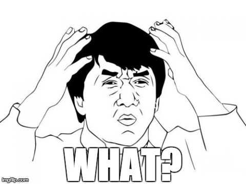
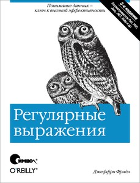
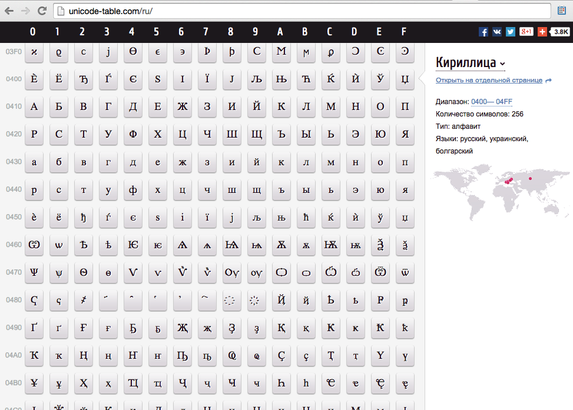

class:firstpage, title

# Программирование на Perl

## Расширенный синтаксис

---
class:note_and_mark title

# Отметьтесь на портале!

---
class: center, middle

# TIMTOWTDI

##There’s More Than One Way To Do It

---
layout:false
# Содержание

* **Сложные структуры данных**
    - Вложенные структуры
    - Символические ссылки
    - Массивы массивов
    - Рекурсия
* Функции
    - Контекст
    - Прототипы
    - Стек
    - Lvalue
* Операторы
    - true и false
    - Строки и числа
    - Логические операторы
* Регулярные выражения
    - введение
* Юникод

---

# Recall

```perl
my `@`array = `(` 4, 8, 15, 16, 23, 42 `)`;
my `%`hash  = `(` k1 => "v1", k2 => v2 `)`;

say `$`array[3]; # 15
say `$`hash{k1}; # v1

my `$`aref  = `[` 4, 8, 15, 16, 23, 42 `]`;
my `$`href  = `{` k1 => "v1", k2 => v2 `}`;

say `$`aref`->`[3];  # 15
say `$`href`->`{k1}; # v1

say ref $aref; # ARRAY
say ref $href; # HASH
```

---
# Сложные структуры

```perl
$var = 7;
%hash = (
    s => "string",
    a => [ qw(some elements) ],  # ARRAY REF
    h => {                       # HASH REF
        nested => "value",
        "key\0" => [ 1,2,$var ], # ARRAY REF
    },
    f => sub { say "ok:@_"; },   # ANON SUB
);

say $hash{s};                 # string
say $hash{a}->[1];            # elements
say $hash{a}[1];              # elements
say $hash{h}`->`{"key\0"}`->`[2]; # 7
say $hash{h}` `{"key\0"}` `[2];   # 7
$hash{f}->(3);                # ok:3
```

---
# Сложные структуры

```perl
$var = 7;
`$`href = `{`
    s => "string",
    a => [ qw(some elements) ],
    h => {
        nested => "value",
        "key\0" => [ 1,2,$var ],
    },
    f => sub { say "ok:@_"; }, 
`}`;

say $href`->`{s};                 # string
say $href`->`{a}->[1];            # elements
say $href`->`{a}[1];              # elements
say $href`->`{h}`->`{"key\0"}`->`[2]; # 7
say $href`->`{h}` `{"key\0"}` `[2];     # 7
$href->{f}->(3);                # ok:3
```

---
# HASH != HASHREF

.not[
```perl
$, = ", "; # $OUTPUT_FIELD_SEPARATOR
@array = (1,2,3);
say @array; # 1, 2, 3

*@array = [1,2,3];
say @array; # ARRAY(0x7fcd02821d38)

%hash  = (key => "value");
say %hash; # key, value

*%hash  = {key => "value"};
say %hash; # HASH(0x7fbbd90052f0)

*%hash = ( key1 => (1,2), key2 => (3,4) );
say $hash{key1}; # 1
say $hash{key2}; # undef
say $hash{2};    # key2
%hash = ( key1 => 1,2 => 'key2', 3 => 4 );
```
]

---
# Автооживление (autovivification)

```perl
$href = {
    s => "string",
};

$href->{none}{key} = "exists";
say $href->{none};      # HASH(0x7fea...)
say $href->{none}{key}; # exists

$href->{ary}[7] = "seven";
say $href->{ary};       # ARRAY(0x7f9...)
say $href->{ary}[7];    # seven
say $#{ $href->{ary} }; # 7
```

---
# Автооживление (autovivification)

```perl
$track = {
    name => "Nobody home",
    band => "Pink Floyd",
    album => { name => "The Wall", year => 1979 }
};

$track = {
    name => "Arnold Lane",
    band => "Pink Floyd"
};

say "Track from single" unless $track->{album};

say "'The Wall' album"
    if $track->{album}{name} eq 'The Wall';

say "Track from album" if $track->{album};
```

---
# Автооживление (autovivification)

```perl
$href = {
    s => "string",
};

$href->{none}{key} = "exists";
say $href->{none};      # HASH(0x7fea...)
say $href->{none}{key}; # exists

$href->{ary}[7] = "seven";
say $href->{ary};       # ARRAY(0x7f9...)
say $href->{ary}[7];    # seven
say $#{ $href->{ary} }; # 7

$href->{s}{error} = "what?";
say $href->{s}{error};  # what?

say $string{error};     # what?
```

---
# Автооживление (autovivification)

.not[
```perl
$href = {
    s => "string",
};

$href->{none}{key} = "exists";
say $href->{none};      # HASH(0x7fea...)
say $href->{none}{key}; # exists

$href->{ary}[7] = "seven";
say $href->{ary};       # ARRAY(0x7f9...)
say $href->{ary}[7];    # seven
say $#{ $href->{ary} }; # 7

*$href->{s}{error} = "what?";
*say $href->{s}{error};  # what?

*say $string{error};     # what?
```
]
---

.center[

]

---
layout: false
# Символические ссылки
> Переменная, чьё значение является именем другой переменной

```perl
$name = "var";
$$name = 1;     # устанавливает $var в 1
${$name} = 2;   # устанавливает $var в 2
@$name = (3,4); # устанавливает @var в (3,4)

$name->{key} = 7; # создаёт %var и
                  # устанавливает $var{key}=7

$name->();      # вызывает функцию var
```

---
# Символические ссылки
> `use strict 'refs'` запрещает их использование

```perl
use strict 'refs';

${ bareword }    # ≡ $bareword; # ok
*${ "bareword" }; # not ok

$hash{ key1 }{ key2 }{ key3 };       # ok
$hash{ "key1" }{ "key2" }{ "key3" }; # also ok

$hash{shift};     # no call to shift
$hash{ +shift };  # call is done
$hash{ shift() }; # or so

```

---

# Массивы массивов

```perl
my @array = (1,2,3);
```

--

```perl
my @AofA = (
    [1,2,3],
    [4,5,6],
    [7,8,9],
);
```

--

```perl
my @AofAofA = (
    [ [1,2,3], [4,5,6], [7,8,9] ],
    [ [0,1,2], [3,4,5], [6,7,8] ],
    [ [9,0,1], [2,3,4], [5,6,7] ],
);
```

---

# Массивы массивов

```perl
my $array = [1,2,3];
```

```perl
my $AofA = [
    [1,2,3],
    [4,5,6],
    [7,8,9],
];
```

```perl
my $AofAofA = [
    [ [1,2,3], [4,5,6], [7,8,9] ],
    [ [0,1,2], [3,4,5], [6,7,8] ],
    [ [9,0,1], [2,3,4], [5,6,7] ],
];
```

---
# Массивы массивов

```perl
say $array[0];    # 1

say $AofA[0];     # ARRAY(0x...)
say $AofA[0][0];  # 1

say $AofAofA[0];        # ARRAY(0x...)
say $AofAofA[0][0];     # ARRAY(0x...)
say $AofAofA[0][0][0];  # 1
```

--

```perl
say $array->[0];    # 1

say $AofA->[0];     # ARRAY(0x...)
say $AofA->[0][0];  # 1

say $AofAofA->[0];        # ARRAY(0x...)
say $AofAofA->[0][0];     # ARRAY(0x...)
say $AofAofA->[0][0][0];  # 1
```

---

# Манипуляции

```perl
say scalar @{ $AofA[0] }; # 3
say $#{ $AofA[0] }; # 2

push @{ $AofA[0] }, 4;
shift @{ $AofA[0] };

# cleanup
@{ $AofA[1] } = (); # make empty
$AofA[1] = [];      # create new

for my $row ( @AofA ) {
    say ref $row; # ARRAY
    say join ", ", @$row;
}
```

---

.small14[
```perl
{
    'playlist' => {
        'id'   => '167759395430',
        'name' => 'Nirvana',
        'tagList' => [
            {
                'name' => 'grunge',
                'id' => 220044
            },
            {
                'name' => 'rock',
                'id' => 295024
            }
        ],   
        'counts' => { 
            'play' => 1499,
            'tracks' => 20
        },
        'owner' => { 
            'id' => 255670890,
            'name' => {
                'first' => "Василий",
                'last' => "Иванов"
            },
            'music' => { 
                'count' => {
                    'playlists' => 41,
                    'tracks' => 3171
                },
                'isModerator' => 0,
            },   
        }    
    }    
};
```
]

---

# Examine

```perl
my $complex_structure = ...;

use Data::Dumper;
print Dumper $complex_structure;

local $Data::Dumper::Maxdepth = 1;
local $Data::Dumper::Sortkeys = 1;

print Dumper $complex_structure;

use DDP;
p $complex_structure;
```

---

# Sort

```perl
my @list = (
    { name => "Dean", year => 1979 },
    { name => "Sam",  year => 1983 },
    { name => "John", year => 1954 },
    { name => "Mary", year => 1954 },
);

my @sorted = sort {
    $a->{year} <=> $b->{year}
    ||
    $a->{name} cmp $b->{name}
} @list;

for (@sorted) {
    say "$_->{name} ($_->{year})";
}
```

---

```perl
my @pic = (
    [ { r=>123, g=>127, b=>27 }, ...  ],
    [ { r=>99, g=>255, b=>127 }, ...  ],
    ...
);
my @gray = map { # $_ is a row
    [
        map { # $_ is a cell
            int(($_->{r}+$_->{g}+$_->{b})/3)
        } @$_
    ];
} @pic;

say Dumper \@gray;
[
    [ 92, ... ],
    [ 160, ...],
    ...
]
```

---

```perl
sub dumper; sub dumper {
    my $what = shift; my $depth = shift || 0;
    if (my $ref = ref $what) {
        if ($ref eq 'ARRAY') {
            say "  "x$depth,"-";
            dumper($_,$depth+1) for @$what;
        }
        elsif ($ref eq 'HASH') {
            while (my ($k,$v) = each %$what) {
                say "  "x$depth,"$k:";
                dumper($v,$depth+1);
            }
        }
        else { die "unsupported: $ref"; }
    }
    else {
        say "  "x$depth,$what;
    }
}
```

---

# sample

```perl
-
  -
    g:
      127
    r:
      123
    b:
      27
  -
    g:
      255
    r:
      99
    b:
      127
```


---

layout:false
# Содержание

* Сложные структуры данных
    - Вложенные структуры
    - Символические ссылки
    - Массивы массивов
    - Рекурсия
* **Функции**
    - Контекст
    - Прототипы
    - Стек
    - Lvalue
* Операторы
    - true и false
    - Строки и числа
    - Логические операторы
* Регулярные выражения
    - введение
* Юникод

---

# Context: wantarray
```perl
sub math {
    my ($x,$y) = @_;

    if (`wantarray`) {
        # called in list context
        return $x + $y, $x - $y; # LIST
    }
    elsif (`defined wantarray`) {
        # wantarray is false, but defined
        # scalar context
        return $x + $y; # SCALAR
    }
    else {
        # void context, no result
        return;
    }
}
```

---

# Context: wantarray

```perl
sub test () {
    return wantarray ? "list" :
    defined wantarray ? "scalar" :
    "void";
}

my `@`x   = test; # list
my `(`$x`)` = test; # list
`say` test;       # list

my `$`y = test    # scalar
say `scalar` test # scalar
1 `+` test        # scalar
if (test) {...} # scalar

test();         # void
```


---

# Prototype: empty & scalar

```perl
sub test() # no args
{ say "@_" };

test(); # ok
test(1); # Too many arguments for main::test

sub test($) # one `scalar` arg
{ say "@_" };

test(1); # ok, 1
test(); # Not enough arguments for main::test

my @a = 1..3;
my %h = (k => 1,x => 2);
test(`@`a); # ok, 3
test(scalar(@a)); # ok, 3
test(%h); # ok, 2/8
```

---

# Prototype: list

```perl
sub test(@); # `list` arg(s)
sub test(%); # also `list` arg(s)

test(); # ok
test(1,2,3); # ok, 1 2 3

my @a = 1..3;
my %h = (k => 1,x => 2);

test(@a); # ok, 1 2 3
test(%h); # ok k 1 x 2
```

---

# Prototype: optional

```perl
sub test($$`;`$); # two mandatory, one optional

test(1); # Not enough arguments for main::test
test(1,2); # ok
test(1,2,3); # ok
test(1,2,3,4); # Too many arguments for main::test

sub test($$`;`@); # two mandatory, any optional
sub test($$@); # two mandatory, any optional
# empty list is also a list

test(1); # Not enough arguments for main::test
test(1,2); # ok
test(1,2,3); # ok
test(1,2,3,4); # ok
test(1,2,3,4,1..100); # ok
# ...
```

---

# Prototype: optional

```perl
sub test(_) # either one arg or $_
{say "@_"};

test(1); # 1
for (1..3) {
    test() # 1, 2, 3
}

say prototype \&CORE::ord; # _
say prototype \&CORE::chr; # _
say prototype \&CORE::length; # _
say prototype \&CORE::ucfirst; # _
# ...

```

---

# Prototype: force type

```perl
my $s = "";
my @a = 1..3;
my %h = (k => 1,x => 2);

sub test(\@); # Force ARRAY

test(@a); # ok, ARRAY(0x7fe55901f3c0)

test(%h); # Type of arg 1 to main::test must
          # be array (not private hash)
test(1); # Type of arg 1 to main::test must
         # be array (not constant item)
test($s); # Type of arg 1 to main::test must
         # be array (not private variable)
```

---

# Prototype: force type

```perl
my $s = "";
my @a = 1..3;
my %h = (k => 1,x => 2);

sub test(\%); # Force HASH

test(@a); # Type of arg 1 to main::test must
          # be hash (not private array)
test(%h); # ok, HASH(0x7fa02402d328)

test(1); # Type of arg 1 to main::test must
         # be hash (not constant item)
test($s); # Type of arg 1 to main::test must
         # be hash (not private variable)
```

---

# Prototype: force type

```perl
my $s = "";
my @a = 1..3;
my %h = (k => 1,x => 2);

sub test(\$); # Force SCALAR

test(@a); # Type of arg 1 to main::test must
          # be scalar (not private array)
test(%h); # Type of arg 1 to main::test must
          # be scalar (not private hash)
test(1); # Type of arg 1 to main::test must
         # be scalar (not constant item)
test($s); # ok, SCALAR(0x7ff034831c90)
```

---

# Prototype: force type

```perl
my $s = "";
my @a = 1..3;
my %h = (k => 1,x => 2);

sub test (\[@%$]); # Any of ARRAY, HASH, SCALAR

test(@a); # ok, ARRAY(0x7f827a029008)
          # 
test(%h); # ok, HASH(0x7f827a029128)
          # 
test(1); # Type of arg 1 to main::test must
         # be one of [@%$] (not constant item)
test($s); # ok, SCALAR(0x7f827a022ce0)

```

---

# Prototype: force type

```perl
sub mypush(\@;@) {
    my $ref = shift;
    my $offset = $#$ref+1;
    for my $i (0..$#_) {
        $ref->[$offset + $i] = $_[ $i ];
    }
}

sub mypop(\@) {
    my $ref = shift;
    my $val = $ref->[-1];
    $#$ref = $#$ref-1;
    return $val;
}
```

---

# Prototype: code block

```perl
sub mymap(&@) {
    my $code = shift;
    my @r;
    push @r, $code->() for @_;
    @r;
}

sub mygrep(&@) {
    my $code = shift;
    my @r;
    push @r, $_ if $code->() for @_;
    @r;
}

say mymap { $_+2 } 1..5; # 3,4,5,6,7
say mygrep { $_ % 2 } 1..5; # 1,3,5
```

---

```perl
# Why
say reverse 'dog';
# prints "dog", but
say ucfirst reverse 'dog';
# prints "God"?
```

--

```perl
say reverse "dog", "cat"; # cat dog;
say scalar reverse "dog"; # god;
say scalar reverse "dog", "cat"; # tac god;

say prototype \&CORE::ucfirst; # _

# ucfirst(...)
# -> ucfirst(scalar(...))
#   -> ucfirst(scalar(reverse("dog")))

# dog -> god -> God
```

---

# Prototype: constants

```sh
perl -MO=Deparse -E 'sub test { 1 }; say test()'
use feature ...,'say',...;
sub test { 1; }
say test();
```

```sh
perl -MO=Deparse -E 'sub test`()`{ `1` }; say test()'
*sub test () { 1; }
use feature ...,'say',...;
say 1;
```

```sh
perl -MO=Deparse -E 'sub test(){ 0 }; say if test'
sub test () { 0; }
use feature ...,'say',...;
*'???';
```

---

# Подавление прототипа

```perl
sub test($;$$$) { say @_ }

sub mytest($;$$$) {
    my @args = @_;
    test(@args);
}
mytest(1,3,5,7); # 4

sub mytest($;$$$) {
    my @args = @_;
    `&`test(@args);
}
mytest(1,3,5,7); # 1 3 5 7

test(); # Not enough arguments for main::test
`&`test(); # ok
```

---

.center[

]

---

# Вызов с чужими параметрами

```perl
sub test { say "@_"; shift; }
sub mytest {
    &test; # <- no ()
    say "@_";
}

mytest(1,2,3,4); # 1 2 3 4
                 # 2 3 4

my $anon = sub { say "@_"; pop; };
sub callanon {
    &$anon; # <- no ()
    say "@_";
}

callanon(1,2,3,4); # 1 2 3 4
                   # 1 2 3 
```

---

# lvalue

```perl
my $t = "test";
substr($t,1,2) = "xx";
say $t; # txxt

my @a = 1..7;
splice( @a, 1, 3 ) = ( 8, 9 );
say @a; # 1, 8, 9, 5, 6, 7

my $var;
sub test : lvalue {
    $var; # `no return`
}
test() = "123";
say $var; # 123
```

---

# HASH + SUB = Handlers

```perl
my %op = (
    '+' => sub { $_[0] + $_[1] },
    '-' => sub { $_[0] - $_[1] },
    '*' => sub { $_[0] * $_[1] },
    '/' => sub { $_[0] / $_[1] },
    '%' => \&mod,
);
sub mod { return $_[0] % $_[1] }

my $x = rand();
my $y = rand();

for my $op (qw(+ - * /)) {
    say "$x $op $y = " . $op{$op}->( $x,$y );
}
```

---

# Содержание

* Сложные структуры данных
    - Вложенные структуры
    - Символические ссылки
    - Массивы массивов
    - Рекурсия
* Функции
    - Контекст
    - Прототипы
    - Стек
    - Lvalue
* **Операторы**
    - true и false
    - Строки и числа
    - Логические операторы
* Регулярные выражения
    - введение
* Юникод

---

layout:false

# Операторы

> Оператор определяет тип операнда

> Ассоциативность и приоритет
> арифметических операторов
> соответствует тому, как это
> принято в математике

> Ассоциативность и приоритет большинства операторов  
> соответствует языку С

---
class: optable

# Приоритеты операторов

ассоциативность | оператор
:---------------|:---------
left            | TERM и LIST (leftward)
left            | `->`
n/a             | `++`,  `--`
right           | `**`
right           | `!` `~` `\`, unary `+`, `-`
left            | `=~` `!~`
left            | `*` `/` `%` `x`
left            | `+` `-` `.`
left            | `<<` `>>`
n/a             | `named unary ops` # (функции с одним аргументом)
n/a             | `<` `>` `<=` `>=` `lt` `gt` `le` `ge`
n/a             | `==` `!=` `<=>` `eq` `ne` `cmp` `~~`
left            | `&`
left            | <code>&#124;</code> `^`
left            | `&&`
left            | <code>&#124;&#124;</code> `//`
n/a             | `..` `...`
right           | `?:`
right           | `=` `+=` `-=` `*=` etc.
left            | `,` `=>`
n/a             | LIST (rightward)
right           | `not`
left            | `and`
left            | `or` `xor`

---

```perl
my $v = 5;
my @a = ( 1,2,sort 3,4+$v,6x2,7 );
```

* `-MO=Deparse,-p`

```perl
(my $v = 5);
(
    my @a = (
        1, 2,
        sort(
            3,
            (4 + $v),
            (6 x 2),
            7
        )
    )
);
```

---

.small[
```perl
(
    my @a = (
*       1,              # 1
*       2,              # 2
        sort(
            3,
            (
                4
                    +
                $v
            ),
            (
                6
                    x
                2
            ),
            7
        )
    )
);
```
]

---

.small[
```perl
(
    my @a = (
        1,              # 1
        2,              # 2
        sort(
*           3,              # 3
            (
                4
                    +
                $v
            ),
            (
                6
                    x
                2
            ),
            7
        )
    )
);
```
]

---

.small[
```perl
(
    my @a = (
        1,              # 1
        2,              # 2
        sort(
            3,              # 3
            (
*               4               # 4
*                   +             # 6
*               $v              # 5
            ),
            (
                6
                    x
                2
            ),
            7
        )
    )
);
```
]

---

.small[
```perl
(
    my @a = (
        1,              # 1
        2,              # 2
        sort(
            3,              # 3
            (
                4               # 4
                    +             # 6
                $v              # 5
            ),
            (
*               6               # 7
*                   x             # 9
*               2               # 8
            ),
            7
        )
    )
);
```
]

---

.small[
```perl
(
    my @a = (
        1,              # 1
        2,              # 2
        sort(
            3,              # 3
            (
                4               # 4
                    +             # 6
                $v              # 5
            ),
            (
                6               # 7
                    x             # 9
                2               # 8
            ),
*           7               # 10 
        )
    )
);
```
]

---

.small[
```perl
(
    my @a = (
        1,              # 1
        2,              # 2
*       sort(           # 11
            3,              # 3
            (
                4               # 4
                    +             # 6
                $v              # 5
            ),
            (
                6               # 7
                    x             # 9
                2               # 8
            ),
            7               # 10 
*       )               # 11
    )
);
```
]

---

.small[
```perl
(
*   my @a = (       # 12
        1,              # 1
        2,              # 2
        sort(           # 11
            3,              # 3
            (
                4               # 4
                    +             # 6
                $v              # 5
            ),
            (
                6               # 7
                    x             # 9
                2               # 8
            ),
            7               # 10 
        )               # 11
*   )               # 12
);
```
]

---
# Операторы инкремента
> Аналогичны соответствующим в C  
> (auto-increment and auto-decrement)

```perl
my $i = 0;
my $x = $i++; # $x = 0; $i = 1;
my $y = ++$i; # $y = 2; $i = 2;

my $j = 5;
my $x = $j--; # $x = 5; $j = 4;
my $y = --$j; # $y = 3; $j = 3;
```

* `++$i + $i++` - неопределённое поведение
* `undef` - всегда как число `0`

---
# Операторы инкремента
> немного "магии"

* Если `$var` строка
* Начинается на `[a-z]` или `[A-Z]`
* Содержит `[a-z]`, `[A-Z]` или `[0-9]`

```perl
say ++($a = "a");   #    b
say ++($a = "aa");  #   ab
say ++($a = "AA");  #   AB
say ++($a = "Aa1"); #  Aa2
say ++($a = "Aa9"); #  Ab0
say ++($a = "Az9"); #  Ba0
say ++($a = "Zz9"); # AAa0
say ++($a = "zZ9"); # aaA0
```

.notes[.note[Декремент магическим не является]]

---

# True & False

> False: `0`, `""`, `undef`, overloaded 'bool', по умолчанию `""`  
> True: остальное, по умолчанию `1`

```perl
!0     #  1
!1     # ""
!""    #  1
!undef #  1
```

```perl
say "false" unless 0; # false
say "false" unless ""; # false
say "false" unless undef; # false

say !1;  # ""
say !0;  # 1
say !""; # 1
```

---

# Числа и строки

> `+` `-` `*` `/` `%` - числовой контекст  
> `.`, интерполяция - строковый контекст  
> a `x` b - a - строковый, b - числовой

```perl
say 1 + 2;       # 3
say "1" + "2";   # 3
say "1z" + "2z"; # 3, Argument "1z" isn't numeric
say "a" + "b";   # 0, Argument "a" isn't numeric

say 1 . 2;       # 12
say "1"."2";     # 12
say "a"."b";     # ab
*say 1.2;         # 1.2, !decimal
```

---

# Операторы сравнения и равенства

> `<`, `>`, `<=`, `>=` - числовой контекст  
> `lt`, `gt`, `le`, `ge` - строковый контекст  

```perl
say 2 > 1; # 1
say 1 >= 1; # 1

say "abc" lt "bcd"; # 1
say "abc" lt "abc"; # ""
say "abc" le "abc"; # 1

say "bcd" gt "abc"; # 1
say "abc" gt "abc"; # ""
say "abc" ge "abc"; # 1

say "a" > "b";    # "", 0 > 0
say "a" < "b";    # "", 0 < 0
say 100 gt 20;    # "", "100" gt "20"
say "100" > "20"; # 1
```

---

# Операторы сравнения и равенства

> `==`, `!=`, `<=>` - числовой контекст  
> `eq`, `ne`, `cmp` - строковый контекст  

```perl
say 10 == "10";   #  1
say "20" != "10"; #  1
say 1 <=> 2;      # -1
say 1 <=> 1;      #  0
say 2 <=> 1;      #  1
say "a" <=> "b";  #  0
say "a" == "b";   #  1

say 1 eq "1";     #  1
say "0" ne 0;     # ""
say "a" cmp "b";  # -1
say "b" cmp "a";  #  1

say "No NaN" if "NaN" == "NaN";
```

---

# C-style логические операторы

> `&&`, `||`, `//`  
> 

* Выполняются последовательно
* Форсируют левый операнд к `bool` контексту
* Передают контекст (`void`,`scalar`,`list`) правому операнду

```perl
say 1 && "test";  # test
say 0 || "test";  # test
say 1 || die;     # 1   # say( 1 || die );
say 0 && die;     # 0   # say( 0 && die );
my $z = $x // $y; # my $z = defined $x ? $x : $y;

my $true = 1; my $false = 0;
sub wa { say "want" if wantarray; }
my @a = $true && wa(); # want
my @b = $false || wa(); # want
my @c = @a || @b; # my @c = scalar(@a) || @b;
```

---

# Низкоприоритетные операторы

> `and`, `or`, `xor`, `not`  

* операторы с нижайшим приоритетом
* сохраняет контекст левого операнда

```perl
open   $file, "<",  "0"   || die "Can't: $!";
open   $file, "<", `(`"0"   || die "Can't: $!" `)`;

open   $file, "<",  "0"   or die "Can't: $!";
open `(` $file, "<",  "0" `)` or die "Can't: $!";

do_one() and do_two() or do_another();

@info = stat($file) || say "error: $!";
#        ^----------^-cast scalar context on stat
@info = stat($file) or say "error: $!";
#                    ^-keep list context
```

---

# Тернарный оператор

> condition `?` if-true `:` if-false
> condition is casted to `bool`

```perl
my $x = $ok ? $y : $z;
my @a = $ok ? @b : @c;
my @a = @z ? @b : @c; # scalar(@z) ? @b : @c

($a_or_b ? $a : $b) = $c;

my $x = 2;
say $x == 1 ? 'one' :     # two
    $x == 2 ? 'two' :
    $x == 3 ? 'three' :
    'other';

my %h = (
    $ok ? ( k1 => "v1" )
        : ( k2 => "v2" )
);
```

---

# Оператор присваивания

> `=`  

* `+=` `-=`
* `*=` `/=` `%=` `**=`
* `&=` `|=` `x=` `<<=` `>>=` `^=`
* `&&=` `||=` `//=`

---

# Оператор запятая

> `,` запятая, `=>` жирная запятая  

```perl
my $x = do { say "one"; 3 }, do { say "two"; 7};
# one, two
say $x; # 7

my @list = (bareword => STMT);
# forces "" on left
my @list = ("bareword", STMT);

use constant CONST => "some";

my %hash = ( CONST   => "val"); # "CONST"
my %hash = ( CONST() => "val"); # "some"
my %hash = (&CONST   => "val"); # "some"
```

---
layout:true
# Оператор кавычки

> `q` `qq` `qw` `qx` `qr` `s` `y` `tr`  

---

* `q` - строка без интерполяции

.not[
```perl
say  'string';
say q{string};
say q/string/;
say q;string;;
say q{str{i}ng}; # balanced, str{i}ng
say q"string";
say q `q`string`q`;
*say q{str{ing};  # not ok, unbalanced }
```
]

---

* `qq` - строка с интерполяцией

```perl
say   "perl $^V";
say qq{perl $^V};
say qq/perl $^V/;
say qq`;`perl $^V`;`;
say qq{perl $^V};
```

---

* `qw` - генератор списка (без интерполяции)

```perl
$, = ', ';

say qw(a b c);
# say split / /, 'a b c';

for (qw(/usr /var)) {
#for ('/usr','/var') {
    say stat $_;
}
```

---

* `qx` - внешняя команда
    - с интерполяцией
    - `qx'...'` - без интерполяции

.apos[
```perl
say qx{uname -a};

say qx'echo $HOME';

say `date`;

```
]

---

* Here-doc

.small.left[
```perl
say <<EOD;
Content of document
for $ENV{USER}
EOD
```
]
.small.right[
```zsh
Content of document
for mons
```
]

.small.left[
```perl
say(<<'THIS', "but", <<THAT);
No $interpolation
THIS
For $ENV{HOME}
THAT
```
]

.small.right[
```shx
No $interpolation
but
For /home/mons
```
]

---

* `qr` - сборка регкспа
* `/.../`, `m` - сопоставление (match)
* `s` - поиск/замена (replace)
* `y`, `tr` - транслитерация

```perl
$re = qr/\d+/;

if ( $a =~ m[test${re}] ) { ... }

$b =~ s{search}[replace];

y/A-Z/a-z/; # on $_
```

---

layout:false
# Содержание

* Сложные структуры данных
    - Вложенные структуры
    - Символические ссылки
    - Массивы массивов
    - Рекурсия
* Функции
    - Контекст
    - Прототипы
    - Стек
    - Lvalue
* Операторы
    - true и false
    - Строки и числа
    - Логические операторы
* **Регулярные выражения**
    - введение
* Юникод

---
layout:false

# Регулярные выражения
> (*regular expressions*)

## формальный язык поиска и осуществления манипуляций с подстроками в тексте, основанный на использовании метасимволов

.normal-width[]

---

# Сопоставление (`m//`)

```perl
"hello" =~ m/hell/; # matches

"hello all" =~ m/hell/; # matches

"Hello" =~ m/hell/; # not matches

"welcome to Hell" =~ m/hell/; # not matches
```

---

# Поиск и замена (`s///`)

```perl
my $say = "Time to drink a beer";

#           ⤺ pattern
$say =~ s/`drink`/make/;

$say =~ s/beer/`homework`/;
#   replacement ⤻

say $say; # Time to make a homework
```

---

# Метасимволы

## Символы, которые необходимо экранировать

.center.huge[
```
{ } [ ] ( ) ^
$ . | * + ? \
```
]

## Для экранирования можно использовать `quotemeta`

```perl
my $str = '{}[]()^\$.|*+?';
say quotemeta($str);
# \{\}\[\]\(\)\^\\\$\.\|\*\+\?
```

## Остальное в паттерне можно использовать как есть

---

# Классы символов

```perl
[...]      # перечисление
/[abc]/      # "a" или "b" или "c"
/[a-c]/      # то-же самое
/[a-zA-Z]/   # ASCII алфавит

/[bcr]at/    # "bat" или "cat" или "rat"

[^...]     # отрицательное перечисление
/[^abc]/     # что угодно, кроме "a", "b", "c"
/[^a-zA-Z]/  # что угодно, кроме букв ASCII
```

---

# Классы символов

```zzz
`\d` - цифры
`\s` - пробельные символы `[\ \t\r\n\f]` и др.
`\w` - "буква". `[0-9a-zA-Z_]`

`\D` - не цифра. `[^\d]`
`\S` - не пробельный символ. `[^\s]`
`\W` - не "буква". `[^\w]`

`\N` - что угодно, кроме "\n"
`.`  - что угодно, кроме "\n" ⃰
`^`  - начало строки ⃰ ⃰
`$`  - конец строки ⃰ ⃰
```

.small[
>∗  поведение меняется в зависимости от модификатора `/s`  
>∗∗ поведение меняется в зависимости от модификатора `/m`
]

---

# Квантификаторы

> `?` - 0 или 1 (`{0,1}`)<br/>
> `*` - 0 или более (`{0,}`)<br/>
> `+` - 1 или более (`{1,}`)<br/>
> `{x}` - ровно x<br/>
> `{x,y}` - от x до y включительно<br/>
> `{,y}` - от 0 до y включительно<br/>
> `{x,}` - от x до бесконечности*<br/>

```perl
/^1?$/  # "" or "1"
/^a*$/  # "" or "a", "aa", "aaa", ...
/^\d*$/ # "" or "123", "11111111", ...
/^.+$/  # "1" or "abc", not ""

/^\d{4}-\d{2}-\d{2} \d{2}:\d{2}:\d{2}$/
    # "2015-10-14 19:35:01"
```

\* бесконечность равна 32768

---

# Захваты

> `$1`, `$2`, `$3`, ...

```perl
$_ = "foo bar baz";

m/^(\w+)\s+(\w+)\s+(\w+)$/;
# $1 = 'foo';
# $2 = 'bar';
# $3 = 'baz';

m/^(\w(\w+))\s+((\w+))/;
#  1  2        34
# $1 = 'foo';
# $2 = 'oo';
# $3 = 'bar';
# $4 = 'bar';
```

---

# Выбор альтернатив `|`

```perl
"i love cats" =~ m/[`c`r]`ats`|dogs/; # matches

"i love dogs" =~ m/[cr]ats|`dogs`/; # matches

"i love rats" =~ m/[c`r`]`ats`|dogs/; # matches

"i love bats" =~ m/[cr]ats|dogs/; # not matches
```

---

# Выбор альтернатив `|`

```perl
    m/boys|girls love dogs|cats/;
```
--
```perl
"boys love pigs" =~ 
    m/boys|girls love dogs|cats/;   # matches ???
```
--
```perl
"boys love pigs" =~ 
    m/`boys`|girls love dogs|cats/;   # matches
```
--
```perl
"boys love pigs" =~ 
    m/(boys|girls) love (dogs|cats)/; # not matches
```
--
```perl
"boys love dogs" =~ 
    m/(`boys`|girls)` love `(`dogs`|cats)/; # matches
```

---

# Выбор альтернатив `|`

```perl
# match 'http' or 'https'
m/^https?$/;                  # ok
```
--
```perl
# match 'http', 'https' or 'ftp'
m/^https?|ftp$/;              # ???
```
--
```perl
"httpaa" =~ m/^https?|ftp$/;  # true
"aaaftp" =~ m/^https?|ftp$/;  # true
```
--
```perl
# match 'http', 'https' or 'ftp'
`m/(^https?|ftp$)/;            # !!!`
```
--
```perl
# match 'http', 'https' or 'ftp'
m/^(https?|ftp)$/;             # ok
```

---

# Модификаторы

> `/i` (case insensitive)

```perl
my $s = "sample\nstring";

$s =~ /SAMPLE/;    # no match
$s =~ /SAMPLE/i;   # "sample"

```

---

# Примеры

```perl
m/^[0-9]+$/                 # dec number
m/^\d+$/                    # dec number, also
m/^0x[a-fA-F0-9]+$/         # hex number
m/^0x[a-f0-9]+$/i           # hex number, ci
m/^0[0-7]+$/                # oct number

m/^[_a-zA-Z][_a-zA-Z0-9]*$/ # bareword

# ISO date
m/^\d{4}-\d{2}-\d{2} \d{2}:\d{2}:\d{2}$/

# Dummy email
/(\S+\@\S+)/

# HTTP Date (Tue, 29 Nov 2016 09:00:32 GMT)
/^[SMTWF][a-z][a-z], (\d\d)
  ([JFMAJSOND][a-z][a-z]) (\d\d\d\d)
  (\d\d):(\d\d):(\d\d) GMT$/x
```

---

# Примеры

.small[
```perl
# /Nirvana/1991 - Nevermind/2 - In Bloom.mp3
# /Deep Purple/1972 - Machine Head/5 Smoke On The Water.mp3
m!^/([^/]+)/(\d+) - ([^/]+)/(\d+)\s*-?\s*(.+)\.mp3$!

# $1 - Artist name
# $2 - Album year
# $3 - Album name
# $4 - Track number
# $5 - Track name
```
]
.small[
```perl
if ($filename =~ /\.(pl|pm|t|html|js)$/
i) {
    ...
}
```
]

---

layout:false
# Содержание

* Сложные структуры данных
    - Вложенные структуры
    - Символические ссылки
    - Массивы массивов
    - Рекурсия
* Функции
    - Контекст
    - Прототипы
    - Стек
    - Lvalue
* Операторы
    - true и false
    - Строки и числа
    - Логические операторы
* Регулярные выражения
    - введение
* **Юникод**

---

# Unicode

Стандарт кодирования символов, позволяющий представить знаки практически всех письменных языков

Даже Клингонского )

А также разнообразных специальных символов

---
class:center,middle



---
class:center,middle

.huge[☺]

WHITE SMILING FACE<br/>
U+263A<br/>
"\x{263A}"<br/>
"\xE2\x98\xBA"<br/>
"\342\230\272"

---
class:center,middle

.huge[😈]

SMILING FACE WITH HORNS<br/>
U+1F608<br/>
"\x{1F608}"<br/>
"\xF0\x9F\x98\x88"<br/>
"\360\237\230\210"

---
class:center,middle

.huge[💩]

PILE OF POO<br/>
U+1F4A9<br/>
"\x{1F4A9}"<br/>
"\xF0\x9F\x92\xA9"<br/>
"\360\237\222\251"

---
class:center,middle

.huge[🐪]

DROMEDARY CAMEL<br/>
U+1F42A<br/>
"\x{1F42A}"<br/>
"\xF0\x9F\x90\xAA"<br/>
"\360\237\220\252"

---

# UTF

Unicode Transformation Format<br>
Формат преобразования юникода<br/>
Способ представления символов Unicode в виде последовательности целых положительных чисел

* UTF-8 (8-битный) endianness safe
* UTF-16 (16-битный) LE | BE
* UTF-32 (32-битный) LE | BE

---

# Представление в байтах

```
 Code Points   Bytes: 1st    2nd    3rd    4th
 
  U+0000..U+007F     00..7F
  U+0080..U+07FF     C2..DF 80..BF
  U+0800..U+0FFF     E0     A0..BF 80..BF
  U+1000..U+CFFF     E1..EC 80..BF 80..BF
  U+D000..U+D7FF     ED     80..9F 80..BF
  U+D800..U+DFFF     utf16 surrogates, not utf8
  U+E000..U+FFFF     EE..EF 80..BF 80..BF
 U+10000..U+3FFFF    F0     90..BF 80..BF 80..BF
 U+40000..U+FFFFF    F1..F3 80..BF 80..BF 80..BF
U+100000..U+10FFFF   F4     80..8F 80..BF 80..BF
```

---

# Значащие биты в UTF-8

.small[
```
1    7  0`vvvvvvv` ≡ ASCII

2   11  110`vvvvv` 10`vvvvvv`

3   16  1110`vvvv` 10`vvvvvv` 10`vvvvvv`

4   21  11110`vvv` 10`vvvvvv` 10`vvvvvv` 10`vvvvvv`

5   26  111110`vv` 10`vvvvvv` 10`vvvvvv` 10`vvvvvv` 10`vvvvvv`

6   31  1111110`v` 10`vvvvvv` 10`vvvvvv` 10`vvvvvv` 10`vvvvvv` 10`vvvvvv`

```
]

---

# Строки и байты

Символ (character)

```perl
"\x{1}" .. "\x{10FFFF}"
chr(1)  .. chr(0x10FFFF)
```

Байт (символы 0..255)

```perl
"\x00" .. "\xff"
"\000" .. "\377"
chr(0) .. chr(255)
```

Октет - 8 бит данных

---

# Строки и байты

Бинарные данные - строка из байт
```perl
my $bytes = "123";
printf "%vX", $bytes; # 31.32.33
my $bytes = "\001\002\377";
printf "%vX", $bytes; # 1.2.ff
my $bytes = "\xfe\xff";
printf "%vX", $bytes; # fe.ff
```
Строка - строка из символов (codepoints)
```perl
use utf8;
my $string = "Ёлка";#\x{401}\x{43b}\x{43a}\x{430}
printf "%vX", $string; # 401.43B.43A.430
my $string = "\x{263A}";
printf "%vX", $string; # 263A
```

---

# Преобразование

## Энкодинг (*encode*)
> преобразование **текста** (строк, символов) в **данные** (байты, октеты)

## Декодинг (*decode*)
> преобразование **данных** (байт, октетов) в **текст** (строки символов)


---

# Кодировка, набор символов

> таблица соответствия символов одного алфавита, последовательности из одного или нескольких символов другого алфавита

```
Байт `F1` в кодировке `cp866` это буква "ё"

Буква `ё` в Unicode - это codepoint `U+0451`
               (CYRILLIC SMALL LETTER IO)

Буква `ё` в windows (`cp1251`) - это байт `B8`
```

### decoding: charset → codepoint
### encoding: codepoint → charset
### recoding: charset → codepoint → charset

---

# Кодировка, набор символов

```perl
use Encode;

say "\xf1";                          # �
say decode('cp866', "\xf1");         # ё
say ord(decode('cp866', "\xf1"));    # 1105 (0x451)

use charnames;
say charnames::viacode(0x451);
                       # CYRILLIC SMALL LETTER IO

say "\x{451}";                       # ё
say encode('cp1251', "\x{451}");     # �
say ord encode('cp1251', "\x{451}"); # 184 (0xB8)
```

---

# Преобразование

```perl
use Encode qw(encode decode);

my $bin = "\xE2\x98\xBA";
printf "%vX", $bin; # E2.98.BA

my $str = decode("utf-8", $bin); # "\x{263a}"
printf "%vX",$str; # 263A
my $bin = encode("utf-8", $str); # "\xE2\x98\xBA"
printf "%vX", $bin; # E2.98.BA

my $bytes_dos = "\xf1"; # cp866 ё
printf "%vX", $bytes_dos; # F1
my $chars = decode("cp866",$bytes_dos);
my $bytes_win = encode("cp1251", $chars);
printf "%vX", $bytes_win; # B8

my $to = encode("cp1251",decode("cp866",$from));
from_to($from,"cp866","cp1251"); # inplace
```

---

# UTF8_FLAG

```perl
say utf8::is_utf8("\xE2\x98\xBA"); # ''
my $string = decode("utf-8", "\xE2\x98\xBA");
say utf8::is_utf8($string); # 1

say utf8::is_utf8("\x{263a}"); # 1
my $octets = encode("utf-8", "\x{263a}");
say utf8::is_utf8($octets); # ''

printf "U+%v04X\n", decode('utf8',"тест");
# U+0442.0435.0441.0442

*say utf8::is_utf8("☺"); # ''

printf "U+%v04X\n", "☺";
# U+00E2.0098.00BA
```

---

# use utf8;

> директива `use utf8` "выполняет"<br/> `decode('utf8',<исходник>)`

```perl
use utf8;

say utf8::is_utf8("\xE2\x98\xBA"); # ''

say utf8::is_utf8("\x{263a}"); # 1

*say utf8::is_utf8("☺"); # 1
```

---

# С флагом и без флага
```
$ perl -MDevel::Peek -E 'Dump "☺"'
SV = PV(0x7f8041804ae8) at 0x7f804182d658
  REFCNT = 1
* FLAGS = (PADTMP,POK,READONLY,pPOK)
  PV = 0x7f804140cf20 "\342\230\272"\0
  CUR = 3
  LEN = 16
```

```

$ perl -MDevel::Peek `-Mutf8` -E 'Dump "☺"'
SV = PV(0x7fbf7a804b48) at 0x7fbf7b801f00
  REFCNT = 1
  FLAGS = (PADTMP,POK,READONLY,pPOK,`UTF8`)
  PV = 0x7fbf7a613920 "\342\230\272"\0 [`UTF8 "\x{263a}"`]
  CUR = 3
  LEN = 16
```

---

# С флагом и без флага
```
$ perl -MDevel::Peek -E 'Dump "\x{ff}"'
SV = PV(0x7fa153802948) at 0x7fa153005b00
  REFCNT = 1
* FLAGS = (PADTMP,POK,READONLY,pPOK)
  PV = 0x7fa152d06a10 "\377"\0
  CUR = 1
  LEN = 16
```

```

$ perl -MDevel::Peek -E 'Dump "\x{100}"'
SV = PV(0x7fcdbc003548) at 0x7fcdbc02c100
  REFCNT = 1
  FLAGS = (PADTMP,POK,READONLY,pPOK,`UTF8`)
  PV = 0x7fcdbb707110 "\304\200"\0 [`UTF8 "\x{100}"`]
  CUR = 2
  LEN = 16
```


---

# Поведение функций

.left[
```perl
my $t = "тест";
say length $t;
say uc $t;
say utf8::is_utf8 $t;
say ord(substr($t,0,1));
printf "%vX", $t;
```
]
.right[
```perl
#
8
тест
''
209
D1.82.D0.B5.D1.81.D1.82
```
]
.left[
```perl
use utf8;
my $t = "тест";
say length $t;
say uc $t;
say utf8::is_utf8 $t;
say ord(substr($t,0,1));
printf "%vX", $t;
```
]
.right[
```perl
#
#
4
ТЕСТ
1
1090 # 0x442
442.435.441.442
```
]

---

# `@ARGV` в UTF-8

```perl
$ perl -CA ...
# A for `A`RGV
```
или
```perl
$ export PERL_UNICODE=A
```
или
```perl
use Encode qw(decode_utf8);
BEGIN {
    @ARGV = map { decode_utf8($_, 1) } @ARGV;
}
```

---

# STDIN, STDOUT, STDERR в UTF-8

> Wide character in print at...<br/>

## IO Layer `:utf8`

```perl
$ perl -CS ...
$ export PERL_UNICODE=S
# S for `S`TD*
```

```perl
binmode(STDIN,':utf8');
binmode(STDOUT,':utf8');
binmode(STDERR,':utf8');
```

---

# Default open

```perl
$ perl -CD ...
$ export PERL_UNICODE=D
# D for `D`efault
```

```perl
open my $f, '<:utf8', 'file.txt';
```

```perl
use open qw(:utf8); # auto
```

```perl
use open qw(:utf8 :std); # auto + STD*
```

---

# Весь ввод/вывод в UTF-8

```perl
$ perl -CASD ... | perl -CS -CA -CD ...
```

```perl
$ export PERL_UNICODE=ASD
```

```perl
use open qw(:std :utf8);
use Encode qw(decode_utf8);
BEGIN{ @ARGV = map decode_utf8($_, 1),@ARGV; }
```

---

# Ввод/вывод в октетах при UTF-8

## IO Layer `:raw`

```perl
binmode($fh,':raw');

binmode(STDOUT,':raw');

open my $f, '<:raw', 'file.bin';
```

---

# Полезности

```perl
use utf8;
use Text::Unidecode;

say unidecode "\x{5317}\x{4EB0}"; # 北亰
# That prints: Bei Jing

say unidecode "Это тест";
# That prints: Eto tiest
```

---

# Полезности

```perl
use utf8;
use Text::Unaccent::PurePerl qw/unac_string/;
say unac_string( "Ёжик" ); # Ежик
```

```
Á → A    latin letter
Æ → AE   single letter split in two
ƒ → f    simpler variant of same letter
IJ → IJ   ligature split in two
¹ → 1    superscript
½ → 1/2  fraction
ώ → ω    Greek letter
Й → И    Cyrillic letter
™ → TM   various symbols
```

---

# Полезности

```perl
use utf8;
use Text::Levenshtein qw/distance/;

say distance( "кот", "коты" ); # 1
say distance( "компот", "кот" ); # 3
```

---

# use charnames

```perl
use charnames qw(:full :short greek);
say "\N{MATHEMATICAL ITALIC SMALL N}"; # 𝑛
say "\N{GREEK CAPITAL LETTER SIGMA}"; # Σ
say "\N{Greek:Sigma}"; # Σ
say "\N{ae}"; # æ
say "\N{epsilon}"; # ε

say "\x{F8FF}"; # 

use charnames ":alias" => {
    "APPLE LOGO" => 0xF8FF,
};
say "\N{APPLE LOGO}"; # 
```

---

# Casefolding

```perl
use utf8;
use feature "fc"; # perl v5.16+

# sort case-insensitively
my @sorted = sort {
    fc($a) cmp fc($b)
} @list;
 
# both are true:
fc("tschüß") eq fc("TSCHÜSS") or die "Not equal";
fc("Σίσυφος") eq fc("ΣΊΣΥΦΟΣ") or die "Not equal";
```

---

# Unicode + RegExp
## Классы символов

```perl
`\d` - цифры. не только `[0-9]` # ۰ ۱ ۲ ۳ ۴ ۵
`\w` - "буква". `[0-9a-zA-Z_]` и юникод
```

## `/i` (case insensitive)

```perl
use utf8;
"tschüß" =~ /TSCHÜSS/i or die;  # match. ß ↔ SS
"Σίσυφος" =~ /ΣΊΣΥΦΟΣ/i or die; # match. Σ ↔ σ ↔ ς
```


---

class: casecharts

# [Case Charts](http://www.unicode.org/charts/case/)

<table>
<tr><td class="z">Code</td><td class="z">Lower</td><td class="z">Title</td><td class="z">Upper</td><td class="z">Fold</td></tr>
<tr>
<td class="z" title="LATIN CAPITAL LETTER I">I<br><tt>0049</tt></td>
<td class="n" title="LATIN SMALL LETTER I">i<br><tt>0069</tt></td>
<td class="g">I<br><tt>0049</tt></td>
<td class="g">I<br><tt>0049</tt></td>
<td class="g">i<br><tt>0069</tt></td>
</tr>
<tr>
<td class="z" title="LATIN SMALL LETTER I">i<br><tt>0069</tt></td>
<td class="g">i<br><tt>0069</tt></td>
<td class="g">I<br><tt>0049</tt></td>
<td class="n" title="LATIN CAPITAL LETTER I">I<br><tt>0049</tt></td>
<td class="g">i<br><tt>0069</tt></td>
</tr>
<tr>
<td class="z" title="LATIN SMALL LETTER DOTLESS I">ı<br><tt>0131</tt></td>
<td class="g">ı<br><tt>0131</tt></td>
<td class="g">I<br><tt>0049</tt></td>
<td class="n" title="LATIN CAPITAL LETTER I">I<br><tt>0049</tt></td>
<td class="g">ı<br><tt>0131</tt></td>
</tr>

<tr>
<td class="z" title="GREEK CAPITAL LETTER SIGMA">Σ<br><tt>03A3</tt></td>
<td class="n" title="GREEK SMALL LETTER SIGMA">σ<br><tt>03C3</tt></td>
<td class="g">Σ<br><tt>03A3</tt></td>
<td class="g">Σ<br><tt>03A3</tt></td>
<td class="g">σ<br><tt>03C3</tt></td>
</tr>
<tr>
<td class="z" title="GREEK SMALL LETTER FINAL SIGMA">ς<br><tt>03C2</tt></td>
<td class="g">ς<br><tt>03C2</tt></td>
<td class="g">Σ<br><tt>03A3</tt></td>
<td class="n" title="GREEK CAPITAL LETTER SIGMA">Σ<br><tt>03A3</tt></td>
<td class="n" title="GREEK SMALL LETTER SIGMA">σ<br><tt>03C3</tt></td>
</tr>
<tr>
<td class="z" title="GREEK SMALL LETTER SIGMA">σ<br><tt>03C3</tt></td>
<td class="g">σ<br><tt>03C3</tt></td>
<td class="g">Σ<br><tt>03A3</tt></td>
<td class="n" title="GREEK CAPITAL LETTER SIGMA">Σ<br><tt>03A3</tt></td>
<td class="g">σ<br><tt>03C3</tt></td>
</tr>

</table>

---
class: casecharts

# [Case Charts](http://www.unicode.org/charts/case/)

<table>
<tr><td class="z">Code</td><td class="z">Lower</td><td class="z">Title</td><td class="z">Upper</td><td class="z">Fold</td></tr>
<tr>
<td class="z" title="GREEK CAPITAL LETTER THETA">Θ<br><tt>0398</tt></td>
<td class="n" title="GREEK SMALL LETTER THETA">θ<br><tt>03B8</tt></td>
<td class="g">Θ<br><tt>0398</tt></td>
<td class="g">Θ<br><tt>0398</tt></td>
<td class="g">θ<br><tt>03B8</tt></td>
</tr>
<tr>
<td class="z" title="GREEK SMALL LETTER THETA">θ<br><tt>03B8</tt></td>
<td class="g">θ<br><tt>03B8</tt></td>
<td class="g">Θ<br><tt>0398</tt></td>
<td class="n" title="GREEK CAPITAL LETTER THETA">Θ<br><tt>0398</tt></td>
<td class="g">θ<br><tt>03B8</tt></td>
</tr>
<tr>
<td class="z" title="GREEK THETA SYMBOL">ϑ<br><tt>03D1</tt></td>
<td class="g">ϑ<br><tt>03D1</tt></td>
<td class="g">Θ<br><tt>0398</tt></td>
<td class="n" title="GREEK CAPITAL LETTER THETA">Θ<br><tt>0398</tt></td>
<td class="n" title="GREEK SMALL LETTER THETA">θ<br><tt>03B8</tt></td>
</tr>
<tr>
<td class="z" title="GREEK CAPITAL THETA SYMBOL">ϴ<br><tt>03F4</tt></td>
<td class="n" title="GREEK SMALL LETTER THETA">θ<br><tt>03B8</tt></td>
<td class="g">ϴ<br><tt>03F4</tt></td>
<td class="g">ϴ<br><tt>03F4</tt></td>
<td class="g">θ<br><tt>03B8</tt></td>
</tr>

<tr>
<td class="z" title="GREEK CAPITAL LETTER PI">Π<br><tt>03A0</tt></td>
<td class="n" title="GREEK SMALL LETTER PI">π<br><tt>03C0</tt></td>
<td class="g">Π<br><tt>03A0</tt></td>
<td class="g">Π<br><tt>03A0</tt></td>
<td class="g">π<br><tt>03C0</tt></td>
</tr>
<tr>
<td class="z" title="GREEK SMALL LETTER PI">π<br><tt>03C0</tt></td>
<td class="g">π<br><tt>03C0</tt></td>
<td class="g">Π<br><tt>03A0</tt></td>
<td class="n" title="GREEK CAPITAL LETTER PI">Π<br><tt>03A0</tt></td>
<td class="g">π<br><tt>03C0</tt></td>
</tr>
<tr>
<td class="z" title="GREEK PI SYMBOL">ϖ<br><tt>03D6</tt></td>
<td class="g">ϖ<br><tt>03D6</tt></td>
<td class="g">Π<br><tt>03A0</tt></td>
<td class="n" title="GREEK CAPITAL LETTER PI">Π<br><tt>03A0</tt></td>
<td class="n" title="GREEK SMALL LETTER PI">π<br><tt>03C0</tt></td>
</tr>

</table>

---

# v-strings
> that's not what you've thought

```perl
my $v1 = v1.999;
printf "%vx", $v1; # 1.3e7
say unpack "H*", encode_utf8 $v1; # 01cfa7

my $v2 = v1.1000;
printf "%vx", $v2; # 1.3e8
say unpack "H*", encode_utf8 $v2; # 01cfa8

*$v1 cmp $v2
```
Compare:
.small[
```
1111110v > 111110vv > 11110vvv > 1110vvvv > 110vvvvv > 0vvvvvvv
```
]

---

# Документация

## Структуры данных

* [perllol](http://perldoc.perl.org/perllol.html)
* [perldata](http://perldoc.perl.org/perldata.html)
* [perlref](http://perldoc.perl.org/perlref.html)
* [perldsc](http://perldoc.perl.org/perldsc.html)
* [perlreftut](http://perldoc.perl.org/perlreftut.html)

## Операторы и функции

* [perlop](http://perldoc.perl.org/perlop.html)
* [perlfunc](http://perldoc.perl.org/perlfunc.html)
* [perlsub](http://perldoc.perl.org/perlsub.html)

## Regexp

* [perlrequick](http://perldoc.perl.org/perlrequick.html)
* [perlretut](http://perldoc.perl.org/perlretut.html)
* [perlre](http://perldoc.perl.org/perlre.html)

---

# Документация по unicode

## perldoc
- [perluniintro](http://metacpan.org/pod/perluniintro), [perlunitut](http://metacpan.org/pod/perlunitut), [perlunicook](http://metacpan.org/pod/perlunicook), [perlunifaq](http://metacpan.org/pod/perlunifaq),  [perlunicode](http://metacpan.org/pod/perlunicode), [perluniprops](http://perldoc.perl.org/perluniprops.html)

## Modules

- [Encode](http://metacpan.org/pod/Encode), [Encode::Locale](http://metacpan.org/pod/Encode::Locale)
- [Unicode::UCD](http://metacpan.org/pod/Unicode::UCD)
- [Unicode::Normalize](http://metacpan.org/pod/Unicode::Normalize), [Unicode::CaseFold](http://metacpan.org/pod/Unicode::CaseFold)
- [Unicode::GCString](http://metacpan.org/pod/Unicode::GCString)
- [Unicode::LineBreak](http://metacpan.org/pod/Unicode::LineBreak)
- [Unicode::Collate](http://metacpan.org/pod/Unicode::Collate), [Unicode::Collate::Locale](http://metacpan.org/pod/Unicode::Collate::Locale)

## Other

- [Tom Christiansen on StackOverflow](http://stackoverflow.com/questions/6162484/why-does-modern-perl-avoid-utf-8-by-default/6163129)
- [Кодировка или набор символов](https://ru.wikipedia.org/wiki/%D0%9D%D0%B0%D0%B1%D0%BE%D1%80_%D1%81%D0%B8%D0%BC%D0%B2%D0%BE%D0%BB%D0%BE%D0%B2)
- [Статья Joel Spolsky про кодировки](http://local.joelonsoftware.com/wiki/%D0%90%D0%B1%D1%81%D0%BE%D0%BB%D1%8E%D1%82%D0%BD%D1%8B%D0%B9_%D0%9C%D0%B8%D0%BD%D0%B8%D0%BC%D1%83%D0%BC,_%D0%BA%D0%BE%D1%82%D0%BE%D1%80%D1%8B%D0%B9_%D0%9A%D0%B0%D0%B6%D0%B4%D1%8B%D0%B9_%D0%A0%D0%B0%D0%B7%D1%80%D0%B0%D0%B1%D0%BE%D1%82%D1%87%D0%B8%D0%BA_%D0%9F%D1%80%D0%BE%D0%B3%D1%80%D0%B0%D0%BC%D0%BC%D0%BD%D0%BE%D0%B3%D0%BE_%D0%9E%D0%B1%D0%B5%D1%81%D0%BF%D0%B5%D1%87%D0%B5%D0%BD%D0%B8%D1%8F_%D0%9E%D0%B1%D1%8F%D0%B7%D0%B0%D1%82%D0%B5%D0%BB%D1%8C%D0%BD%D0%BE_%D0%94%D0%BE%D0%BB%D0%B6%D0%B5%D0%BD_%D0%97%D0%BD%D0%B0%D1%82%D1%8C_%D0%BE_Unicode_%D0%B8_%D0%9D%D0%B0%D0%B1%D0%BE%D1%80%D0%B0%D1%85_%D0%A1%D0%B8%D0%BC%D0%B2%D0%BE%D0%BB%D0%BE%D0%B2)

---

# Домашнее задание

## 1. Клонирование сложных структур данных

Требуется написать функцию, принимающую на вход ссылку на какую либо структуру данных и отдающую, в качестве результата, ее точную независимую копию.
Это значит, что ни один элемент результирующей структуры не может ссылаться на элементы исходной, но при этом она должна в точности повторять ее схему.

Входные данные:
* undef
* строка
* число
* ссылка на массив
* ссылка на хеш

Элементами ссылок на массив и хеш могут быть любые из указанных выше конструкций.
Любые, отличные от указанных типы данных - недопустимы. В этом случае результатом клонирования должен быть undef.

.small16[
https://github.com/Nikolo/Technosfera-perl/tree/master/homeworks/deep-clone
]

---

# Домашнее задание

## 2. Поиск анаграмм по словарю

Напишите функцию поиска всех множеств анаграмм по словарю.
Например:
* 'пятак', 'пятка' и 'тяпка' - принадлежат одному множеству,
* 'листок', 'слиток' и 'столик' - другому.

Входные данные для функции:
ссылка на массив, каждый элемент которого - слово на русском языке в кодировке UTF-8

Выходные данные:
Ссылка на хеш множеств анаграмм.
* Ключ - первое встретившееся в словаре слово из множества
* Значение - ссылка на массив, каждый элемент которого - слово из множества. Массив должен быть отсортирован по возрастанию.
* Множества из одного элемента не должны попасть в результат.
* Все слова должны быть приведены к нижнему регистру.
* Каждое слово должно встречаться только один раз.

.small16[
https://github.com/Nikolo/Technosfera-perl/tree/master/homeworks/anagrams
]

---
class:center, middle

# \_\_END\_\_

---
class:lastpage title

# Спасибо за внимание!

## Оставьте отзыв

.teacher[]


---
layout:true
# Секретные операторы
---

```perl
*0+           Venus              Приведение к числу
say 0+"234asd"; # 234
```

```perl
*!!           Bang bang          Приведение к bool
say !! $string; # 1
say !! undef; # ''
```

```perl
*~~           Inchworm           Scalar context

say ~~localtime();
#say scalar localtime();
```

```perl
*@{[ ]}        Babycart          Интерполяция

say "1 + 2 = @{[ 1 + 2 ]}" # 1 + 2 = 3
```

---

## Отвёртки

```perl
*-=! -=!!   Плоские             Условный декремент
$x -=!! $y     # $x-- if $y;
$x -=!  $y     # $x-- if not $y;

*+=! +=!!   Крестовые           Условный инкремент
$x +=!! $y     # $x++ if $y;
$x +=!  $y     # $x++ if not $y;

*x=! x=!!   Крестовые           Условный сброс в ''
$x x=!! $y     # $x='' if not $y;
$x x=!  $y     # $x='' if $y;

**=! *=!!   Torx                Условный сброс в 0
$x *=!! $y     # $x=0 if not $y;
$x *=!  $y     # $x=0 if $y;
```

---

## Интерполяция

> Инлайновое исполнение:<code><br/></code>
> dereference + reference constructor

```perl

$var = 100;
say "1+2 = @{[ 1+2 ]}"; # 1+2 = 3
say "\$var/=10 = @{[do{ $var/=10; $var }]}";
    # $var/=10 = 10

say "1+2 = ${\( 1+2 )}";
say "1+2 = ${\do{ 1+2 }}";

say "1+2 = ${{key=> 1+2 }}{key}";
say "\$var = ${{key=> do{ $var } }}{key}";

say "Now: ${\scalar localtime}";
   # Now: Wed Mar  1 16:58:36 2017
```

???

use 5.010;
use Time::Local;
my $time = timelocal(30,25,19,3,2,16);
say "Now: ${\scalar localtime}";

---

layout:false
# Юникод: конкатенация

.small[
```perl
sub debug {
    my $str = shift;
    printf "%d\t%s\t%vX\n", utf8::is_utf8($str), $str, $str;
}

$bytes_string = "Ф";
debug($bytes_string);

$utf_string = Encode::decode("UTF-8", $bytes_string);
debug($utf_string);

$result = $bytes_string.$utf_string;
debug($result);

$result2 = Encode::encode("UTF-8", $result);
debug($result2);
```
]
--
.small[
```perl
0       Ф       D0.A4
1       Ф       424
1       Ð¤Ф     D0.A4.424
0       Ð¤Ф     C3.90.C2.A4.D0.A4
```
]
