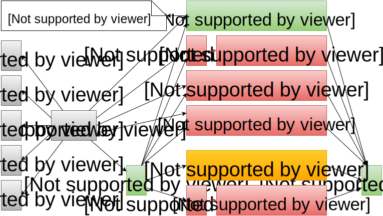
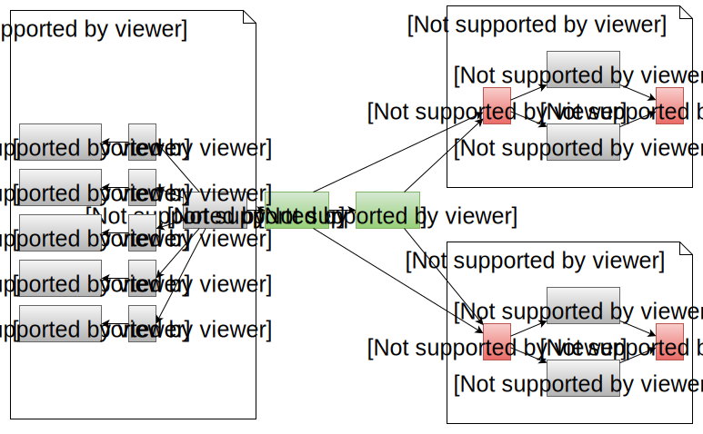
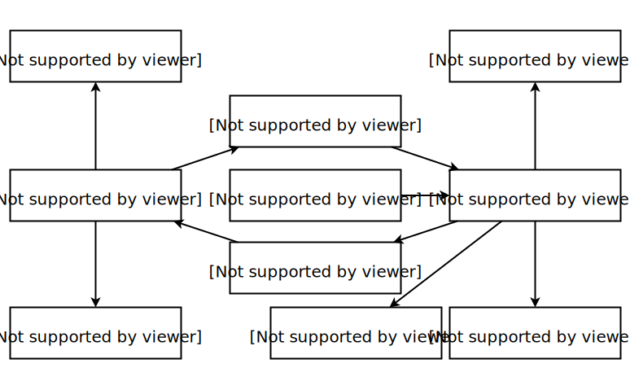

class:firstpage, title

# Программирование на Perl

## Синтаксис и данные

---
class:note_and_mark title

# Отметьтесь на портале!

---
layout:false
# Содержание
.small[
* **Базовый синтаксис**
    - Условия, циклы
    - Управляющие функции
    - Постфиксная нотация
* Переменные
    - Основные типы
    - Ссылки
    - Интерполяция
* Функции
    - Декларация, аргументы
    - Контекст
    - Прототипы
    - Встроенные функции
    - grep, map, sort
    - eval
* Операторы
    - Порядок исполнения
    - Особенные операторы
    - Числа и строки
]

---
class: center, middle

# TIMTOWTDI

##There’s More Than One Way To Do It

---
class: center, middle

# The only thing can parse
# **Perl** (the language) is
# **perl** (the binary)

---

layout: true

.footer[[perlsyn](http://perldoc.perl.org/perlsyn.html)]

---

# Блок

```perl
*{
	statement;
	statement;
	...
*}
```

--

```perl
*do { ... } ≠ { ... }
```

```perl
*$value = do { ... }
```

.not[
```perl
*$value = { ... };
```
]

---

# Управление циклами
## [next](http://perldoc.perl.org/functions/next.html)

```perl
for my $item ( @items ) {
    my $success = prepare($item);

    unless ($success) {
*       next;
    }

    process($item);
} continue {
*   # next переходит сюда
    postcheck($item);
}
```
???
* `next` Начинает новую итерацию цикла, как `continue` в C.
* Если присутствует блок `continue {}`, то он исполняется даже для пропущенных строк

---
# Управление циклами
## [last](http://perldoc.perl.org/functions/last.html)
```perl
for my $item ( @items ) {
    my $success = prepare($item);

    unless ($success) {
*       last;
    }

    process($item);
} continue {
    postcheck($item);
}
*# last переходит сюда
```
???
* `last` прерывает исполнение текущего цикла
* `last` является эквивалентом `break` из языка C
* Даже, если присутствует блок `continue {}`, то он не исполняется
---
# Управление циклами
## [redo](http://perldoc.perl.org/functions/redo.html)
```perl
for my $item ( @items ) {
*   # redo переходит сюда
    my $success = prepare($item);

    unless ($success) {
*       redo;
    }

    process($item);
} continue {
    postcheck($item);
}
```
???
* `redo` начинает итерацию цикла с начала без исполнения блока условия
* `redo` не имеет аналога в языке C
* При наличии блока `continue {}`, он не исполняется
---
# Блок идентичен одиночному циклу

```perl
{
    # redo
    stmt;
    if (...) { next; }

    stmt;
    if (...) { last; }

    stmt;
    if (...) { redo; }

    stmt;
    # next
}
# last
```

---

# Выбор - `given`/`when`

```perl
*use feature 'switch'; # v5.10 - v5.18

given ( EXPR ) {
    when ( undef )    { ... }
    when ( "str" )    { ... }
    when ( 42 )       { ... }
    when ( [4,8,15] ) { ... }
    when ( /regex/ )  { ... }
    when ( \&sub )    { ... }
    when ( $_ > 42 )  { ... }
    default           { ... }    
}
```
--
* Нет ключевого слова `break`
* `continue` для "проваливания"

---
# Переход - `goto` (обычный)

```perl
*goto LABEL;
```

```perl
LABEL1:
    say "state 1";
    goto LABEL2;
LABEL2:
    say "state 2";
    goto LABEL1;
```

```perl
state 1
state 2
state 1
state 2
...
```

---

# Переход - `goto` (странный)
.not[
```perl
*goto EXPR; # DEPRECATED
```
]

```perl
{
EVEN:
    say "even";
    last;
ODD:
    say "odd";
    last;
}

goto(
    ("EVEN","ODD")[ int(rand 10) % 2 ]
);
```


---

# Переход - `goto` - **хвостовой**

```perl
*goto &NAME;
*goto &$var;
```

```perl
sub fib {
    return 0 if $_[0] == 0;
    return 1 if $_[0] == 1;
    return _fib($_[0]-2,0,1);
}

sub _fib { my ($n,$x,$y) = @_;
    if ($n) {
        return _fib( $n-1, $y, $x+$y );
    }
    else {
        return $x+$y;
    }
}
```

---

# Переход - `goto` - **хвостовой**

```perl
*goto &NAME;
*goto &$var;
```

```perl
sub fib {
    return 0 if $_[0] == 0;
    return 1 if $_[0] == 1;
    return _fib($_[0]-2,0,1);
}

sub _fib { my ($n,$x,$y) = @_;
    if ($n) {
*       @_ = ( $n-1, $y, $x+$y ); goto &_fib;
    }
    else {
        return $x+$y;
    }
}
```

---

# Переход - `goto` - **хвостовой**

```perl
*goto &NAME;
*goto &$var;
```

```perl
sub fac {
    my $n = shift;
    return _fac($n,1);
}

sub _fac {
    my ($n,$acc) = @_;
    return $acc if $n == 0;
*   @_ = ($n-1,$n*$acc);
*   goto &_fac;
}
```

---

# Постфиксная нотация

```perl
STMT if EXPR;
```

```perl
STMT unless EXPR;
```

```perl
STMT while EXPR;
```

```perl
STMT until EXPR;
```

```perl
STMT for LIST;
```

```perl
STMT when EXPR;
```

---

# Постфиксные циклы

```perl
do {
    ...;
} while ( EXPR );
```

```perl
do {
    ...;
} until ( EXPR );
```

```perl
do {
    ...;
} for ( LIST );
```

---

# Постфиксные циклы

```perl
do {
    ...;
} while ( EXPR );
```

* Не работает `next`
* Не работает `last`
* Не работает `redo`
* Нет места для `continue {...}`

--

.big[Нет обрамляющего блока]

---
layout:false

# Содержание
.small[
* Базовый синтаксис
    - Условия, циклы
    - Управляющие функции
    - Постфиксная нотация
* **Переменные**
    - Основные типы
    - Ссылки
    - Интерполяция
* Функции
    - Декларация, аргументы
    - Контекст
    - Прототипы
    - Встроенные функции
    - grep, map, sort
    - eval
* Операторы
    - Порядок исполнения
    - Особенные операторы
    - Числа и строки
]

---
layout:true
# Переменные

---

* SCALAR
    - Number
    - String
    - Reference
* ARRAY
    - Of scalars
* HASH
    - Key: string
    - Value: scalar

---

* SCALAR (`$s`)
    - Number
    - String
    - Reference
* ARRAY (`@a`, `$a[...]`)
    - Of scalars
* HASH (`%h`, `$h{key}`, `$h{...}`)
    - Key: string
    - Value: scalar

---

* SCALAR (`$s`)
    - Number (`$s = 1`, `$s = -1e30`)
    - String (`$s = "str"`)
    - Reference
        + Scalar (`$$r`, `${ $r }`) 
        + Array (`@$r`, `@{ $r }`, `$r->[...]`)
        + Hash (`%$r`, `%{ $r }`, `$r->{...}`)
        + Function (`&$r`, `&{$r}`, `$r->(...)`)
        + Filehandle (`*$r`)
        + Lvalue (`$$r`, `${ $r }`)
        + Reference (`$$r`, `${ $r }`)
* ARRAY (`@a`, `$a[...]`)
* HASH (`%h`, `$h{key}`, `$h{...}`)

---
layout:false
# Переменные: идентификатор



---

# Переменные: идентификатор

* Обычные
    - `$var`, `@array`, `%hash`, `&func`, `*glob`
    - `${var}`, `@{array}`, `%{hash}`, `&{func}`, `*{glob}`
    - `${ "scalar" . "name" }`, `%{ "hash".$id }`
* Специальные
    - `$^W`, `$^O`, `$^X`, `${^W}`, `${^O}`, `${^X}`, ...
    - `$0`, `$1`, `$100`, `${0}`, `${1}`, `${100}`, ...
    - `${^PREMATCH}`, `${^MATCH}`, `${^POSTMATCH}`, ...
    - `$_`, `@_`, `$!`, `$@`, `$?`, `$"`, `$/`, `$,`, ...
    - `${_}`, `@{_}`, `${!}`, `${@}`, `${?}`, `${"}`, `${/}`, `${,}`, ...
    - Список - в [perlvar](http://perldoc.perl.org/perlvar.html)

???

Далее будет употребляться термин `bareword`.

---
layout:true
# Переменные: SCALAR
---

## Числа
```perl
$int         = 12345;
$pi          = 3.141592;
$pi_readable = 3.14_15_92_65_35_89;
$plank       = .6626E-33;
$hex         = 0xFEFF;
$bom         = 0xef_bb_bf;
$octal       = 0751;
$binary      = 0b10010011;
```

---

## Строки
```perl
$one    = "string";
$two    = 'quoted';
$wrap   = "wrap
           ped";
$join   = "prefix:$one";
$at     = __FILE__ .':'. __LINE__;

$q_1    = q/single-'quoted'/;
$qq_2   = qq(double-"quoted"-$two);
$smile  = ":) -> \x{263A}";
$ver    = v1.2.3.599;
```

---

## Ссылки
```perl
$scalarref = \$scalar;
$arrayref  = \@array;
$hashref   = \%hash;
$coderef   = \&function;
$globref   = \*FH;
$refref    = \$scalarref;

$arrayref  = [ 4,8,15,16 ];
$hashref   = { one => 1, two => 2 };
$coderef   = sub { ... };

($a,$b)    = (\"one",\"two");
($a,$b)    = \("one","two");
```


---

layout:false
# Переменные: ARRAY & HASH



---
layout:true
# Переменные: ARRAY

---



---

```perl
@simple = qw(1 2 3 bare);
@array = (4,8,15,16,23,42,@simple);
@array = (4,8,15,16,23,42,1,2,3,'bare');
$aref = \@array;
$aref = [4,8,15,16,23,42,@simple];

say $array[2];   # 15
say ${array}[2];
say ${array[2]};
say "last i = ", $#array;
say "last i = ", $#{array};

say $aref->[2];
say $$aref[2];
say ${$aref}[2];
say "last i = ", $#$aref;
say "last i = ", $#${aref};
say "last i = ", $#{${aref}};
```

.footer[[Array vs list](http://friedo.com/blog/2013/07/arrays-vs-lists-in-perl)]

---

## Срезы
```perl
@simple = qw(1 2 3 bare);
@array = (4,8,15,16,23,42,@simple);
$aref = \@array;

say join ",", @array[0,2,4]; # 4,15,23
say join ",", @{array}[0,2,4]; # 4,15,23
say join ",", @{ array[0,2,4] }; # 4,15,23

say join ",", @$aref[0,2,4]; # 4,15,23
say join ",", @{ $aref }[0,2,4]; # 4,15,23
say join ",", @{ ${aref} }[0,2,4]; # 4,15,23
```

---


---

layout:true
# Переменные: HASH

---


---

```perl
%simple = qw(k1 1 k2 2);
%hash = (key3 => 3, 'key4',"four", %simple);
$href = \%hash; $key = "key3";

say $hash{key3};
say $hash{"key3"};
say $hash{ $key };
say ${hash}{key3};
say ${ hash{key3} };
say ${ hash{$key} };

say $href->{key3};
say $href->{"key3"};
say $href->{$key};
say ${href}->{key3};
say $${href}{key3};
say ${$href}{key3};
say ${${href}}{key3};

```

---

```perl
%simple = qw(k1 1 k2 2);
%hash = (key3 => 3, 'key4',"four", %simple);
$href = \%hash; $key = "key3";

say join ",", %simple; # k2,2,k1,1
say join ",", keys %hash; # k2,key3,k1,key4
say join ",", values %$href; # 2,3,1,four

say join ",", @hash{ "k1", $key }; # 1,3
say join ",", @{hash}{ "k1", $key }; # 1,3
say join ",", @{ hash{ "k1", $key } }; # 1,3

say join ",", @{$href}{ "k1","key3" }; # 1,3

$hash{key5} = "five";
$one = delete $href->{k1}; say $one; # 1
say $hash{k2} if exists $hash{k2}; # 2
```

---


---
layout:true
# Ссылки - использование

---

```perl
$var = 7;
%hash = (
    s => "string",
    a => [ qw(some elements) ],
    h => {
        nested => "value",
        "key\0" => [ 1,2,$var ],
    },
    f => sub { say "ok:@_"; }, 
);

say $hash{s}; # string
say $hash{a}->[1]; # elements
say $hash{h}->{"key\0"}->[2]; # 7
say $hash{h}{"key\0"}[2]; # 7
$hash{f}->(3); # ok:3
&{ $hash{f} }(3); # ok:3
```

---

```perl
$var = 7;
$href = {
    s => "string",
    a => [ qw(some elements) ],
    h => {
        nested => "value",
        "key\0" => [ 1,2,$var ],
    },
    f => sub { say "ok:@_"; }, 
};

say $href->{s}; # string
say $href->{a}->[1]; # elements
say $href->{h}->{"key\0"}->[2]; # 7
say $href->{h}{"key\0"}[2]; # 7
$href->{f}->(3); # ok:3
&{ $href->{f} }(3); # ok:3
```


---
.not[
```perl
$, = ", "; # $OUTPUT_FIELD_SEPARATOR
@array = (1,2,3);
say @array; # 1, 2, 3

*@array = [1,2,3];
say @array; # ARRAY(0x7fcd02821d38)

%hash  = (key => "value");
say %hash; # key, value

*%hash  = {key => "value"};
say %hash; # HASH(0x7fbbd90052f0), 

*%hash = ( key1 => (1,2), key2 => (3,4) );
say $hash{key1}; # 1
say $hash{key2}; # undef
say $hash{2};    # key2
%hash = ( key1 => 1,2 => 'key2', 3 => 4 );
```
]

---

```perl
$href = {
    s => "string",
};

$href->{none}{key} = "exists";
say $href->{none};      # HASH(0x7fea...)
say $href->{none}{key}; # exists

$href->{ary}[7] = "seven";
say $href->{ary};       # ARRAY(0x7f9...)
say $href->{ary}[7];    # seven
say $#{ $href->{ary} }; # 7
```

---

```perl
$href = {
    s => "string",
};

$href->{none}{key} = "exists";
say $href->{none};      # HASH(0x7fea...)
say $href->{none}{key}; # exists

$href->{ary}[7] = "seven";
say $href->{ary};       # ARRAY(0x7f9...)
say $href->{ary}[7];    # seven
say $#{ $href->{ary} }; # 7

$href->{s}{error} = "what?";
say $href->{s}{error};  # what?
say $string{error};     # what?
```

---

.not[
```perl
$href = {
    s => "string",
};

$href->{none}{key} = "exists";
say $href->{none};      # HASH(0x7fea...)
say $href->{none}{key}; # exists

$href->{ary}[7] = "seven";
say $href->{ary};       # ARRAY(0x7f9...)
say $href->{ary}[7];    # seven
say $#{ $href->{ary} }; # 7

*$href->{s}{error} = "what?";
*say $href->{s}{error};  # what?
*say $string{error};     # what?
```
]
---

.center[

]

---
layout: false
# Символические ссылки
> Переменная, чьё значение является именем другой переменной

```perl
$name = "var";
$$name = 1;     # устанавливает $var в 1
${$name} = 2;   # устанавливает $var в 2
@$name = (3,4); # устанавливает @var в (3,4)

$name->{key} = 7; # создаёт %var и
                  # устанавливает $var{key}=7

$name->();      # вызывает функцию var
```

---
# Символические ссылки
> `use strict 'refs'` запрещает их использование

```perl
use strict 'refs';

${ bareword }    # ≡ $bareword; # ok
*${ "bareword" }; # not ok

$hash{ "key1" }{ "key2" }{ "key3" }; # ok
$hash{ key1 }{ key2 }{ key3 }; # also ok

$hash{shift}; # ok for keyword, no call
$hash{ +shift }; # call is done
$hash{ shift() }; # or so

```

---

# Интерполяция

> В строках интерполируются `$..` и `@..`

```perl
$var = "one";
@ary = (3, "four", 5);
%hash = (k => "v", x => "y");
say "new $var";      # new one
say 'new $var';      # new $var

$" = ';'; # $LIST_SEPARATOR
say "new @ary";      # new 3;four;5
say 'new @ary';      # new @ary
say "1st: $ary[0]";  # 1st: 3
say "<@ary[1,2]>";   # <four;5>
say "<${ ary[1] }>"; # <four>
say "<$hash{x}>";    # <y>
```

---

# Интерполяция

> Инлайновое исполнение:<code><br/></code>
> dereference + reference constructor

```perl

$var = 100;
say "1+2 = @{[ 1+2 ]}"; # 1+2 = 3
say "\$var/=10 = @{[do{ $var/=10; $var }]}";
    # $var/=10 = 10

say "1+2 = ${\( 1+2 )}";
say "1+2 = ${\do{ 1+2 }}";

say "1+2 = ${{key=> 1+2 }}{key}";
say "\$var = ${{key=> do{ $var } }}{key}";

say "Now: ${\scalar localtime}";
   # Now: Wed Mar  2 01:58:36 2016
```
???
use 5.010;
use Time::Local;
my $time = timelocal(30,25,19,3,2,16);
say "Now: ${\scalar localtime}";
---
layout:false
# Содержание
.small[
* Базовый синтаксис
    - Условия, циклы
    - Управляющие функции
    - Постфиксная нотация
* Переменные
    - Основные типы
    - Ссылки
    - Интерполяция
* **Функции**
    - Декларация, аргументы
    - Контекст
    - Прототипы
    - Встроенные функции
    - grep, map, sort
    - eval
* Операторы
    - Порядок исполнения
    - Особенные операторы
    - Числа и строки
]

---

layout: true
# Функции

.footer[[perlsub](http://perldoc.perl.org/perlsub.html)]
---

```perl
sub NAME;
sub NAME(PROTO);

sub NAME BLOCK
sub NAME(PROTO) BLOCK

$sub = sub BLOCK;
$sub = sub (PROTO) BLOCK;
```

---

* Объявление

```perl
sub mysub;
...
sub mysub {
    @_;              # <- args here
    my $a = shift;   # one arg
    my ($a,$b) = @_; # 2 args
    my %h = @_;      # kor k/v
    say "my arg: ",$_[0];

    return unless defined wantarray;
    return (1,2,3) if wantarray; # return list
    1; # implicit ret, last statement
}
```

---

* Контекст

```perl
# scalar context
my $var = mysub(1, 2, $var);
say 10 + mysub();

# list context
@a = mysub();
($x,$y) = mysub();

#void context
mysub();
```

---

* Вызов

```perl
mysub(...);
mysub ...;
&mysub(  );
&mysub;     # ≡ &mysub( @_ );

$sub->(...);
&$sub(...);
&$sub;      # ≡ &$sub( @_ );
```

---

* Прототипы

```perl
 $ # scalar
 @ # list
 % # list
 * # filehandle
 & # special codeblock
 ; # optional separator

 _ # scalar or $_
 + # hash or array (or ref to)
 \ # force type
 \[%@] # ex: real hash or array

sub vararg($$;$); # 2 req, 1 opt
sub vararg($$;@); # 2 req, 0..* opt
sub noarg(); # no arguments at all
```

---

* Прототипы

```perl
sub check (&@) {
    my ($code, @args) = @_;
    for (@args) {
        $code->($_);
    }
}

check {
    if( $_[0] > 10 ) {
        die "$_[0] is too big";
    }
} 1, 2, 3, 12;
```

---

layout:true
# Встроенные функции

---

* **`grep`**, `map`, `sort`

```perl
@nonempty = grep { length $_; } @strings;
$count    = grep { length $_; } @strings;
@nonempty = grep length($_), @strings;

@odd  = grep {     $_ % 2 } 1..100;
@even = grep { not $_ % 2 } 1..100;

%uniq = ();
@unique = grep { !$uniq{$_}++ } @with_dups;}

@a = 1..55;
@b = 45..100;
%chk; @chk{@a} = ();
@merge = grep { exists $chk{$_} } @b;
```

.footer[[grep](http://perldoc.perl.org/functions/grep.html)]

---

* `grep`, **`map`**, `sort`

```perl
@squares = map { $_**2 } 1..5; # 1,4,9,16,25

say map chr($_), 32..127;

@nums = 1..100;
@sqrs = map {
    if( int(sqrt($_)) == sqrt($_) ) {
        $_
    } else { () }
} @nums;

my @reduced =
    map $_->[0],
    grep { int($_->[1]) == $_->[1] }
    map { [$_,sqrt $_] } 1..1000;
```

.footer[[map](http://perldoc.perl.org/functions/map.html)]

---

* `grep`, `map`, **`sort`**

```perl
@alphabetically = sort @strings;
@nums = sort { $a <=> $b } @numbers;
@reverse = sort { $b <=> $a } @numbers;
@ci = sort { fc($a) cmp fc($b) } @strings;

sub smart {$a<=>$b || fc($a) cmp fc($b) }
@sorted = sort smart @strings;

my @byval = sort { $h{$a} cmp $h{$b} } keys %h;

```

.footer[[sort](http://perldoc.perl.org/functions/sort.html)]

---

* `eval`, `die`, `warn`

```perl
eval "syntax:invalid";
warn $@ if $@;

eval { $a/$b; };
warn $@ if $@;

eval { die "Not root" if $<; };
warn $@ if $@;

eval {      # try
    ...;
1} or do {  # catch
    warn "Error: $@";
};
```

---

* `chop`, `chomp`

```perl
$/ = "\r\n";
$a = $b = "test\r\n";
chop($a),chop($a),chop($a); # \n,\r,t
say $a;
chomp($b),chomp($b) # \r\n, '';
say $b;
```

* `index`, `rindex`, `substr`, `length`

```perl
#            ↓─────index($_," ") # 4
$_  =   "some average string\n";
#           └─┬─┘    ↑───rindex($_," ") # 12
#        substr($_,3,5) = "e ave"
```

---

* `lc`, `lcfirst`, `uc`, `ucfirst`, `fc`

```perl
$big = "WORD"; $small = "word";
say lc $big;         # word "\L"
say lcfirst $big;    # wORD "\l"
say uc $small;       # WORD "\U"
say ucfirst $small;  # Word "\u"

say "equal" if
    fc $big eq fc $small; # v5.16+

say "\u\LnAmE\E"; # Name
```

---

* `reverse`, `sprintf`

```perl
# Why
say reverse 'dog';
# prints dog,
# but
say ucfirst reverse 'dog';
# prints God?
```

```perl
$a = sprintf"%c %s %d %u\n%o %x %e %f %g",
    9786, "str", -42, -1, 2537,
    57005, 1/9, 1/3, .6626E-33;
say $a;
# ☺ str -42 18446744073709551615
# 4751 dead 1.111111e-01 0.333333 6.626e-34
```

---

* `each`, `keys`, `values`

```perl
%h = map { $_ => -$_ } 1..3;
@a = keys %h; @b = values %h;
while (my ($k,$v) = each @a)
    { say "$k: $v ($b[$k])"; }
while (my ($k,$v) = each %h)
    { say "$k: $v"; }
```

```perl
0: 1 (-1)
1: 3 (-3)
2: 2 (-2)
1: -1
3: -3
2: -2
```

---

* `push`, `pop`, `shift`, `unshift`, `splice`

```perl
push(@a,$x,$y)      splice(@a,@a,0,$x,$y)
pop(@a)             splice(@a,-1)
shift(@a)           splice(@a,0,1)
unshift(@a,$x,$y)   splice(@a,0,0,$x,$y)
$a[$i] = $y         splice(@a,$i,1,$y)
```

```perl
@a =      ( 1, 2, 3, 4, 5, 6, 7 );
#│             └────┬┘
#│             └─┐  │     ┌ replacement
#└───────────┐   │  │  ┌──┴───┐
@b = splice( @a, 1, 3, ( 8, 9 ) );
say @a;
# 1, 8, 9, 5, 6, 7
say @b;
# 2, 3, 4
```

---

* `gmtime`, `localtime`, `time`, `strftime`

```perl
say time;         # 1457022000
say ~~localtime;  # Thu Mar  3 19:20:00 2016
say ~~localtime 0;# Thu Jan  1 03:00:00 1970
say ~~gmtime 0;   # Thu Jan  1 00:00:00 1970

($s,$m,$h,$D,$M,$Y,$Wd,$Yd,$dst) =
    localtime( time+86400 );
printf "%04u-%02u-%02uT%02u:%02u:%02u",
   $Y+1900, $M+1, $D, $h, $m, $s; 
printf "Day no: %u, Weekday: %u", $Yd, $Wd;

# 2016-03-04T19:20:00
# Day no: 63, Weekday: 5

use POSIX 'strftime';
say strftime "%r",localtime(); # 07:20:40 PM
```

???

use 5.010;
use Time::Local;
use POSIX 'strftime';
my $time = timelocal(0,20,19,3,2,16);
say "# ",~~ $time;
say "# ",~~ localtime $time;
($s,$m,$h,$D,$M,$Y,$Wd,$Yd,$dst) =
    localtime( $time+86400 );
printf "# %04u-%02u-%02uT%02u:%02u:%02u\n",
   $Y+1900, $M+1, $D, $h, $m, $s; 
printf "# Day no: %u, Weekday: %u\n", $Yd, $Wd;
say strftime "%r",localtime($time+40);

---

* `ref`

```perl
my $s = "test";
say ref $s;                   # ""

my $aref = []; say ref $aref; # ARRAY
my $href = {}; say ref $href; # HASH
my $sref = \1; say ref $sref; # SCALAR

my $rr = \$sref; say ref $rr; # REF

say ref sub {};               # CODE

my %h = (k => []);
say ref $h{k};                # ARRAY
```

---

* `caller`, `goto`

```perl
sub test1 {
    my $i=0;
    while ( ($pk, $f, $l,$s) = caller($i++)) {
        say "$i. from $f:$l ($s)";
    }
}
sub test2 {
    test1()
};
sub test3 {
    test2();
}
sub test4 { goto &test2; }
test3();
test4();
```

---
layout:false
# Содержание
.small[
* Базовый синтаксис
    - Условия, циклы
    - Управляющие функции
    - Постфиксная нотация
* Переменные
    - Основные типы
    - Ссылки
    - Интерполяция
* Функции
    - Декларация, аргументы
    - Контекст
    - Прототипы
    - Встроенные функции
    - grep, map, sort
    - eval
* **Операторы**
    - Порядок исполнения
    - Особенные операторы
    - Числа и строки
]

---

layout:false

# Операторы

> Оператор определяет тип операнда

> Ассоциативность и приоритет
> арифметических операторов
> соответствует тому, как это
> принято в математике


---
class: optable
# Приоритеты операторов

ассоциативность | оператор
:---------------|:---------
left            | TERM и LIST (leftward)
left            | `->`
n/a             | `++`,  `--`
right           | `**`
right           | `!` `~` `\`, unary `+`, `-`
left            | `=~` `!~`
left            | `*` `/` `%` `x`
left            | `+` `-` `.`
left            | `<<` `>>`
n/a             | `named unary ops` # (функции с одним аргументом)
n/a             | `<` `>` `<=` `>=` `lt` `gt` `le` `ge`
n/a             | `==` `!=` `<=>` `eq` `ne` `cmp` `~~`
left            | `&`
left            | <code>&#124;</code> `^`
left            | `&&`
left            | <code>&#124;&#124;</code> `//`
n/a             | `..` `...`
right           | `?:`
right           | `=` `+=` `-=` `*=` etc.
left            | `,` `=>`
n/a             | LIST (rightward)
right           | `not`
left            | `and`
left            | `or` `xor`
---
layout:true
# Операторы TERM, LIST(L)

---

* Любая переменная (`$variable`)
* Обращение к хэшу или массиву (`$hash{key}` или `$array[$x]`)
* Любая строка (`"string"` или `'str'`), число (`42`, `-1e42`) или quote-like оператор
* Любой вызов функции со скобками `func(...)`
* `do{ ... }`, `eval{ ... }`, `sub{ ... }`
* Анонимные конструкторы<code><br/></code> `{ ... }` и `[ ... ]`

---

```perl
my $v = 5;
my @a = ( 1,2,sort 3,4+$v,6x2,7 );
```

* `-MO=Deparse,-p`

```perl
(my $v = 5);
(
    my @a = (
        1, 2,
        sort(
            3,
            (4 + $v),
            (6 x 2),
            7
        )
    )
);
```

---
```perl
(
    my @a = (
*       1,              # 1
*       2,              # 2
        sort(
            3,
            (
                4
                    +
                $v
            ),
            (
                6
                    x
                2
            ),
            7
        )
    )
);
```
---
```perl
(
    my @a = (
        1,              # 1
        2,              # 2
        sort(
*           3,              # 3
            (
                4
                    +
                $v
            ),
            (
                6
                    x
                2
            ),
            7
        )
    )
);
```
---
```perl
(
    my @a = (
        1,              # 1
        2,              # 2
        sort(
            3,              # 3
            (
*               4               # 4
*                   +             # 6
*               $v              # 5
            ),
            (
                6
                    x
                2
            ),
            7
        )
    )
);
```
---
```perl
(
    my @a = (
        1,              # 1
        2,              # 2
        sort(
            3,              # 3
            (
                4               # 4
                    +             # 6
                $v              # 5
            ),
            (
*               6               # 7
*                   x             # 9
*               2               # 8
            ),
            7
        )
    )
);
```
---
```perl
(
    my @a = (
        1,              # 1
        2,              # 2
        sort(
            3,              # 3
            (
                4               # 4
                    +             # 6
                $v              # 5
            ),
            (
                6               # 7
                    x             # 9
                2               # 8
            ),
*           7               # 10 
        )
    )
);
```
---
```perl
(
    my @a = (
        1,              # 1
        2,              # 2
*       sort(           # 11
            3,              # 3
            (
                4               # 4
                    +             # 6
                $v              # 5
            ),
            (
                6               # 7
                    x             # 9
                2               # 8
            ),
            7               # 10 
*       )               # 11
    )
);
```
---
```perl
(
*   my @a = (       # 12
        1,              # 1
        2,              # 2
        sort(           # 11
            3,              # 3
            (
                4               # 4
                    +             # 6
                $v              # 5
            ),
            (
                6               # 7
                    x             # 9
                2               # 8
            ),
            7               # 10 
        )               # 11
*   )               # 12
);
```
---
layout:false
# Оператор стрелочка (`->`)
> суффиксный оператор разыменования  
> (infix dereference)

```perl
STMT->{...} # STMT должен вернуть HASHREF
```

```perl
STMT->[...] # STMT должен вернуть ARRAYREF
```

```perl
STMT->(...) # STMT должен вернуть CODEREF
```

```perl
STMT->method(...)
 # STMT должен вернуть объект или класс
STMT->$var(...)
# $var должен вернуть имя метода или CODEREF
```
---
# Операторы инкремента
> Аналогичны соответствующим в C  
> (auto-increment and auto-decrement)

```perl
my $i = 0;
$x = $i++; # $x = 0; $i = 1;
$y = ++$i; # $y = 2; $i = 2;
```

* `++$i + $i++` - неопределённое поведение
* `undef` - всегда как число `0`

---
# Операторы инкремента
> немного "магии"

* Если `$var` строка
* Начинается на `[a-z]` или `[A-Z]`
* Содержит `[a-z]`, `[A-Z]` или `[0-9]`

```perl
say ++($a = "a");   #    b
say ++($a = "aa");  #   ab
say ++($a = "AA");  #   AB
say ++($a = "Aa1"); #  Aa2
say ++($a = "Aa9"); #  Ab0
say ++($a = "Az9"); #  Ba0
say ++($a = "Zz9"); # AAa0
say ++($a = "zZ9"); # aaA0
```

.notes[.note[Декремент магическим не является]]

---
# Унарные операторы - `!`
> логическое отрицание  
> logical negation

> False: `0`, `""`, `undef`, overloaded obj  
> True: остальное, по умолчанию `1`

```perl
!0     #  1
!1     # ""
!""    #  1
!undef #  1
```

---
# Унарные операторы - `-`
> математическое отрицание  
> arithmetic negation  
> • специальное поведение на строках  

```perl
-0       #  0
-1       # -1
- -1     #  1
-"123"   # -123
-"-123"  #  123
-undef   #  0 or -0
-bare    # "-bare"
-"word"  # "-word"
-"+word" # "-word"
-"-word" # "+word"
-"-0"    #  0 or +0
```

---

# Унарные операторы - `~`
> битовая инверсия  
> bitwise negation

```perl
# numbers
~0   # 0xffff_ffff or 0xffff_ffff_ffff_ffff
0777 & ~027 # 0750 (in oct)

# byte string
~"test"    # "\213\232\214\213"
           # chr(~ord("t")).chr(~ord("e")).
           # chr(~ord("s")).chr(~ord("t"));
# char string
use utf8;
 "ё" # ≡ "\x{451}"
~"ё" # "\x{fffffbae}" 32b
~"ё" # "\x{fffffffffffffbae}" 64b
```

---

# Унарные операторы - `+`
> унарный плюс  
> unary "+"

Не имеет эффекта,  
используется как разделитель

```perl
say +( 1 + 2 ) * 3; # 9
say  ( 1 + 2 ) * 3; # 3

return +{}; # empty anon hash
map { +{ $_ => -$_} } @_;
```

---

# Операторы - `=~`, `!~`
> Применение регэкспа  
> match, binding

```perl
# match
$var =~ /regexp/;
$var !~ /shoudn't/;

# replace
$var =~ s/word/bare/g;

# transliterate
$var =~ tr/A-Z/a-z/;

*if ($var = ~ /match/) {...} # always true
#         ^
#         '-------- beware of space
if ($var = (~(/match/))) {...}

```

---

# Операторы - `*` `/` `%` `x`
> Умножение, деление, остаток, повтор  
> multiply, divide, modulo, repeat

```perl
say 9*7; # 63
say 9/7; # 1.28571428571429
say 9%7; # 2

say 9x7; # 9999999
say join ",",(9,10)x3; # 9,10,9,10,9,10
```

---

# Операторы - `+` `-` `.`
> Сложение, вычитание, конкатенация  
> add, subtract, concat

```perl
say 1+2;         # 3
say "1"+"2";     # 3
say "1z" + "2z"; # 3
say "a" + "b";   # 0

*say 1.2;         # 1.2
say 1 . 2;       # 12
say "1"."2";     # 12
say "a"."b";     # ab

```

---

# Операторы - `<<` `>>`
> Сдвиг влево, сдвиг вправо  
> shift-left, shift-right

Реализовано полностью с использованием C  
Поведение аналогично

```perl
say 20 << 20;  # 20971520
say 20 << 40;  # 5120 on 32-bit
               # 21990232555520 on 64-bit
use bigint;
say 20 << 80;  # 24178516392292583494123520
```

---

# Операторы сравнения
> `<`, `>`, `<=`, `>=`, `lt`, `gt`, `le`, `ge`  
> relational operators

```perl
say "a" > "b";    # "", 0 > 0
say "a" < "b";    # "", 0 < 0

say 100 gt 20;    # "", "100" gt "20"
say "100" > "20"; # 1
```

* `<`, `>`, `<=`, `>=` - всегда преобразуют к числу
* `lt`, `gt`, `le`, `ge` - преобразуют к строке

---

# Операторы равенства

> `==`, `!=`, `<=>`, `eq`, `ne`, `cmp`  
> equality operators

```perl
say 10 == "10";   #  1
say "20" != "10"; #  1
say 1 <=> 2;      # -1
say 1 <=> 1;      #  0
say 2 <=> 1;      #  1
say "a" <=> "b";  #  0
say "a" == "b";   #  1

say 1 eq "1";     #  1
say "0" ne 0;     # ""
say "a" cmp "b";  # -1
say "b" cmp "a";  #  1

say "No NaN" if "NaN" == "NaN";
```

---

# Оператор умного сравнения
> `~~`, perl 5.10.1+  
> smartmatch operator  
> .red[experimental in 5.18+]

```perl
my @ary = (1,2,undef,7);
say "sparse" if undef ~~ @ary;

given ($num) {
    when ([1,2,3]) { # as $num ~~ [1,2,3]
        say "1..3";
    }
    when ([4..7]) {  # as $num ~~ [4..7]
        say "4..7";
    }
}
```

---

# Битовые операторы
> `&`, `|`, `^`  
> and, or, xor

```perl
$x = int(rand(2**31-1));
say $x & ~$x + 1;
say $x ^ ( $x & ($x - 1));

$x = $x ^ $y;
$y = $y ^ $x;
$x = $x ^ $y;

say "test" ^ "^^^^"; # *;-*
say "test" & "^^^^"; # TDRT
```

---

# C-style логические операторы

> `&&`, `||`, `//`  
> and, or, defined-or

* Выполняются последовательно
* Передают контекст
* Возвращают последнее значение

```perl
say 1 && "test"; # test
say 0 || "test"; # test
say 1 || die;    # 1   # say( 1 || die );
say 0 && die;    # 0   # say( 0 && die );

$a = $x // $y;
$a = defined $x ? $x : $y;

```

---

# Операторы диапазона

> `..`, `...`  
> range operators  
> .red[списковый контекст]

```perl
@a = 1..10;

for ("a".."z") {
    say $_;
}

say "A"..."Z";

@b = @a[3..7];
```

---

# Операторы диапазона (flip-flop)

> `..`, `...`  
> range operators  
> .red[скалярный (логический) контекст]
> константный операнд

```perl
for $. (1,2,3,4,5) { # $. - $INPUT_LINE_NUMBER
    say "$. : ".`(2..4)`;
}
```
```perl
1 : 
2 : 1      # became true ($. == 2)
3 : 2      # stay true, while $. != 4 
4 : 3E0    # ret true, $. == 4, became false
5 : 
```

---

# Тернарный оператор

> `?:`  
> ternary operator, as in C

```perl
$a = $ok ? $b : $c;
@a = $ok ? @b : @c;

($a_or_b ? $a : $b) = $c;
```

---

# Оператор присваивания

> `=`  
> assignment operator, as in C  

* `+=` `-=` 
* `*=` `/=` `%=` `**=`
* `&=` `|=` `x=` `<<=` `>>=` `^=`
* `&&=` `||=` `//=`

---

# Оператор запятая

> `,` запятая, `=>` жирная запятая  
> comma, fat comma  

```perl
$a = do { say "one"; 3 }, do { say "two"; 7};
# $a = 7. 3 thrown away

@list = (bareword => STMT);
# forces "" on left
@list = ("bareword", STMT);

use constant CONST => "some";
%hash = ( CONST   => "val"); # "CONST"
%hash = (+CONST   => "val"); # "CONST" 
%hash = ( CONST() => "val"); # "some"
%hash = (&CONST   => "val"); # "some" 

```

---

# Низкоприоритетные операторы

> `and`, `or`, `xor`, `not`  

* операторы с нижайшим приоритетом

```perl
*open   $file, "<",  "0"   || die "Can't";
open   $file, "<", ("0"   || die "Can't" );

open   $file, "<",  "0"   or die "Can't";
open ( $file, "<",  "0" ) or die "Can't";

do_one() and do_two() or do_another();

@info = stat($file) || say "error";
#        ^----------^-cast scalar context on stat
@info = stat($file) or say "error";
#                    ^-keep list context
```

---
layout:true
# Оператор кавычки

> `q` `qq` `qw` `qx` `qr` `s` `y` `tr`  
> quote-like operators
---

* `q` - строка без интерполяции

.not[
```perl
say 'string';
say q{string};
say q/string/;
say q;string;;
say q{str{i}ng}; # balanced
say q qtestq;
*say q{str{ing};  # not ok, unbalanced }
```
]

---

* `qq` - строка с интерполяцией

```perl
say "perl $^V";
say qq{perl $^V};
say qq/perl $^V/;
say qq;perl $^V;;
say qq{perl $^V};
```

---

* `qw` - генератор списка (без интерполяции)

```perl
$, = ', ';

say qw(a b c);
# say split / /, 'a b c';

for (qw(/usr /var)) {
#for ('/usr','/var') {
    say stat $_;
}
```

---


* `qx` - внешняя команда
    - с интерполяцией
    - qx'...' - без интерполяции

.apos[

```perl
say qx{uname -a};

say qx'echo $HOME';

say `date`;

```

]

---

* `qr` - сборка регкспа
* `/.../`, `m` - сопоставление (match)
* `s` - поиск/замена (replace)
* `y`, `tr` - транслитерация

```perl
$re = qr/\d+/;
if ( $a =~ m[test${re}] ) { ... }
$b =~ s{search}[replace];
y/A-Z/a-z/; # on $_
```

---

* Here-doc

```perl
say <<EOD;
Content of document
EOD

say(<<'THIS', "but", <<THAT);
No $interpolation
THIS
For $ENV{HOME}
THAT

```

---
layout:true
# Секретные операторы
---

```perl
*0+           Venus              Приведение к числу
say 0+"234asd"; # 234
```

```perl
*!!           Bang bang          Приведение к bool
say !! $string; # 1
say !! undef; # ''
```

```perl
*}{           Butterfly          END для one-liners

perl -lne '}{ print$.'
perl -le 'while (<>) { `}{` print$. }'
```

```perl
*~~           Inchworm           Scalar context

say ~~localtime();
#say scalar localtime();
```

---

## Отвёртки

```perl
*-=! -=!!   Плоские             Условный декремент
$x -=!! $y     # $x-- if $y;
$x -=!  $y     # $x-- if not $y;

*+=! +=!!   Крестовые           Условный инкремент
$x +=!! $y     # $x++ if $y;
$x +=!  $y     # $x++ if not $y;

*x=! x=!!   Крестовые           Условный сброс в ''
$x x=!! $y     # $x='' if not $y;
$x x=!  $y     # $x='' if $y;

**=! *=!!   Torx                Условный сброс в 0
$x *=!! $y     # $x=0 if not $y;
$x *=!  $y     # $x=0 if $y;
```

---

layout:false
# Содержание
.small[
* Базовый синтаксис
    - Условия, циклы
    - Управляющие функции
    - Постфиксная нотация
* Переменные
    - Основные типы
    - Ссылки
    - Интерполяция
* Функции
    - Декларация, аргументы
    - Контекст
    - Прототипы
    - Встроенные функции
    - grep, map, sort
    - eval
* Операторы
    - Порядок исполнения
    - Особенные операторы
    - Числа и строки
]

---
layout: false

# Список документации

* [perlsyn](http://perldoc.perl.org/perlsyn.html)
* [perldata](http://perldoc.perl.org/perldata.html)
* [perlref](http://perldoc.perl.org/perlref.html)
* [perllol](http://perldoc.perl.org/perllol.html)
* [perlsub](http://perldoc.perl.org/perlsub.html)
* [perlfunc](http://perldoc.perl.org/perlfunc.html)
* [perlop](http://perldoc.perl.org/perlop.html)
* [perlglossary](http://perldoc.perl.org/perlglossary.html)
* [perlsecret](https://metacpan.org/pod/perlsecret)

---
layout:true
# Домашнее задание
---

* Калькулятор
    1. Синтаксический разбор
    2. Преобразование в обратную польскую нотацию
    3. Вычисление результата по обратной польской нотации
* Программа должна читать выражения из стандартного ввода.
* Одна строка - одно выражение. Пустые строки игнорировать
* В ответ должна вывести 2 строки:
    - обратную польскую нотацию
    - вычисленное значение
* В случае если выражение не удалось разобрать, вывести:
    - Сообщение об ошибке в формате "Error: ..."
    - NaN
* Унарные '+' и '-' записывать как "U-" и "U+"

---

```sh
 ^        - возведение в степень,
            приоритет 4, правоассоциативный

 - +      - унарные минус и минус,
            приоритет 3, правоассоциативный

 * /      - умножение, деление,
            приоритет 2, левоассоциативный

 + -      - сложение, вычитание,
            приоритет 1, левоассоциативный

 ( )      - приоритет 0


1 / 2 / 3 -> ( 1 / 2 ) / 3 # левоассоциативный
2 ^ 3 ^ 4 -> 2 ^ ( 3 ^ 4 ) # правоассоциативный

```


---

```perl
# входное выражение:
- 16 + 2 * 0.3e+2 - .5 ^ ( 2 - 3 )
# с расставленными скобками
( - 16 ) + ( 2 * ( 30.0 ) ) - ( 0.5 ^ ( 2 - 3 ) )
# обратная польская нотация
16 U- 2 30 * + 0.5 2 3 - ^ -
# значение на выходе
42
```

---

```sh
$ git clone \
    git@github.com:Nikolo/Technosfera-perl.git \
    sfera
Cloning into 'sfera'...
remote: Counting objects: 948, done.
remote: Total 948 (delta 0), reused 0 (delta 0), pack-reused 948
Receiving objects: 100% (948/948), 5.47 MiB | 888.00 KiB/s, done.
Resolving deltas: 100% (447/447), done.
Checking connectivity... done.

$ cd sfera/homeworks/calculator
```

---

```sh
$ tree
.
├── Makefile.PL
├── README.md
├── bin
│   └── calculator  # это основной файл
├── lib
│   ├── evaluate.pl # функция вычисления
│   ├── rpn.pl      # построение польской нотации
│   └── tokenize.pl # разбивка строки на части
└── t # здесь тесты
    ├── 00-run.t      # это основной тест
    ├── 01-tokenize.t # вспомогательный тест
    ├── 02-rpn.t      # тест функции для нотации
    └── tests.pl      # тестовые наборы
```

---

```sh
$ perl Makefile.PL
# Generating a Unix-style Makefile
# Writing Makefile for Local::App::Calculator
# Writing MYMETA.yml and MYMETA.json

$ make test
# dmake test для windows

# ...

```

---

```sh
t/00-run.t .......
t/00-run.t ....... 1/6
#   Failed test 'Required good'
...
...
# Looks like you failed 6 tests of 6.
...
...
Test Summary Report
-------------------
t/00-run.t     (Wstat: 1536 Tests: 6 Failed: 6)
  Failed tests:  1-6
  Non-zero exit status: 6
t/02-rpn.t     (Wstat: 768 Tests: 3 Failed: 3)
  Failed tests:  1-3
  Non-zero exit status: 3
Files=3, Tests=32,  2 wallclock secs ( 0.06 usr  0.01 sys +  0.96 cusr  0.09 csys =  1.12 CPU)
Result: FAIL
Failed 2/3 test programs. 9/32 subtests failed.

```

---

## Как должно работать
```sh
$ perl ./bin/calculator
*1+1
1 1 +
2
*1 + 2 * 3
1 2 3 * +
7
*-(1+-2)*3/4
1 2 U- + U- 3 * 4 /
0.75
*1*/1
Error: Sequence of ops at tokenize.pl line 68...
NaN
```

---

## Как должно работать
```sh
$ make test
t/00-run.t ....... ok
t/01-tokenize.t .. ok
t/02-rpn.t ....... ok
All tests successful.

Test Summary Report
-------------------
t/01-tokenize.t (Wstat: 0 Tests: 23 Failed: 0)
  TODO passed:   1-23
Files=3, Tests=32,  1 wallclock secs ( 0.05 usr  0.01 sys +  0.84 cusr  0.08 csys =  0.98 CPU)
Result: `PASS`
```

---
layout:true
# Подсказки
---

```perl
my $str = '1+1-1';

my @chars = split //, $str;
# '1','+','1','-','1'

my @chunks = split m{[-+]}, $str;
# '1','1','1';

my @chunks = split m{([-+])}, $str;
# '1','+','1','-','1';
```

---

```perl
for my $c (@chunks) {
    next if $c =~ /^\s*$/;
    # пропустить, если пустая строка или пробелы
    given ($c) {
        when (/^\s*$/) {} # то-же самое
        when (/\d/) { # элемент содержит цифру
            # ...
        }
        when ( '.' ) {} # элемент равен "."
        when ([ '+','-' ]){ # элемент "+" или "-"
            # ...
        }
        default {
            die "Bad: '$_'";
        }
    }
}
```

---

## Venus!

```perl
my $str = "1e3";
say $str;   # 1e3
say 0+$str; # 1000

my $str = ".5";
say $str;   # .5
say 0+$str; # 0.5

my $str = "0.3e+2";
say $str;   # 0.3e+2
say 0+$str; # 30
```

---

[Обратная польская запись](https://ru.wikipedia.org/wiki/%D0%9E%D0%B1%D1%80%D0%B0%D1%82%D0%BD%D0%B0%D1%8F_%D0%BF%D0%BE%D0%BB%D1%8C%D1%81%D0%BA%D0%B0%D1%8F_%D0%B7%D0%B0%D0%BF%D0%B8%D1%81%D1%8C)

[Очерёдность_операций](https://ru.wikipedia.org/wiki/%D0%9E%D0%B1%D1%80%D0%B0%D1%82%D0%BD%D0%B0%D1%8F_%D0%BF%D0%BE%D0%BB%D1%8C%D1%81%D0%BA%D0%B0%D1%8F_%D0%B7%D0%B0%D0%BF%D0%B8%D1%81%D1%8C)

[Perl Operator Precedence and Associativity](http://perldoc.perl.org/perlop.html#Operator-Precedence-and-Associativity)

[Разбор выражений. Обратная польская нотация](http://e-maxx.ru/algo/expressions_parsing)

---
class: center, middle
layout:false

# \_\_END\_\_

---
class: center, middle

# Bonus tracks

---

## Постфиксные циклы

* Добавка внутреннего блока

```perl
do {`{`
    next if $cond1;
    redo if $cond2;
    last if $cond3;
    ...
`}`} while ( EXPR );
```

* Работает `next`
* Работает `redo`
* .red[Не работает `last`]

---

## Постфиксные циклы

* Добавка внешнего блока

```perl
`{`
    do {
        next if $cond1;
        redo if $cond2;
        last if $cond3;
        ...
    } while ( EXPR );
`}`
```

* Работает `last`
* .red[Не работает `redo`] *
* .red[Не работает `next`] *

.notes[.note[.red[*] А точнее, работает не так, как ожидалось]]

---

## Постфиксные циклы

* Добавка внешнего и внутреннего блока

```perl
`LOOP: {`
    do {`{`
        next if $cond1;
        redo if $cond2;
        last `LOOP` if $cond3;
        ...
    `}`} while ( EXPR );
`}`
```

* Работает `last` (по внешней метке)
* Работает `redo`
* Работает `next`

.notes[.note[.txt[*] Главное не ошибиться с метками]]

---


---


## Особенности perl 5.20: постфиксное разыменование

```perl
use feature 'postderef';
no warnings 'experimental::postderef';

$sref->$*;  # same as  ${ $sref }

$aref->@*;  # same as  @{ $aref }

$aref->$#*; # same as $#{ $aref }

$href->%*;  # same as  %{ $href }

$cref->&*;  # same as  &{ $cref }

$gref->**;  # same as  *{ $gref }
```

---

## Особенности perl 5.20: срезы ключ/значение

```perl
%hash = (
    key1 => "value1",
    key2 => "value2",
    key3 => "value3",
    key4 => "value4",
);
#%sub = (
#    key1 => $hash{key1},
#    key3 => $hash{key3},
#);
%sub = %hash{"key1","key3"};
       ^    ^             ^
       |    +-------------+--- на хэше
       +----- хэш-срез
```

---

## Особенности perl 5.20: срез ключ/значение на массиве

```perl
@array = (
    "value1",
    "value2",
    "value3",
    "value4",
);
#%sub = (
#    1 => $array[1],
#    3 => $array[3],
#);
%sub = %array[ 1, 3 ];
       ^     ^      ^
       |     +------+--- на массиве
       +----- хэш-срез
```

---

## Особенности perl 5.20: постфиксный срез

```perl
*($a,$b) = $aref->@[ 1,3 ];
($a,$b) = @{ $aref }[ 1,3 ];

*($a,$b) = $href->@{ "key1", "key2" };
($a,$b) = @{ $href }{ "key1","key2" };

*%sub = $aref->%[ 1,3 ];
*%sub = %{ $aref }[1,3];
%sub = (1 => $aref->[1], 3 => $aref->[3]);

*%sub = $href->%{ "k1","k3" };
*%sub = %{ $href }["k1","k3"];
%sub = (k1 => $href->{k1},
        k3 => $href->{k3});

```

---

## Сигнатуры в 5.20+

```perl
use feature 'signatures';

sub foo ($x, $y) {
    return $x**2+$y;
}

sub foo {
*   die "Too many arguments for subroutine"
*       unless @_ <= 2;
*   die "Too few arguments for subroutine"
*       unless @_ >= 2;
*   my $x = $_[0];
*   my $y = $_[1];

    return $x**2 + $y;
}
```

---
class:lastpage title

# Спасибо за внимание!

## Оставьте отзыв

.teacher[]
