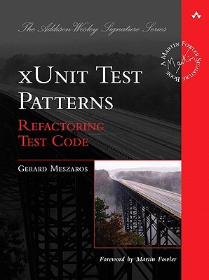

class: firstpage, title

# Программирование на Perl

## Тестирование

---

class: center, middle

.center[.normal-width[]]

---

# Степень изолированности

* Модульное тестирование
* Интеграционное тестирование
* Системное тестирование

---

# Goals of Test Automation

* Tests should help us improve quality.
* Tests should help us understand the SUT.
* Tests should reduce (and not introduce) risk.
* Tests should be easy to run.
* Tests should be easy to write and maintain.
* Tests should require minimal maintenance as the system evolves around them.

---

class: center, middle

# Are tests QA?

---

class: center, middle

# Test the interface,
# not the implementation

---

# t/*

```sh
$ ls t
factory.t  pod.t
```

---

# TAP

```perl
$ perl t/factory.t
1..15
ok 1 - get_fields
ok 2 - build
ok 3 - create
...
ok 10 - related_factory helper
ok 11 - related_factory_batch helper
ok 12 - create with excluded param
ok 13 - after_get_fields
ok 14 - after_build
ok 15 - after_create
```

---

# TAP

```perl
$ perl t/factory.t
1..15
ok 1 - get_fields
ok 2 - build
ok 3 - create
...
ok 10 - related_factory helper
ok 11 - related_factory_batch helper
ok 12 - create with excluded param
ok 13 - after_get_fields
ok 14 - after_build
not ok 15 - after_create
#   Failed test 'after_create'
#   at t/factory.t line 290.
# Compared $data->[0]->sum
#    got : '123'
# expect : '1123'
# Looks like you failed 1 test of 15.
```

---

# prove

```bash
$ prove
t/factory.t .. ok
t/pod.t ...... ok
All tests successful.
Files=2, Tests=17,  0 wallclock secs (...)
Result: PASS
```

---

# prove

```bash
$ prove
t/factory.t .. 1/15
#   Failed test 'after_create'
#   at t/factory.t line 290.
# Compared $data->[0]->sum
#    got : '123'
# expect : '1123'
# Looks like you failed 1 test of 15.
t/factory.t .. Dubious, test returned 1 ...
Failed 1/15 subtests
t/pod.t ...... ok

Test Summary Report
-------------------
t/factory.t (Wstat: 256 Tests: 15 Failed: 1)
  Failed test:  15
  Non-zero exit status: 1
Files=2, Tests=17,  0 wallclock secs (...)
Result: FAIL
```

---

# TAP::Harness

```perl
use TAP::Harness;

my $h = TAP::Harness->new(\%args);

$h->runtests("A", "B", "C");
```

---

# Test::Builder

```perl
use Test::Builder;

my $test = Test::Builder->new;

$test->ok(1 == 1, 'one');
$test->is_eq 2, 7, 'two';

$test->done_testing();
```

```bash
ok 1 - one
not ok 2 - two
#   Failed test 'two'
#   at T.pm line 6.
#          got: '2'
#     expected: '7'
1..2
# Looks like you failed 1 test of 2.
```

---

# Test::Simple

```perl
use Test::Simple tests => 42;

ok(sin(0) == 0, 'Sin(0)');
```

---

# Test::More

```perl
use Test::More tests => 42;
```

```perl
use Test::More;

# ...

done_testing($n);
```

---

# ok, is, isnt

```perl
ok(sin(0) == 0, '...');

is(sin(0), 0, '...');

isnt($result, 'error', '...');
```

---

# like, unlike

```perl
like($error, qr/forbidden/, '...');

unlike($error, qr/forbidden/, '...');
```

---

# cmp_ok

```perl
cmp_ok($x, '==', $y);

cmp_ok($x, '&&', $y);
```

---

# can_ok

```perl
can_ok("Dog", qw(bark run));
can_ok($dog,  qw(bark run));

foreach my $method (qw(bark run)) {
  can_ok($dog, $method, "method $method");
}
```

---


# isa_ok, new_ok

```perl
my $obj = Some::Module->new;
isa_ok( $obj, 'Some::Module' );

new_ok("Dog" => ['Pluto', 42]);
```

---

# subtest

```perl
subtests sinus => sub {
  is(Sin(0), 0, 'zero');
  is(Sin(PI/2), 1, 'pi/2');
};
```

```bash
1..1
    # Subtest: sinus
    ok 1 - zero
    ok 2 - pi/2
    1..2
ok 1 - sinus
```

---

# pass, fail

```perl
my $name = '...';
pass($name);
fail($name);
```

---

# require_ok, use_ok

```perl
require_ok 'My::Module';
require_ok 'My/Module.pm';

BEGIN { use_ok('Some::Module', qw(foo bar)) }
```

---

# is_deeply

```perl
is_deeply(
  {1 => [1,2,3]},
  {1 => [1,2,3]},
  '...'
);
```

---

# diag, note

```perl
pass('A'); pass('B');
diag('DIAG');
note('NOTE');
pass('C'); pass('D');
```

```bash
1..4
ok 1 - A
ok 2 - B
# DIAG
# NOTE
ok 3 - C
ok 4 - D
```

```bash
T.pm .. 1/4 # DIAG
T.pm .. ok
All tests successful.
Files=1, Tests=4,  0 wallclock secs (...)
Result: PASS```

---

# explain

```perl
sub explain {
    my $self = shift;
 
    return map {
        ref $_
          ? do {
            $self->_try(
                sub { require Data::Dumper },
                die_on_fail => 1
            );
 
            my $dumper = Data::Dumper->new( [$_] );
            $dumper->Indent(1)->Terse(1);
            $dumper->Sortkeys(1)
                if $dumper->can("Sortkeys");
            $dumper->Dump;
          }
          : $_
    } @_;
}
```

---

# BAIL_OUT

```perl
require_ok($module) or
    BAIL_OUT("Can't load $module");
```

---

# Test::Class

```perl
package My::Cube::Test;
use base qw(Test::Class);
use Test::More;
use My::Cube;

sub test_volume : Test(2)
{
  my ($self) = @_;

  my $cube = My::Cube->new(x => 2);
  is($cube->volume, 8, 'regular cube');
  $cube->x(0);
  is($cube->volume, 0, 'trivial cube');

  return;
}

sub test_diagonal : Test(4)
{ ... }
```

---

# setup, teardown

```perl
package My::Cube::Test;
use base qw(Test::Class);
use Test::More;
use My::Cube;

sub init_cube : Test(setup)
{
  my ($self) = @_;
  $self->{cube} = My::Cube->new(x => 2);
}

sub test_volume : Test(2)
{
  my ($self) = @_;
  is($self->{cube}->volume, 8, 'regular cube');
  $self->{cube}->x(0);
  is($self->{cube}->volume, 0, 'trivial cube');
  return;
} 
```

---

# startup, shutdown

```perl
use My::Test;
use base qw(Test::Class);

sub db_connect : Test(startup) {
    shift->{dbi} = DBI->connect(...);
}
 
sub db_disconnect : Test(shutdown) {
    shift->{dbi}->disconnect;
}
```

```perl
package My::Some::Module::Test;
use base qw(My::Test);
```

---

# Test::Class::Load

```perl
use Foo::Test;
use Foo::Bar::Test;
use Foo::Fribble::Test;
use Foo::Ni::Test;
Test::Class->runtests;
```

```perl
use Test::Class::Load qw(t/tests t/lib);
Test::Class->runtests;
```

```perl
package My::Test::Class;
 
use base 'Test::Class';
INIT { Test::Class->runtests() }
 
1;
```

---

# TEST DESCRIPTIONS

```perl
sub one_plus_one_is_two : Test {
    is(1+1, 2);
}
```

```bash
ok 1 - one plus one is two
```

---

# Наследование

```perl
package My::Test;
use base qw(Test::Class);

package My::Some::Module::Test;
use base qw(My::Test);
sub SKIP_CLASS { 1 }

package My::Some::Module::A::Test;
use base (My::Some::Module::Test);

package My::Some::Module::B::Test;
use base (My::Some::Module::Test);
```

---

# Организация

```perl
use Local::OK::Post;
use Local::OK::Post::Test;
```

```bash
lib/Local/OK/Post.pm
t/lib/Local/OK/Post/Test.pm
t/class.t
```

---

# Test::Deep

```perl
my $name_re = re('^(Mr|Mrs|Miss) \w+ \w+$');
cmp_deeply(
  $person,
  {
    Name => $name_re,
    Phone => re(q{^0d{6}$}),
    ChildNames => array_each($name_re)
  },
  "person ok"
);
```

---

# cmp_deeply

```perl
cmp_deeply(
  [{1 => 2}, {3 => 4}],
  [{1 => 2}, {3 => 4}],
);
```

---

# ignore()

```perl
cmp_deeply(
  [{1 => 2}, {3 => 4}],
  [{1 => 2}, {3 => ignore()}],
);
```

---

# methods

```perl
cmp_deeply(
  $obj,
  methods(
    name => "John",
    ["favourite", "food"] => "taco"
  )
);
```

```perl
cmp_deeply(
  $obj,
  listmethods(
    name => "John",
    ["favourites", "food"] =>
        ["Mapo tofu", "Gongbao chicken"]
  )
);
```

---

# re

```perl
cmp_deeply($got, [ re("ferg") ])
```

---

# bag

```perl
cmp_deeply([1, 2, 2], bag(2, 2, 1))
```

```perl
cmp_bag([1, 2, 2], [2, 2, 1])
```

---

# all, any

```perl
cmp_deeply(
    $got,
    all(isa("Person"), methods(name => 'John'))
);

any(
    re("^John"),
    all(isa("Person"), methods(name => 'John'))
);

re("^John") |
    isa("Person") & methods(name => 'John')
```

---

# array_each

```perl
my $common_tests = all(
   isa("MyFile"),
   methods(
     handle => isa("IO::Handle")
     filename => re("^/home/ted/tmp"),
  )
);
 
cmp_deeply($got, array_each($common_tests));
```

---

# Fixtures

```perl
use Test::DBIx::Class;
```

```perl
$schema->resultset($source_name)->populate([...]);
```

---

# ...::PopulateMore

```perl
{Gender => {
        fields => 'label',
        data => {
                male => 'male',
                female => 'female',
        }}},

{Person => {
        fields => ['name', 'age', 'gender'],
        data => {
                john => ['john', 38,
                    "!Index:Gender.male"],
                jane => ['jane', 40,
                    '!Index:Gender.female'],
        }}},
```

---

# ...::PopulateMore

```perl
{FriendList => {
        fields => [
            'person',
            'friend',
            'created_date'
        ],
        data => {
                john_jane => [
                        '!Index:Person.john',
                        '!Index:Person.jane'
                        '!Date: March 30, 1996',
                ],
        }}},
```

---

# DBIx::Class::Factory :-)

```perl
package My::UserFactory;
use base qw(DBIx::Class::Factory);
 
__PACKAGE__->resultset(
    My::Schema->resultset('User')
);
__PACKAGE__->fields({
    name => __PACKAGE__->seq(
        sub {'User #' . shift}
    ),
    status => 'new',
});
 
package My::SuperUserFactory;
use base qw(DBIx::Class::Factory);
 
__PACKAGE__->base_factory('My::UserFactory');
__PACKAGE__->field(superuser => 1);
```

---

# DBIx::Class::Factory :-]

```perl
my $user = My::UserFactory->create();
my @verified_users = @{
    My::UserFactory->create_batch(
        3, {status => 'verified'}
    )
};
 
my $superuser = My::SuperUserFactory->build();
$superuser->insert();
```

---

# Test Double

* Dummy object
* Test Stub
* Test Spy
* Mock Object

---

# Test::MockModule;

```perl
use Module::Name;
use Test::MockModule;

{
    my $module = Test::MockModule->
        new('Module::Name');
    $module->mock('subroutine', sub { ... });
    Module::Name::subroutine(@args); # mocked
}

Module::Name::subroutine(@args); # orig
```

---

# Test::MockObject;

```perl
use Test::MockObject;

my $mock = Test::MockObject->new();
$mock->set_true('somemethod');
ok($mock->somemethod());

$mock->set_true('foo')
    ->set_false('bar')
    ->set_series('baz', 'a', 'b', 'c');
```

---

# Test::TCP

```perl
my $server = Test::TCP->new(
    listen => 1,
    code => sub {
        my $socket = shift;
        # ...
    },
);
my $client = MyClient->new(
    host => '127.0.0.1',
    port => $server->port
);
undef $server;
```

---

# Test::TCP

```perl
my $memcached = Test::TCP->new(
    code => sub {
        my $port = shift;

        exec $bin, '-p' => $port;
        die "cannot execute $bin: $!";
    },
);
```

