class:firstpage, title
# Программирование на Perl
## Веб-приложения

---

class:note_and_mark title

# Отметьтесь на портале!
 
---

# Содержание
1. **Протокол HTTP**
1. CGI, mod_perl, FastCGI, PSGI
1. Веб-фреймворки
	- Dancer
	- Mojolicious
	- Catalyst
1. Механизмы безопасности в приложениях

---

layout: true
# Протокол HTTP


---

**Пример простейшего запроса**

```perl
say 'GET / HTTP/1.1\r\nHost:search.cpan.org\r\n\r\n';
```

```http
GET / HTTP/1.1
Host: search.cpan.org
```

**Ответ**

```http
HTTP/1.1 200 OK
Date: Mon, 13 Apr 2015 20:19:35 GMT
Server: Plack/Starman (Perl)
Content-Length: 3623
Content-Type: text/html

__CONTENT__

```
---

**Формат ответа**

```rfc
 Response      = Status-Line  ; Section 6.1
 *(( general-header           ; Section 4.5
 | response-header            ; Section 6.2
 | entity-header ) CRLF)      ; Section 7.1
 CRLF
 [ message-body ]             ; Section 7.2

 Status-Line = HTTP-Version SP Status-Code SP 
               Reason-Phrase CRLF

```
**Статус**
- 1** - информационные сообщения от сервера клиенту
- 2** - успешная обработка запроса
- 3** - контент находится в другом месте или не изменялся
- 4** - ошибка обработки запроса (клиент неправильно сформировал пакет)
- 5** - ошибка обработки запроса (проблема на сервере)
---

**HTTP/1.1 messages (HTTP/1.1 сообщения)**

```rfc
 HTTP-message   = Request | Response

 generic-message = start-line
 *(message-header CRLF)
 CRLF
 [ message-body ]
 start-line      = Request-Line | Status-Line
```

**Заголовки**

```rfc
message-header = field-name ":" [ field-value ]
field-name     = token
field-value    = *( field-content | LWS )
field-content  = <the octets making up the field-
value and consisting of either *text or combinations
of token, separators, and quoted-string>
```

---

HTTP = HyperText Transfer Protocol

Стандарт http://tools.ietf.org/html/rfc2616

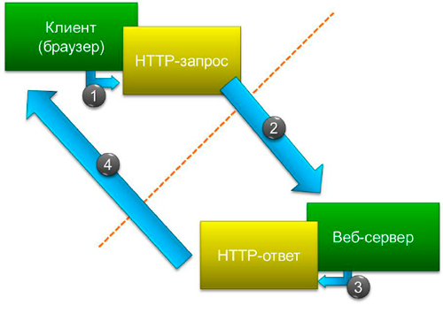


---

**Распространённые методы**

.boredred_table[.table_vtop[
Метод     | Пояснение
:-----------------------------|:---------
GET	   | позволяет получить информацию от сервера, тело запроса всегда остается пустым;
HEAD   | аналогичен GET, но тело ответа остается всегда пустым, позволяет проверить доступность запрашиваемого ресурса и прочитать HTTP-заголовки ответа;
POST   | позволяет загрузить информацию на сервер, по смыслу изменяет ресурс на сервере, но зачастую используется и для создания ресурса на сервере, тело запроса содержит изменяемый/создаваемый ресурс;
PUT    | аналогичен POST, но по смыслу занимается созданием ресурса, а не его изменением, тело запроса содержит создаваемый ресурс;
DELETE | удаляет ресурс с сервера.
]]

---

**Использование HTTP-протокола как транспорт**

- XML-RPC
- SOAP
- WebSocket

.center[.normal-width[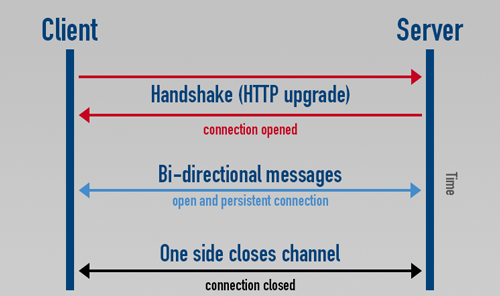]]

---

**Безопасность**

.center[.normal-width[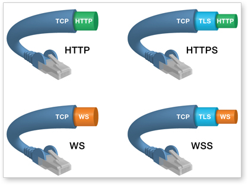]]

---

layout:false
# Содержание

1. Протокол HTTP
1. **CGI, mod_perl, FastCGI, PSGI**
1. Веб-фреймворки
	- Dancer
	- Mojolicious
	- Catalyst
1. Механизмы безопасности в приложениях
---

layout: true
# CGI, mod_perl, FastCGI, PSGI

---

.bigger_font[
**Взаимодействие сервера и приложения**

CGI (Common Gateway Interface) — это не язык, а лишь тип интерфейса

mod_perl - это надстройка над CGI для единоразовой компиляции скриптов

FastCGI - это развитие технологии CGI, запускается отдельным процессом и общается по сети с сервером

PSGI - Перловый суперклей для веб-фреймворков и веб-серверов
]

---

**CGI.pm**

Первый большой модуль для работы с CGI интерфейсом

.floatright[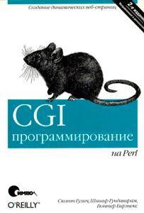]

При помощи этого модуля можно сделать многое. Это комбайн.

Генерация HTML/XHTML

Поддержка старых браузеров IE 3.01

Очень много магии (174+ модуля/245KB кода)

Книга на 245 страниц

Он устарел. Он очень громоздкий.

121 открытый баг!

Однако он встречается!

---

**mod_perl**

Самый часто встречающийся вариант

На него легко перенести ранее написанное CGI приложение

Самым большим превосходством является единоразовая компиляция приложения

Он тоже устарел.

---

**Пример**

CGI (/perl/test.pl):
```perl
print "Content-type: text/html\r\n\r\n";
print "<h1>Hello world!</h1>";
```

Mod_perl:
```perl
package Apache::ROOT::perl::test_2epl;
use Apache qw(exit);

sub handler {
    #line 1 test.pl
    my $r = shift;
    $r->content_type("text/html");
    $r->send_http_header;
    print "Hello world!";
}
```

---

**FastCGI**

Современный вариант CGI программирования

Приложение запускается отдельно от сервера

.center[.normal-width[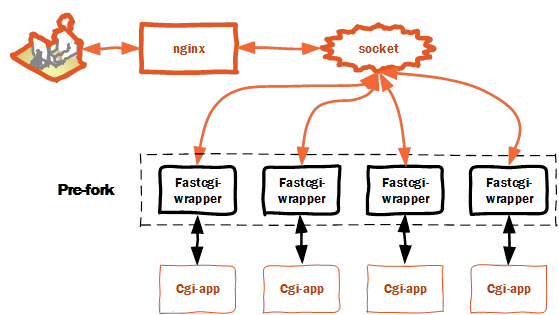]]

---

**Пример**

```perl
#!/usr/bin/perl

use strict;
use FCGI; 

my $socket = FCGI::OpenSocket(":9000", 5);

my $request = FCGI::Request(
    \*STDIN, \*STDOUT, \*STDERR, \%ENV, $socket
);

my $count = 1;

while($request->Accept() >= 0) {
    print "Content-Type: text/html\r\n\r\n";
    print $count++;
}

```

---

Plack

Простейшее приложение

```perl
my $app = sub {
    my $env = shift;
    return [
        200, 
        ['Content-Type' => 'text/plain'], 
        ["hello, world\n"]
    ];
};
```

---


```perl
use strict;
use Plack;
use Plack::Request;

my $app = sub {
    my $env = shift;
    my $req = Plack::Request->new($env);
    my $res = $req->new_response(200);

    $res->body('Hello World!');

    return $res->finalize();
};
```

---

layout:false
# Содержание

1. Протокол HTTP
1. CGI, mod_perl, FastCGI, PSGI
1. **Веб-фреймворки**
	- Dancer
	- Mojolicious
	- Catalyst
1. Механизмы безопасности в приложениях

---

layout: true
# Веб-фреймворки

---

Веб-фреймворк vs CMS

.center[.normal-width[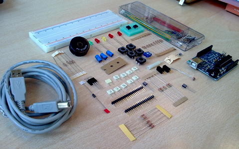]]

Программная платформа, определяющая структуру программной системы

---

Веб-фреймворк vs CMS

.center[.normal-width[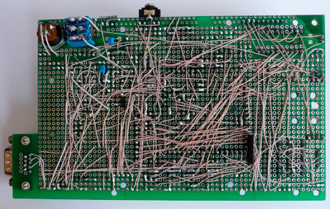]]

Система управления содержимым

---

MVC (Модель-Представление-Контроллер)

.center[.normal-width[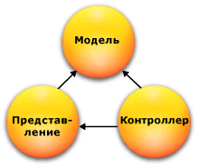]]

Модель живёт сама по себе и содержит бизнеслогику

За формат результата отвечает представление

Контроллер обрабатывает запрос пользователя, занимается аутентификацией/авторизацией

---

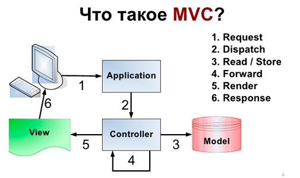

---

layout: true
# Dancer

---

Установка:

```bash
%cpan Dancer2
...
...
F:\Strawberry\c\bin\dmake.exe install UNINST=1 -- OK

%dancer2 -a sferamailapp
+ sferamailapp
+ sferamailapp\config.yml
+ sferamailapp\cpanfile
+ sferamailapp\Makefile.PL
+ sferamailapp\MANIFEST.SKIP
+ sferamailapp\bin
+ sferamailapp\bin\app.psgi
+ sferamailapp\environments
+ sferamailapp\environments\development.yml
+ sferamailapp\environments\production.yml
+ sferamailapp\lib
+ sferamailapp\lib\sferamailapp.pm
+ sferamailapp\public
+ sferamailapp\public\dispatch.cgi
+ sferamailapp\public\dispatch.fcgi
...

```

---

Запуск:

```bash
%plackup -p 5000 bin\app.psgi
HTTP::Server::PSGI: Accepting connections at http://0:5000/
```

Можно открывать браузер и заходить на http://127.0.0.1:5000

Так же генерируются файлы для запуска в режимах cgi и fcgi

sferamailapp\public\dispatch.cgi

sferamailapp\public\dispatch.fcgi

---

Маршруты/Роутинг
```perl
get '/main/:page' => sub {
    return "Hello ".params->{page};
};
```

```perl
any ['get', 'post'] => '/main/*.*' => sub {
    my ($page, $ext) = splat;
    return pass if $ext = 'mp3';
    ...
};
```

```perl
get qr{ /main/([\w]+) }x => sub {
    my ($login) = splat;
    return "Hello $login";
};
```

---

```perl
set views => path(dirname(__FILE__), 'templates');
set engines => {
    template => {
	template_toolkit => {
	    extension => 'foo',
	},
    },
};
```

```perl
hook before_template_render => sub {
    ...
}
```

```perl
hook after_template_render => sub {
    # do something with $content
};
```

---

```perl
hook before_layout_render => sub {
    ...
};
```

```perl
hook before => sub {
    if (!session('user') && 
        request->dispatch_path !~ m{^/login/}) {
        # Pass the original path requested along 
        # to the handler:
        forward '/login/', {path => request->path};
    }
};
```

```perl
set session => 'YAML';
session varname => 'value';
session('varname');
$app->destroy_session;
```

---

```perl
hook before => sub { if (!session('user') && 
    request->dispatch_path !~ /^\/login/) {
        forward '/login', { 
          requested_path => request->dispatch_path
}}};

get '/secret' => sub { return "Top Secret" };

get '/login' => sub { template 'login', {
      path => param('requested_path') 
}};

post '/login' => sub {
    if (param('user') eq 'bob' && 
        param('pass') eq 'letmein') {
	  session user => param('user');
	  redirect param('path') || '/';
    } else { redirect '/login?failed=1' }
};
```

---

```perl
set serializer => 'JSON';

get '/user/:id/' => sub {
    { foo => 42,
      number => 100234,
      list => [qw(one two three)],
    }
};
```
	
```perl
post '/upload/:file' => sub {
    my $filename     = params->{file};
    my $uploadedFile = request->upload($filename);
};
```

---

```YAML
plugins:
 Database:
  driver: 'mysql'
  database: 'test'
  host: 'localhost'
  port: 3306
  username: 'myusername'
  password: 'mypassword'
  connection_check_threshold: 10
  dbi_params:
   RaiseError: 1
   AutoCommit: 1
   on_connect_do: ["SET NAMES 'utf8'"]
   log_queries: 1
   handle_class: 'My::Super::Database::Handle'
```

---

```perl
use Dancer2::Plugin::Database;

my $user = database->quick_select(
    'users', 
    {username => params->{user}} 
);
```

DBIx::Class

```perl
use Dancer2;
use Dancer2::Plugin::DBIC qw(schema resultset);

get '/users/:user_id' => sub {
  my $user = schema('default')->resultset('User')
   ->find(param 'user_id');
  template user_profile => {
    user => $user
  };
};
```

---

```perl
# param.t
use strict; use warnings;
use Test::More; use Plack::Test;
use MyApp;

my $test = Plack::Test->create( MyApp->to_app );
subtest 'An empty request' => sub {
  my $res = $test->request( GET '/' );
  ok( $res->is_success, 'Successful request' );
  is( $res->content, '{}', 'Empty response back' );
};

subtest 'Request with user' => sub {
  my $res = $test->request(GET '/?user=sawyer_x');
  ok($res->is_success, 'Successful request');
  is($res->content, '{"user":"sawyer_x"}', 'Rsp');
};

done_testing();
```

---

layout: true
# Mojolicious

---

```bash
%cpan Mojolicious
...
F:\Strawberry\c\bin\dmake.exe install UNINST=1 -- OK

%mojo generate app SferaMailMojo

[mkdir] sfera_mail_mojo\script
[write] sfera_mail_mojo\script\sfera_mail_mojo
[chmod] sfera_mail_mojo\script\sfera_mail_mojo 744
[mkdir] sfera_mail_mojo\lib
[write] sfera_mail_mojo\lib\SferaMailMojo.pm
[mkdir] sfera_mail_mojo\lib\SferaMailMojo\Controller
[write] sfera_mail_mojo\lib\SferaMailMojo\Controller\Example.pm
[mkdir] sfera_mail_mojo\t
[write] sfera_mail_mojo\t\basic.t
[mkdir] sfera_mail_mojo\log
[mkdir] sfera_mail_mojo\public
[write] sfera_mail_mojo\public\index.html
[mkdir] sfera_mail_mojo\templates\layouts
[write] sfera_mail_mojo\templates\layouts\default.html.ep
[mkdir] sfera_mail_mojo\templates\example
[write] sfera_mail_mojo\templates\example\welcome.html.ep
```
---

*Запуск*

- В lib хранится код, 
- В log логи
- В public статические файлы, которые раздаются отдельным сервером
- В script скрипт запуска сервера
- В t лежат тесты
- В templates шаблоны.

```perl
%perl script\sfera_mail_mojo daemon -m development
Server available at http://127.0.0.1:3000
```

---

*Mojo::Lite*

```bash
%mojo generate lite_app SferaMailLiteApp
[write] SferaMailLiteApp
[chmod] SferaMailLiteApp 744
```

Запуск

```bash
%perl SferaMailLiteApp daemon
[Sat Apr 18 14:57:59 2015] [info] Listening at "http://*:3000"
```

---

*Маршруты*

```perl
my $r = Mojolicious::Routes::Route->new;
$r->get('/hello')->to(
    namespace  => 'SferaMailApp::Special',
    controller => 'foo', 
    action     => 'hello'
);
$r->put('/hello')->to(controller => 'foo', action => 'hello');
$r->any('/whatever')->to(controller => 'foo', action => 'whatever');
```

*Плейсхолдеры*

.boredred_table[
||||
|:--   |:--              |:--              |:--                |:--                 |
|Route |/:path/test      | /(:path)test    | /#path/test       | /*path/test        |
|regexp|([^/.]+)         | ([^/.]+)        | ([^/]+)           | (.+)               |
|Good  |/sfera/test      | /sferatest      | /sfera.23/test    | /sfera/23/test     |
|Wrong |/sfera.1/test    | /sfera/test     | /sfera/hello      | /sfera/hi          |
|Stash |path => 'sfera'  | path => 'sfera' | path => 'sfera.23'| path => 'sfera/23' |
]

---

*Шаблоны*

```bash
sfera_mail_mojo\templates
```

```perl
sub welcome {
    my $self = shift;
    # Render response
    $self->stash(mymessage => 'Welcome');
    $self->render(text => 'Hello there.');
}
```

```perl
    $r->get('/foo/:user')
      ->to('foo#bar')
      ->name('baz');

    my $url = $c->url_for('baz');
```

---

*Сессии*

```perl
my $sessions = Mojolicious::Sessions->new;
$sessions->cookie_name('myapp');
$sessions->default_expiration(86400);
```

```perl
my $auth = $r->under('/' => sub {
  my $c = shift;
  return 1 if $c->session->{is_auth};
  $c->render(text => "You're not authenticated.");
  return undef;
});
$auth->get('/admin')->to('admin#welcome');
```

---

layout: true
# Catalyst

---

```bash
%cpan Catalyst
...
F:\Strawberry\c\bin\dmake.exe install UNINST=1 -- OK

%cpan -i Catalyst::Devel
...

```

```bsah
% catalyst.pl SferaMail::Ctalyst
created "SferaMail-Ctalyst"
created "SferaMail-Ctalyst\script"
created "SferaMail-Ctalyst\lib"
created "SferaMail-Ctalyst\root"
created "SferaMail-Ctalyst\root\static"
created "SferaMail-Ctalyst\root\static\images"
created "SferaMail-Ctalyst\t"
created "SferaMail-Ctalyst\lib\SferaMail\Ctalyst"
created "SferaMail-Ctalyst\lib\SferaMail\Ctalyst\Model"
created "SferaMail-Ctalyst\lib\SferaMail\Ctalyst\View"
created "SferaMail-Ctalyst\lib\SferaMail\Ctalyst\Controller"
created "SferaMail-Ctalyst\sferamail_ctalyst.conf"
Change to application directory and Run "perl Makefile.PL" to make sure your ins
tall is complete
```
---

*Кодогенерация*

```bash
%script\sferamail_ctalyst_create.pl controller Stud
%script\sferamail_ctalyst_create.pl view Stud
```

*Заготовленные рецепты*

```perl
requires 'Catalyst::Plugin::Authentication';
requires 'Catalyst::Plugin::Session';
requires 'Catalyst::Plugin::Session::Store::File';
requires 'Catalyst::Plugin::Session::State::Cookie';
# Configure SimpleDB Authentication
__PACKAGE__->config(
  'Plugin::Authentication' => {
    default => {
      class           => 'SimpleDB',
      user_model      => 'DB::User',
      password_type   => 'clear',
}});
```

---

*DBIx::Class внутри*

```bash
$ script/myapp_create.pl model DB DBIC::Schema \
SferaMail::Catalyst::Schema create=static \
components=TimeStamp,PassphraseColumn \
dbi:SQLite:sferamail.db \
on_connect_do="PRAGMA foreign_keys = ON"
```

*Аутентификация*

```perl
requires 'Catalyst::Plugin::Authentication';
$c->authenticate({
  username => $username, 
  password => $password
})
```

```bash
$ DBIC_TRACE=1 perl -Ilib set_hashed_passwords.pl
```

---

*Авторизация*

```perl
requires 'Catalyst::Plugin::Authorization::Roles';
if ($c->check_user_roles('admin')) {
    ...
}

```

---

layout:false
# Содержание

1. Протокол HTTP
1. CGI, mod_perl, FastCGI, PSGI
1. Веб-фреймворки
	- Dancer
	- Mojolicious
	- Catalyst
1. **Механизмы безопасности в приложениях**

---

layout: true
# Безопасности в приложениях

---

.floatright[]

.bigger_font[
- XSS
- CSRF
- Response-splitting
- Poison NULL byte
- Innumeration
- Sql-injection
- Code-including
- .....
]

---

*XSS - Cross-site scripting*

.center[.normal-width[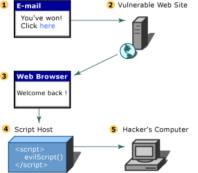]]

---

*CSRF - Межсайтовая фальсификация запросов*


---

*Response-splitting*

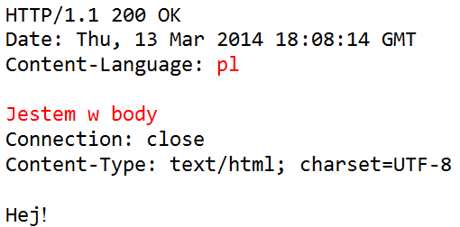

---

*Poison NULL byte*

```perl
my $tpl_name = $c->param('tpl') || 'main.tpl';
if ( $tpl_name !~ /\.tpl$/s ) {
    $tpl_name = 'main.tpl';
}
$tpl_name = "templates/$tpl_name";
open( my $hTPL, '<', $tpl_name )
  or die "can't open $tpl_name: $OS_ERROR";
print for $hTPL;
close $hTPL;
```

---

*Poison NULL byte*

```
http://my.site/?tpl=../../../../../etc/passwd%00.tpl
```

.center[.normal-width[]]

---

.bigger_font[
*Innumeration*

- Получение результатов заказа по id
- Получение данных пользователя по id
	
Перебор id в запросах с целью получения личных данных
]

---

*Sql-injection*


---

*Sql-injection*

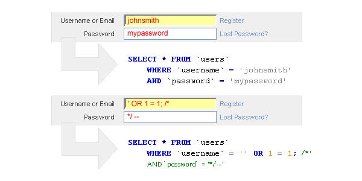

---

*Remote Code Execution*

```perl
eval $str;

open(my $fh, $str);

system($str);

```

---
layout: false
# Мастер класс

[https://www.youtube.com/watch?v=p9nzKKmBwJc&t=6s](https://www.youtube.com/watch?v=p9nzKKmBwJc&t=6s)


---

layout: false
# Домашнее задание

## Notes

`homeworks/notes_web`


---

class:lastpage title

# Спасибо за внимание!

## Оставьте отзыв

.teacher[]

