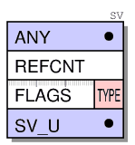
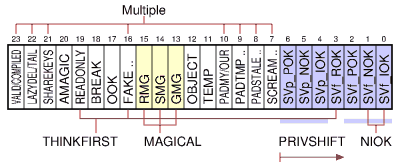
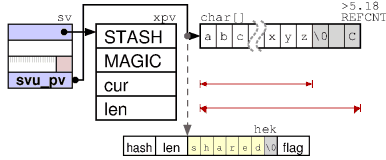
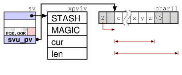
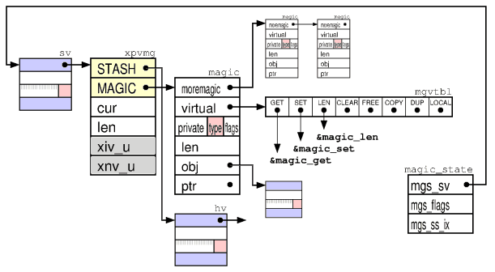
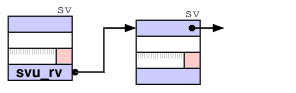
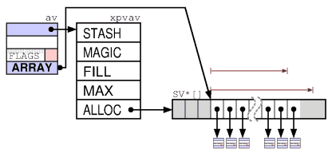
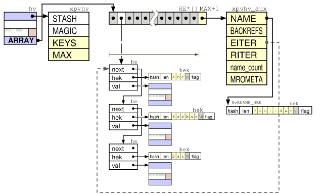
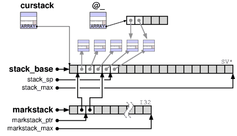
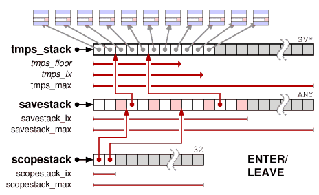

class:firstpage
# Программирование на Perl

---

class: firstpage
# Ускоряем перл
# Расширяем «C»

---

layout:false

# Содержание

1. **Генерация XS модулей**
1. Макропроцессор
1. Типы данных изнутри
1. Работа со стеком
1. Typemaps
1. Встраивание Perl (perlembed)

---

layout: true
# Генерация XS модулей

---

```bash
% perl -V:make

make='dmake';

% h2xs -b 5.10.1 -n sferamail::perlxs
```

C::Scan - модуль для парсинга хеадер-файла для генерации xsubs

```bash
h2xs -n sferamail::locale -O -x "F:\locale.h"
```

???

Компиляция модулей должна происходить точно так же как и собирался перл. Что бы узнать, какой мейкер доступен в вашей среде, нужно выполнить первую команду.
А что бы разработчику на вспоминать и не создавать вручную всю структуру каталогов и файлов, можно воспользоваться утилитой h2xs

Так же эта утилита позволяет не только создавать пустые модули, но ее можно использовать для создания скилета для уже существующей библиотеки на С если у вас есть необходимый хеадер файл.

---

Базовый набор файлов, необходимых для создания модуля.

```bash
Writing sferamail-perlxs/ppport.h
Writing sferamail-perlxs/lib/sferamail/perlxs.pm
Writing sferamail-perlxs/perlxs.xs
Writing sferamail-perlxs/fallback/const-c.inc
Writing sferamail-perlxs/fallback/const-xs.inc
Writing sferamail-perlxs/Makefile.PL
Writing sferamail-perlxs/README
Writing sferamail-perlxs/t/sferamail-perlxs.t
Writing sferamail-perlxs/Changes
Writing sferamail-perlxs/MANIFEST
```

---

Сборка и тестирование модуля

```bash
% perl Makefile.PL
% dmake
% dmake test

t/sferamail-perlxs.t .. ok
All tests successful.
Files=1, Tests=1,  0 wallclock secs ( 0.00 usr +  0.08 sys =  0.08 CPU)
Result: PASS

% dmake install
```

---

layout:false

# Содержание

1. Генерация XS модулей
1. **Макропроцессор**
1. Типы данных изнутри
1. Работа со стеком
1. Typemaps
1. Встраивание Perl (perlembed)

---

layout: true
# Макропроцессор

---

xsub - функции написанные в xs-модуле

XS - набор макросов

xsubpp - компилятор который собирает С код из макросов

TYPEMAP - правила преобразования типов данных

```txt
 __________
| TYPEMAP  |___
|__________|   \       ___________       _________
                \_____|  XSUBPP   |_____| C-File  |
                /     |___________|     |_________|
 __________    /                             ^
|  XS-file |__/                          ____|____
|__________|                            | PM-file |
                                        |_________|
```

---

layout:false

# Содержание

1. Генерация XS модулей
1. Макропроцессор
1. **Типы данных изнутри**
1. Работа со стеком
1. Typemaps
1. Встраивание Perl (perlembed)

---

layout: true
# Типы данных изнутри

---

- SV  Scalar Value
- AV  Array Value
- HV  Hash Value

.floatright[]

- SV:
 - IV - signed integer value 
 - UV - unsigned integer value 
 - NV - double
 - PV - pointer value
 - SV
 


---

SvPV



SvOOK



---

SvPVMG



---

SvRV



SvAV



---

SvHV



---

*Создание переменных*

```perlxs
SV* newSV(0);
SV* newSViv(IV);
SV* newSVuv(UV);
SV* newSVnv(double);
SV* newSVpv(const char*);
SV* newSVpvn(const char*, STRLEN);
SV* newSVpvf(const char*, ...);
SV* newSVsv(SV*);
```

---

*Определение значения переменной*

```perlxs
void  sv_setiv(SV*, IV);
void  sv_setuv(SV*, UV);
void  sv_setnv(SV*, double);
void  sv_setpv(SV*, const char*);
void  sv_setpvn(SV*, const char*, STRLEN)
void  sv_setpvf(SV*, const char*, ...);   //sprintf
void  sv_setsv(SV*, SV*);
```

---

*Установка значения переменной*

```perlxs
SvIV(SV*)
SvUV(SV*)
SvNV(SV*)
SvPV(SV*, STRLEN len) //возвращается длинна строки 
SvPV_nolen(SV*)
```

*Проверка типа SV-шки*

```perlxs
SvIOK(SV*)
SvNOK(SV*)
SvPOK(SV*)
SvTRUE(SV*)
```

---

*Работа со строками*

```c
SvCUR(SV*) - длина
SvCUR_set(SV*, I32 val)

SvGROW(sv, needlen + 1)

SvUTF8_off(sv);

SvEND(SV*) // Ссылка на последний байт в строке

sv_setpvn(sv, "", 0);

s = SvGROW(sv, needlen + 1);
// something that modifies up to needlen bytes 
// at s, but modifies newlen bytes
// eg. newlen = read(fd, s, needlen); 

s[newlen] = '\0';
SvCUR_set(sv, newlen);
```
---

layout:false

# Содержание

1. Генерация XS модулей
1. Макропроцессор
1. Типы данных изнутри
1. **Работа со стеком**
1. Typemaps
1. Встраивание Perl (perlembed)

---

layout: true
# Работа со стеком

---

*Вызов XSUB из перл*

Получение переменной из стека
```perlxs
ST(n)
```

Установка переменной в стек

```perlxs
EXTEND(SP, num);
PUSHs(SV*);
```

```perlxs
XPUSHs(SV*);
```

---

perlxs.xs

```c
#define PERL_NO_GET_CONTEXT
#include "EXTERN.h"
#include "perl.h"
#include "XSUB.h"
#include "ppport.h"
#include "const-c.inc"

MODULE = local::perlxs PACKAGE = local::perlxs
INCLUDE: const-xs.inc

```

---

*CODE + OUTPUT = dSP + xPUSHs + ...* 

```c
#include <math.h>

double distance_point(x1,y1,x2,y2)
    double x1
    double y1
    double x2
    double y2

    CODE:
    double ret;
    ret = sqrt( pow(x1-x2, 2) + pow(y1-y2, 2) );
    RETVAL = ret;

    OUTPUT:
    RETVAL
```

---

*PPCODE*

```c
#include <math.h>

void distance_point(x1,y1,x2,y2)
    double x1
    double y1
    double x2
    double y2

    PPCODE:
    double ret;
    ret = sqrt( pow(x1-x2, 2) + pow(y1-y2, 2) );
    PUSHn((double)ret);
```

---

```c
void distance_ext_point(x1,y1,x2,y2)
    double x1
    double y1
    double x2
    double y2

    PPCODE:
    double dx = abs(x1-x2);
    double dy = abs(y1-y2);
    double dist = sqrt( pow(dx, 2) + pow(dy, 2) );

    PUSHs(sv_2mortal(newSVnv(dist)));
    PUSHs(sv_2mortal(newSVnv(dx)));
    PUSHs(sv_2mortal(newSVnv(dy)));
```

---



---

```c
dXSARGS; //dSP and dMARK and dITEMS
if (items != 4) croak_xs_usage(cv, "x1,y1,x2,y2");
double        x1 = (double)SvNV(ST(0));
double        y1 = (double)SvNV(ST(1));
double        x2 = (double)SvNV(ST(2));
double        y2 = (double)SvNV(ST(3));
double dx = abs(x1-x2);
double dy = abs(y1-y2);
double dist = sqrt( pow(dx, 2) + pow(dy, 2) );
SP -= items;
PUSHs(sv_2mortal(newSVnv(dist)));
PUSHs(sv_2mortal(newSVnv(dx)));
PUSHs(sv_2mortal(newSVnv(dy)));
PUTBACK;
return;

```

---



---

```c
int SvREFCNT(SV* sv);
SV* SvREFCNT_inc(SV* sv);
void SvREFCNT_dec(SV* sv);

SV*        newRV_noinc(SV *const sv);

```

```c
SV*  sv_newmortal()
SV*  sv_2mortal(SV*)
SV*  sv_mortalcopy(SV*)

ENTER; SAVETMPS;

sv_2mortal(newSVnv(sqrt(pow(x1-x2,2)+pow(y1-y2,2))));

SV *tmp = sv_newmortal();
sv_setiv(tmp, an_integer);

FREETMPS; LEAVE;
```

---

```c
ST(0) = sv_2mortal(
    sv_bless(
        newRV_noinc(
            newSViv(
                PTR2IV( self )
            )
        ),
        gv_stashpv(
            SvPV_nolen( ST(0) ),
            TRUE
        )
    )
);

```

---

*Вызов перл функции из XSUB*

```perl
sub get_points { return 1,1,1,3; }
```

```c
double distance_call_point()
  PPCODE:
    int count;
    double x1, y1, x2, y2;
    ENTER; SAVETMPS; PUSHMARK(SP);
    count = call_pv("local::perlxs::get_points", 
                    G_ARRAY|G_NOARGS);
    SPAGAIN;
    if (count!=4) croak("call get_points trouble");
    x1 = POPn; y1 = POPn; x2 = POPn; y2 = POPn;
    double dist = sqrt(pow(x1-x2,2)+pow(y1-y2,2));
    FREETMPS; LEAVE;
    PUSHs(sv_2mortal(newSVnv(dist)));
```

---

```perl
sub get_points {
    if( !$_[0] )      { return 1,1,1,3 }
    elsif($_[0] == 1) { return 1,1 }
    elsif($_[0] == 2) { return 1,3 }
}
```

---

```c
double distance_call_arg_point()
 PPCODE:
  int count; double x1, y1, x2, y2;
  ENTER; SAVETMPS; PUSHMARK(SP); 
  XPUSHs(sv_2mortal(newSViv(1))); PUTBACK;
  count=call_pv("local::perlxs::get_points",
                G_ARRAY);
  SPAGAIN;
  if (count!=2) croak("call get_points trouble\n");
  x1 = POPn; y1 = POPn;PUSHMARK(SP);
  XPUSHs(sv_2mortal(newSViv(2)));PUTBACK;
  count=call_pv("local::perlxs::get_points", 
                G_ARRAY);
  SPAGAIN;
  if (count!=2) croak("call get_points trouble\n");
  x2 = POPn; y2 = POPn;
  double dist=sqrt(pow(x1-x2,2)+pow(y1-y2,2));
  FREETMPS; LEAVE;
  PUSHs(sv_2mortal(newSVnv(dist)));
```

---

layout:false

# Содержание

1. Генерация XS модулей
1. Макропроцессор
1. Типы данных изнутри
1. Работа со стеком
1. **Typemaps**
1. Встраивание Perl (perlembed)

---

layout: true
# Typemaps

---

```typemap
TYPEMAP
WORD                    T_IV
LONG                    T_IV
int                     T_IV
unsigned                T_IV
char                    T_CHAR
unsigned char           T_U_CHAR
char *                  T_PV
unsigned char *         T_PV
AV *                    T_AVREF
HV *                    T_HVREF
CV *                    T_CVREF
...
INPUT
T_PV
    $var = ($type)SvPV_nolen($arg)
OUTPUT
T_PV
    sv_setpv((SV*)$arg, $var);
```

---

```c
double distance_pointobj(r_point1, r_point2)
  SV *r_point1
  SV *r_point2
  PPCODE:
  double x1,y1,x2,y2;
  SV **_x1,**_y1,**_x2,**_y2,*_point1,*_point2;
  HV *point1, *point2;
  if (!(SvOK(r_point1) 
     && SvROK(r_point1) 
     && SvOK(r_point2) 
     && SvROK(r_point2)))
      croak("Point must be a hashref");
  _point1 = SvRV(r_point1); 
  _point2 = SvRV(r_point2);
  if (SvTYPE(_point1)!=SVt_PVHV 
     || SvTYPE(_point2) != SVt_PVHV)
      croak("Point must be a hashref");
```

---

```c
  point1 = (HV*)_point1;
  point2 = (HV*)_point2;
  if (!(hv_exists(point1, "x", 1) 
     && hv_exists(point2, "x", 1) 
     && hv_exists(point1, "y", 1) 
     && hv_exists(point2, "y", 1)))
      croak("Point mush contain x and y keys");
  _x1 = hv_fetch(point1, "x", 1, 0); 
  _y1 = hv_fetch(point1, "y", 1, 0);
  _x2 = hv_fetch(point2, "x", 1, 0); 
  _y2 = hv_fetch(point2, "y", 1, 0);
  if (!(_x1 && _x2 && _y1 && _y2))
     croak("Non allow NULL in x and y coords");
  x1 = SvNV(*_x1); x2 = SvNV(*_x2);
  y1 = SvNV(*_y1); y2 = SvNV(*_y2);
  PUSHs(sv_2mortal(newSVnv(
    sqrt(pow(x1-x2,2) + pow(y1-y2,2))
  )));
```

---

```c
typedef struct { double x, y; } GEOM_POINT;
```
```c
TYPEMAP
WORD                    T_IV
LONG                    T_IV
int                     T_IV
unsigned                T_IV
char                    T_CHAR
unsigned char           T_U_CHAR
char *                  T_PV
unsigned char *         T_PV
AV *                    T_AVREF
HV *                    T_HVREF
CV *                    T_CVREF
...
GEOM_POINT*             T_HVREF
```

---

```c
INPUT
T_HVREF
  {
  double typemap_x, typemap_y;
  if (!SvOK($arg) || !SvROK($arg))
    croak(\"Point must be a hashref\");
  HV *typemap__point = SvRV($arg);
  if (SvTYPE(typemap__point)!=SVt_PVHV)
    croak(\"Point must be a hashref\");
  SV* typemap_point = (HV*)typemap__point;
  if (!hv_exists(typemap_point,\"x\",1) 
     || !hv_exists(typemap_point,\"y\",1))
      croak(\"Point must contain x and y keys\");
  SV **tm__x=hv_fetch(typemap_point,\"x\",1,0);
  SV **tm__y=hv_fetch(typemap_point,\"y\",1,0);
  if(!tm__x || !tm__y) croak(\"x and y required\");
  typemap_x=SvNV(*tm__x); typemap_y=SvNV(*tm__y);
  $type pt = malloc(sizeof(GEOM_POINT));
  pt->x = typemap_x; pt->y = typemap_y;
  $var = ($type)pt;
  }
OUTPUT
T_HVREF
  croak(\"Unimplemented output $type\");

```

---

```c
double distance_pointstruct(point1, point2)
    GEOM_POINT *point1
    GEOM_POINT *point2
    CODE:
    double ret;
    ret = sqrt(pow(point1->x-point2->x,2) 
              +pow(point1->y-point2->y,2));
    free(point1);
    free(point2);
    RETVAL = ret;
    OUTPUT:
    RETVAL
```

---

```c
TYPEMAP
HV* T_HVREF_3D
GEOM_POINT_3D* T_HVREF_3D

INPUT
T_HVREF_3D
  {
  double typemap_x, typemap_y, typemap_z;
  if (!(SvOK($arg) && SvROK($arg)))
    croak(\"Point must be a hashref\");
  SV *typemap__point = SvRV($arg);
  if (SvTYPE(typemap__point) != SVt_PVHV )
    croak(\"Point must be a hashref\");
  HV *typemap_point = (HV*)typemap__point;
  if (!(hv_exists(typemap_point,\"x\",1) 
     && hv_exists(typemap_point,\"y\",1) 
     && hv_exists(typemap_point,\"z\",1)))
       croak(\"x, y, z keys is required\");
```

---

``` c
  SV **tm__x=hv_fetch(typemap_point,\"x\",1,0);
  SV **tm__y=hv_fetch(typemap_point,\"y\",1,0);
  SV **tm__z=hv_fetch(typemap_point,\"z\",1,0);
  if(!(tm__x && tm__y && tm__z))
    croak(\"Non allow NULL in x or y or z\");
  typemap_x = SvNV(*tm__x);
  typemap_y = SvNV(*tm__y);
  typemap_z = SvNV(*tm__z);
  $type pt = malloc(sizeof(GEOM_POINT_3D));
  pt->x = typemap_x;
  pt->y = typemap_y;
  pt->z = typemap_z;
  $var = ($type)pt;
  }
```

---

layout: false
# Содержание

1. Генерация XS модулей
1. Макропроцессор
1. Типы данных изнутри
1. Работа со стеком
1. Typemaps
1. **Встраивание Perl (perlembed)**

---

layout: true
# Встраивание Perl (perlembed)

---

```c
#include <EXTERN.h>
#include <perl.h>
static PerlInterpreter *my_perl;
int main(int argc, char **argv, char **env)
{
  PERL_SYS_INIT3(&argc,&argv,&env);
  my_perl = perl_alloc();
  perl_construct(my_perl);
  PL_exit_flags |= PERL_EXIT_DESTRUCT_END;
  perl_parse(my_perl,NULL,argc,argv,(char **)NULL);
  perl_run(my_perl);
  perl_destruct(my_perl);
  perl_free(my_perl);
  PERL_SYS_TERM();
}
```

---

```bash
perl -MExtUtils::Embed -e ccopts -e ldopts
```

```bash
cc -o interp interp.c `perl -MExtUtils::Embed \
   -e ccopts -e ldopts`
```

---

Что хотим использовать:
```html
ABSTRACT_TEXT
<!--[FUNC_NAME(PARAM1,PARAM2)]-->
ABSTRACT_TEXT
<!--[VAR_NAME]-->
ABSTRACT_TEXT
```

Например:

```html
<--[set_var(str,world)]--> Hello 
<!--[html_escape(str)]-->!!!
<--[set_var(num1,10)]-->
<--[incr_var(num1,15)]-->
Sum: <--[num1]-->
```

---

```c
int main (int argc, char **argv, char **env)
{
  ...
  char *perl_argv[]={"",module,include_dir,"-e0"};
  PERL_SYS_INIT3(&argc,&argv,&env);
  my_perl = perl_alloc();
  perl_construct( my_perl );
  exitstatus=perl_parse(my_perl,NULL,4,perl_argv,
                         (char**)NULL);
  if(exitstatus){
    exit(exitstatus);
  }
  perl_run(my_perl);
  ...
  call_func(func_name, num_param, args);
  print_var(var_in_pkg, str);
  ...
}
```

---

```c
static void
call_func(char *func_name, int argv, char **argc )
{
  int count, f;
  dSP;       
  ENTER; SAVETMPS; PUSHMARK(SP);
  for(f=0;f<argv;f++){
    XPUSHs(sv_2mortal(newSVpv(argc[f],
                      strlen(argc[f])))); }
  PUTBACK;                        
  count = call_pv(func_name, G_SCALAR|G_EVAL); 
  SPAGAIN; PUTBACK;
  if (SvTRUE(ERRSV)){error_tmpl(SvPV_nolen(ERRSV);}
  else{
    if (count != 1)
      error_tmpl("More then 1 params returning");
    printf ("%s", POPp);
  }
  FREETMPS; LEAVE;
}
```

---

```c
static void
print_var(char *var_name, char *var)
{
  HV *h_var;
  h_var = get_hv(var_name, 0);
  if(!h_var) error_tmpl("Vars hash not exist");
  SV **sr_var=hv_fetch(h_var,var,(int)strlen(var),0);
  if(!sr_var) error_tmpl("Var not exist");
  if(SvTYPE(*sr_var) == SVt_IV)
    printf( "%li", SvIV(*sr_var));
  else if(SvTYPE(*sr_var)==SVt_NV){
    printf("%f", SvNV(*sr_var));
  }
  else if(SvTYPE(*sr_var) == SVt_PV){
    printf("%s", SvPV_nolen(*sr_var));
  }
  else{ error_tmpl("Incompatible type of var"); }
}
```

---
layout: false
# Домашнее задание

1. Написать xs-модуль который позволяет рассчитать:
  - расстояние от точки до окружности (принимает 2 параметра, точку и окружность в виде хешей)
  - возвращает точку пересечения прямой проходящей от заданой точки до центра окружности с этой окружностью
  - умножает матрицы (принимает 2 AoA на вход), реализовать на чистом перл и на с
2. Написать программу на С, которая использует в своём коде перловые регулярки + хеши. На вход подаётся файл в base64, внутри которого лежит текст. Необходимо найти все предложения, которые содержат запятые. Найти в них все слова, короче 5 букв, посчитать частотность по каждому.
  - Сишная часть читает файл, декодирует base64, выводит результат по статистике, которую считает перл
  - Перловая часть находит слова короче 5 букв и считает статистику
